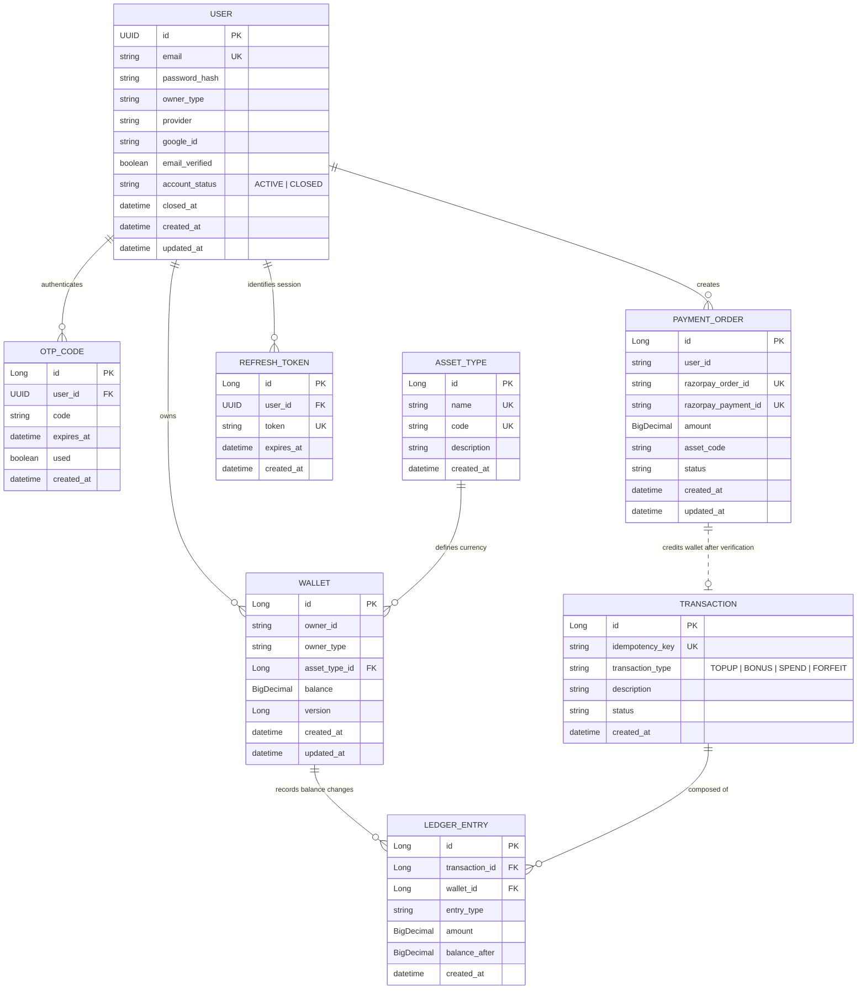
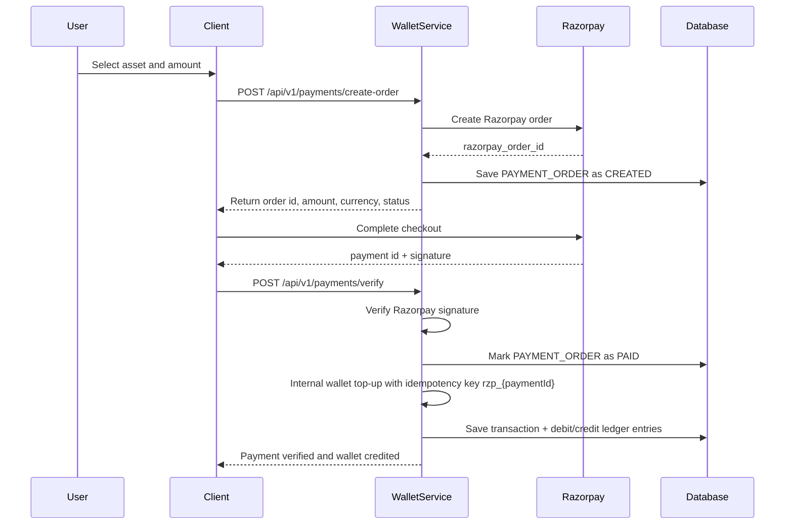

# 💰 Wallet Service

A high-performance, financially rigorous digital wallet service built with Spring Boot 4. The service manages user wallets, supports multiple asset types, records every balance movement through a double-entry ledger, and provides a secure session management system using JWT and Refresh Tokens.

* [Initial Requirement](https://drive.google.com/file/d/1PTFW5_xbD04Lx3RW_QgvM-MmMYp23y78/view?usp=sharing)
---

## 📌 What This Project Is

Wallet Service is a backend application for managing prepaid digital balances such as Gold Coins, Diamonds, and Loyalty Points. It is designed for products where users buy credits, receive promotional bonuses, and spend those credits inside an application.

The important design goal is that wallet balance must be fast to read, safe to update, and fully auditable. To achieve that, the project stores the current wallet balance on the `wallets` table for quick reads, while every financial movement is also written to immutable `ledger_entries`. The ledger is the source of truth for audit and reconciliation, and the wallet balance acts as an optimized projection of that ledger.

The app also includes payment integration with Razorpay and a robust authentication system that supports account lifecycle management, including secure logout and GDPR-compliant account closure.

---

## 🧭 How The Application Works

1. A user signs up using email and password, verifies OTP, or logs in through Google.
2. The service issues a short-lived **Access Token** (5 mins) and a long-lived **Refresh Token** (7 days).
3. Protected wallet and payment endpoints use Spring Security and JWT authentication.
4. Each user can own one wallet per asset type, such as `GOLD`, `DIAMOND`, or `LOYALTY`.
5. Wallet operations are modeled as financial transfers between two wallets:
   - Top-up: `SYSTEM_TREASURY` debits, user wallet credits.
   - Bonus: `SYSTEM_TREASURY` debits, user wallet credits.
   - Spend: user wallet debits, `SYSTEM_TREASURY` credits.
6. Account Closure Flow:
   - Verifies that all wallets are empty or explicitly confirmed for forfeiture.
   - Forfeits remaining balances to the treasury.
   - Scrubs PII (email/password) and marks the account as `CLOSED`.
   - Revokes all active refresh tokens immediately.

---

## 🏗 System Architecture & Entity Relationships

The following diagram shows users, authentication records, wallets, payment orders, transactions, and the immutable ledger trail.



---

## 💳 Payment Integration Flow

Payment integration is built around Razorpay orders and server-side signature verification.



---

## 📡 API Reference

### Auth API

| Method | Endpoint | Access | Description |
|--------|----------|--------|-------------|
| `POST` | `/api/v1/auth/signup` | Public | Register with email and password |
| `POST` | `/api/v1/auth/verify-otp` | Public | Verify OTP and receive tokens |
| `POST` | `/api/v1/auth/login` | Public | Login and receive JWT + Refresh Token |
| `POST` | `/api/v1/auth/google` | Public | Login/Signup via Google ID Token |
| `POST` | `/api/v1/auth/refresh-token` | Public | Exchange Refresh Token for new Access Token |
| `POST` | `/api/v1/auth/logout` | User | Revoke a specific refresh token session |
| `DELETE` | `/api/v1/auth/close-account` | User | Close account, forfeit funds, and scrub data |

### Wallet API

| Method | Endpoint | Access | Description |
|--------|----------|--------|-------------|
| `GET` | `/api/v1/wallets/{userId}/balance` | User | Get all balances for authenticated user |
| `POST` | `/api/v1/wallets/spend` | User | Spend credits from authenticated user wallet |
| `POST` | `/api/v1/wallets/topUp` | System | Credit a user wallet from treasury |
| `POST` | `/api/v1/wallets/bonus` | System | Issue promotional credits from treasury |
| `GET` | `/api/v1/wallets/{userId}/ledger` | User/System | View auditable ledger history |

### Payment API

| Method | Endpoint | Access | Description |
|--------|----------|--------|-------------|
| `POST` | `/api/v1/payments/create-order` | User | Create Razorpay order and local payment order |
| `POST` | `/api/v1/payments/verify` | User | Verify signature and credit wallet |

---

## 🛡 Security & Reliability

### Dual-Token System
- **Access Tokens**: Short-lived (5m) JWTs used for API authorization.
- **Refresh Tokens**: Long-lived (7d) database-backed tokens. This allows the system to revoke specific device sessions instantly (logout) without waiting for a JWT to expire.

### Account Closure & GDPR
Closing an account is a multi-step destructive process:
1. **Financial Verification**: Prevents closure if funds are remaining (unless `confirmForfeit` is true).
2. **Forfeiture**: If confirmed, remaining funds are moved to the system treasury with a `FORFEIT` transaction type.
3. **Data Scrubbing**: The email is replaced with an anonymous string, and passwords/IDs are nullified.
4. **Session Termination**: All active refresh tokens for the user are deleted.

### Concurrency & Financial Safety
- **Pessimistic Locking**: Wallets are locked using `PESSIMISTIC_WRITE` during transfers.
- **Lock Ordering**: Wallet IDs are sorted before locking to prevent deadlocks.
- **Idempotency**: All mutations require an `idempotencyKey` to prevent double-spending.
- **Typed Exceptions**: Specific HTTP statuses for business failures (e.g., `409 Conflict` for positive balances during closure).

---

## 🚀 Quick Start With Docker

1. Copy `.env.example` to `.env`.
2. Start the services:
```bash
docker-compose up --build
```
3. Access Swagger UI at: `http://localhost:8080/swagger-ui.html`
