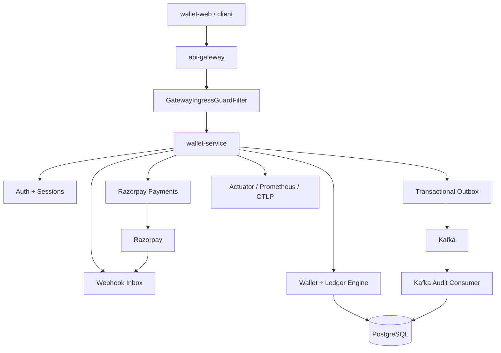

# 🤗 Wallet Service 🤗

A production-oriented Spring Boot wallet backend for prepaid digital assets, Razorpay payment top-ups, double-entry ledger accounting, OTP/Google authentication, account closure, webhook reconciliation, transactional Kafka outbox publishing, Kafka audit observability, and gateway-controlled API access.

## Core idea

Wallet Service has one central invariant: every trusted business event that changes a balance must become an atomic wallet transfer, and every successful transfer must leave an auditable trail.

The current architecture has three reliability layers:

1. PostgreSQL wallet and ledger state remains the source of truth.
2. Razorpay webhook inbox reconciles payment capture when the browser verification path is interrupted.
3. Kafka transactional outbox publishes committed wallet events after the database transaction succeeds.



## What the service does

| Area           | Capability                                                                                                         |
|----------------|--------------------------------------------------------------------------------------------------------------------|
| Auth           | Email signup, OTP verification, email login, Google ID token login, refresh token session, logout, account closure |
| Wallets        | One wallet per user and asset, lazy wallet creation, balance lookup, ledger lookup                                 |
| Assets         | `GOLD`, `DIAMOND`, `LOYALTY`; `LOYALTY` is reward-only and cannot be bought                                        |
| Wallet actions | `TOPUP`, `BONUS`, `SPEND`, `FORFEIT` through a common transfer engine                                              |
| Accounting     | Every successful transfer writes one `transactions` row and two `ledger_entries` rows                              |
| Payments       | Razorpay order creation, checkout verification, payment order status                                               |
| Webhooks       | Razorpay signature validation, transactional inbox, `SKIP LOCKED` polling, idempotent wallet credit                |
| Kafka          | Transactional outbox, `wallet.transaction.posted.v1`, scheduled publisher, audit consumer, admin messaging APIs    |
| Security       | Gateway ingress guard, JWT/refresh tokens, `ownerType` based access rules, method-level ownership checks           |
| Observability  | Actuator, Prometheus metrics, OTLP hooks, admin Kafka/outbox views                                                 |

## Current repository scope

This repository owns the Spring Boot wallet backend only.

Related repositories:

| Repository           | Responsibility                                                                                                         |
|----------------------|------------------------------------------------------------------------------------------------------------------------|
| `wallet-service`     | Spring Boot wallet backend, database schema, domain logic, outbox, Kafka consumer                                      |
| `api-gateway`        | Client JWT validation, route security, rate limiting, circuit breakers, gateway headers                                |
| `wallet-web`         | Next.js frontend dashboard and user console                                                                            |
| `wallet-local-infra` | Local Docker Compose orchestration for Postgres, Redis, Kafka, Prometheus, Grafana, Tempo, gateway, and wallet service |

## Important runtime rules

| Rule                                                                                     | Reason                                                           |
|------------------------------------------------------------------------------------------|------------------------------------------------------------------|
| Clients enter through `api-gateway`, not directly through `wallet-service`               | `wallet-service` trusts gateway headers after ingress validation |
| Direct access must include `X-Gateway-Token`                                             | Blocks bypassing the gateway security boundary                   |
| `ownerType=USER` can spend and create payment orders                                     | Normal user action                                               |
| `ownerType=SYSTEM` can issue bonus and inspect admin messaging                           | System/operator action                                           |
| `ownerType=SYSTEM` cannot spend or create user payment orders                            | Prevents system accounts from behaving like user wallets         |
| `LOYALTY` is not purchasable                                                             | It is reward-only and issued via SYSTEM bonus                    |
| Idempotency keys are generated by clients/backend flows, not manually typed by end users | Prevents accidental duplicate business mutation                  |
| Razorpay webhook endpoint is public to Razorpay but still behind the gateway route       | Razorpay cannot send app JWTs                                    |
| Kafka publish happens after wallet DB commit through outbox                              | Prevents event emission for rolled-back transactions             |

## Documentation map

The detailed documentation is split under [`docs/`](docs/). Start with the architecture and data-model documents before making backend changes.

| Topic                               | File                                                                                                 |
|-------------------------------------|------------------------------------------------------------------------------------------------------|
| Reading guide                       | [`docs/00-contents-and-reading-guide.md`](wallet-service-readme-docs/docs/00-contents-and-reading-guide.md)                     |
| System overview                     | [`docs/01-system-overview.md`](wallet-service-readme-docs/docs/01-system-overview.md)                                           |
| Complete system architecture        | [`docs/19-complete-system-overview.md`](wallet-service-readme-docs/docs/19-complete-system-overview.md)                         |
| Architecture                        | [`docs/02-architecture.md`](wallet-service-readme-docs/docs/02-architecture.md)                                                 |
| Security and access control         | [`docs/03-runtime-security-and-access-control.md`](wallet-service-readme-docs/docs/03-runtime-security-and-access-control.md)   |
| Domain model and ER diagrams        | [`docs/04-domain-model-and-er.md`](wallet-service-readme-docs/docs/04-domain-model-and-er.md)                                   |
| Wallet and ledger engine            | [`docs/05-wallet-ledger-engine.md`](wallet-service-readme-docs/docs/05-wallet-ledger-engine.md)                                 |
| Concurrency and consistency         | [`docs/20-concurrency-transactions-and-consistency.md`](wallet-service-readme-docs/docs/20-concurrency-transactions-and-consistency.md) |
| Razorpay payments                   | [`docs/06-payments-razorpay.md`](wallet-service-readme-docs/docs/06-payments-razorpay.md)                                       |
| Webhook reconciliation              | [`docs/07-webhook-reconciliation.md`](wallet-service-readme-docs/docs/07-webhook-reconciliation.md)                             |
| Kafka outbox and audit              | [`docs/08-kafka-outbox-and-audit.md`](wallet-service-readme-docs/docs/08-kafka-outbox-and-audit.md)                             |
| Auth and account lifecycle          | [`docs/09-authentication-and-account-lifecycle.md`](wallet-service-readme-docs/docs/09-authentication-and-account-lifecycle.md) |
| User profile and admin user options | [`docs/10-user-profile-and-admin-user-options.md`](wallet-service-readme-docs/docs/10-user-profile-and-admin-user-options.md)   |
| API reference                       | [`docs/11-api-reference.md`](wallet-service-readme-docs/docs/11-api-reference.md)                                               |
| Persistence and migrations          | [`docs/12-persistence-and-migrations.md`](wallet-service-readme-docs/docs/12-persistence-and-migrations.md)                     |
| Configuration                       | [`docs/13-configuration.md`](wallet-service-readme-docs/docs/13-configuration.md)                                               |
| Local development and Docker        | [`docs/14-local-development-and-docker.md`](wallet-service-readme-docs/docs/14-local-development-and-docker.md)                 |
| Observability                       | [`docs/15-observability.md`](wallet-service-readme-docs/docs/15-observability.md)                                               |
| Testing strategy                    | [`docs/16-testing-strategy.md`](wallet-service-readme-docs/docs/16-testing-strategy.md)                                         |
| Operational runbook                 | [`docs/17-operational-runbook.md`](wallet-service-readme-docs/docs/17-operational-runbook.md)                                   |
| Tradeoffs and roadmap               | [`docs/18-design-tradeoffs-and-roadmap.md`](wallet-service-readme-docs/docs/18-design-tradeoffs-and-roadmap.md)                 |
| Contributing                        | [`contributing.md`](wallet-service-readme-docs/contributing.md)                                                                 |

## Technology stack

| Component                      | Used for                                                        |
|--------------------------------|-----------------------------------------------------------------|
| Java 17                        | Application runtime target                                      |
| Spring Boot                    | Web, validation, JPA, security, actuator, Flyway, scheduling    |
| PostgreSQL                     | Primary transactional store                                     |
| Flyway                         | Versioned schema migrations                                     |
| Spring Data JPA / Hibernate    | Entities, repositories, transactions, row locks                 |
| Kafka                          | Domain event distribution and audit observability               |
| Spring Kafka                   | Producer, consumer, manual acknowledgement                      |
| Razorpay SDK                   | Order creation, signature verification, webhooks                |
| Google API Client              | Google ID token verification                                    |
| Brevo / OkHttp                 | OTP email delivery                                              |
| ShedLock                       | Distributed scheduled-job locking                               |
| Micrometer / Prometheus / OTLP | Metrics and traces                                              |
| Docker                         | Container image; local orchestration is in `wallet-local-infra` |
| Lombok                         | DTO, entity, and builder boilerplate reduction                  |
| Mockito                        | Unit tests                                                      |

## API groups

| Group           | Endpoints                                                                                                |
|-----------------|----------------------------------------------------------------------------------------------------------|
| Auth            | `/api/v1/auth/signup`, `/verify-otp`, `/login`, `/google`, `/refresh-token`, `/logout`, `/close-account` |
| Wallet          | `/api/v1/wallets/{userId}/balance`, `/ledger`, `/spend`, `/bonus`, `/topUp`                              |
| Payments        | `/api/v1/payments/create-order`, `/verify`, `/order-status/{orderId}`                                    |
| Webhooks        | `/api/v1/webhooks/razorpay`                                                                              |
| Admin users     | `/api/v1/admin/users/options`                                                                            |
| Admin messaging | `/api/v1/admin/messaging/summary`, `/outbox-events`, `/kafka-audit-events`                               |

See [`docs/11-api-reference.md`](wallet-service-readme-docs/docs/11-api-reference.md) for request/response examples and ownership rules.

## Running locally [Visit here.](https://github.com/abhi01-01/wallet-loacl-infra)

This service can still run standalone with PostgreSQL available:

```bash
./mvnw spring-boot:run
```

Direct local calls to `wallet-service` require the gateway token header unless the endpoint is an explicitly allowed health path:

```bash
curl -H "X-Gateway-Token: default-edge-secret-string-123" \
  http://localhost:8081/actuator/health
```

## Local verification checklist

| Check                 | Expected result                                                             |
|-----------------------|-----------------------------------------------------------------------------|
| Signup and OTP verify | Access and refresh tokens returned                                          |
| Google login          | Token contains `sub`, `email`, `ownerType`                                  |
| Refresh token         | New access token returned while refresh token is valid                      |
| Wallet balance        | User sees only own balances; SYSTEM can select a user through admin options |
| Spend                 | USER only; `GOLD` and `DIAMOND` only                                        |
| Bonus                 | SYSTEM only; target user selected by email/LDAP but backend receives userId |
| Payments              | USER only for create order; status check available to USER and SYSTEM       |
| Webhook               | Razorpay calls gateway URL with `X-Razorpay-Signature`                      |
| Outbox                | Wallet mutation creates an `outbox_events` row                              |
| Kafka publish         | Outbox row reaches `PUBLISHED`; audit consumer records the consumed event   |

## Branch and release discipline

Recommended flow:

```text
development -> testing -> production
```

## Technical integrity checklist

- [x] Flyway-owned schema evolution.
- [x] Double-entry ledger for wallet movement.
- [x] Pessimistic wallet locking with consistent sorted-id ordering.
- [x] Idempotency for wallet transfers and payment credits.
- [x] Razorpay server-side signature verification.
- [x] Webhook transactional inbox with `FOR UPDATE SKIP LOCKED`.
- [x] Refresh-token backed sessions and account closure token revocation.
- [x] Transactional outbox for Kafka event publishing.
- [x] Kafka audits consumer with duplicate-safe persistence.
- [x] Admin messaging APIs for outbox and Kafka audit visibility.
- [x] Gateway-first security boundary.
- [x] Metrics for transfers, payments, webhooks, outbox, and Kafka publishing.
