# 🤗  Wallet Service

A wallet backend for prepaid digital assets, real payment top-ups, double-entry accounting, OTP/Google authentication, gateway-based authorization, asynchronous webhook reconciliation, and production observability.


### <span style="color:Green">Project can be viewed at this path - [`https://wallet-api-gateway.onrender.com/swagger-ui/index.html`](https://wallet-api-gateway.onrender.com/swagger-ui/index.html) <sub>exposed intentionally</sub> </span>

## How The Application Works

Wallet Service is organized around one central invariant: every trusted business event that changes a balance must become an atomic wallet transfer, and every successful transfer must leave an auditable double-entry trail. Auth, payment, webhook, account closure, and system wallet APIs are separate entry points, but they all converge on the same wallet engine when value needs to move.

1. **Gateway-First Request Entry**: Requests enter through an API gateway or edge layer. `GatewayIngressGuardFilter` rejects direct traffic unless `X-Gateway-Token` matches the configured internal secret, while `GatewayIdentityAuthenticationFilter` hydrates Spring Security from trusted `X-User-Id` and `X-User-Role` headers.
2. **Authentication**: Users can sign up with email/password and verify a Brevo-delivered OTP, or authenticate with a Google ID token. `AuthService` delegates to `EmailAuthService`, `GoogleAuthService`, `OtpService`, `AuthSessionService`, and `AccountClosureService`.
3. **Session Management**: `AuthSessionService` issues a JWT access token and a database-backed refresh token using configured lifetimes. Refresh token creation deletes existing user refresh tokens, so the current session model keeps one active refresh token per user.
4. **Role And Ownership Checks**: Controllers use `@PreAuthorize` and explicit principal checks to keep users inside their own wallet/payment boundaries. System-only wallet operations require `ROLE_SYSTEM` and can also be restricted through `AUTHORIZED_SYSTEM_IDS`.
5. **Multi-Asset Wallets**: Each owner can have one wallet per asset type. Flyway seeds `GOLD`, `DIAMOND`, `LOYALTY`, `SYSTEM_TREASURY`, and sample local/dev wallets. `WalletProvider` lazily creates zero-balance wallets for valid asset codes.
6. **Strategy-Driven Wallet Operations**: `TOPUP`, `BONUS`, `SPEND`, and `FORFEIT` are implemented as `WalletOperation` beans. `WalletOperationRegistry` resolves the operation by `TransactionType`, builds a `TransferCommand`, and hands it to `WalletTransferService`.
7. **Financial Transfer Engine**: `WalletTransferService` checks idempotency, resolves wallets, locks wallet rows in sorted id order with `PESSIMISTIC_WRITE`, runs operation policies under lock, updates balances, writes one `Transaction`, and writes two `LedgerEntry` rows.
8. **Double-Entry Ledger**: Top-up and bonus debit `SYSTEM_TREASURY` and credit the user wallet. Spend and account-closure forfeit debit the user wallet and credit `SYSTEM_TREASURY`. `wallets.balance` is the fast projection; `ledger_entries` is the audit trail.
9. **Payment Integration**: Users create Razorpay orders through `PaymentOrderService`, complete checkout on the client, then verify payment through `PaymentVerificationService`. Valid signatures mark the order `PAID` and call `WalletCreditService`, which credits the wallet through the same `TOPUP` operation.
10. **Webhook Reconciliation**: Razorpay webhooks are verified by `WebhookIngestionService`, stored in `webhook_events` as a transactional inbox, claimed by `WebhookPollerJob` with `FOR UPDATE SKIP LOCKED`, dispatched by `WebhookDispatcher`, and processed by `PaymentCapturedStrategy`.
11. **Background Maintenance**: `PaymentSweeperJob` uses ShedLock and runs every 2 hours to mark stale `CREATED` payment orders as `FAILED`. Webhook polling runs every 500 ms and retries failed events until `MAX_ATTEMPTS = 3`.
12. **Account Lifecycle**: `AccountClosureService` refuses to close accounts with positive balances unless forfeiture is explicitly confirmed. Confirmed positive balances are moved with `FORFEIT`, PII is scrubbed, the account is marked `CLOSED`, and refresh tokens are revoked.
13. **Notifications**: OTP delivery is asynchronous. `EmailNotificationService` renders the OTP template and sends it through `BrevoEmailGateway`, which uses OkHttp and Brevo configuration properties.
14. **Persistence And Observability**: PostgreSQL stores auth, wallet, payment, ledger, webhook, and ShedLock data. Flyway owns schema evolution. Micrometer records ledger transfer metrics, lock wait timing, payment verification outcomes, webhook processing, and strategy latency.

This separation keeps business concerns replaceable. Razorpay answers whether real money was captured. The payment layer records that gateway state. The wallet engine decides how internal credits move. The ledger explains every resulting balance.

```mermaid
flowchart TB
    subgraph ClientLayer["Client Layer"]
        Client["Web or Mobile App"]
        Checkout["Razorpay Checkout SDK"]
    end

    subgraph EdgeLayer["Gateway And Security Boundary"]
        Gateway["API Gateway or Edge Proxy"]
        GatewayGuard["GatewayIngressGuardFilter<br/>validates X-Gateway-Token"]
        IdentityFilter["GatewayIdentityAuthenticationFilter<br/>hydrates principal from X-User-Id and X-User-Role"]
        SpringSecurity["Spring Security<br/>@PreAuthorize role and ownership checks"]
    end

    subgraph ApiLayer["HTTP API Layer"]
        RootController["RootController<br/>/ -> Swagger"]
        AuthController["AuthController<br/>signup, OTP, login, Google, refresh, logout, closure"]
        WalletController["WalletController<br/>balance, ledger, topUp, bonus, spend"]
        PaymentController["PaymentController<br/>create-order, verify, order-status"]
        WebhookController["WebhookController<br/>Razorpay webhook ingestion"]
        ExceptionHandler["GlobalExceptionHandler<br/>ApiResponse error shape"]
    end

    subgraph AuthSubsystem["Auth And Account Subsystem"]
        AuthService["AuthService facade"]
        EmailAuth["EmailAuthService"]
        GoogleAuth["GoogleAuthService"]
        GoogleVerifier["GoogleIdentityVerifier"]
        GoogleUser["GoogleUserService"]
        OtpService["OtpService"]
        SessionService["AuthSessionService"]
        AccountClosure["AccountClosureService"]
        UserLookup["UserLookupService"]
    end

    subgraph NotificationSubsystem["Notification Subsystem"]
        EmailNotification["EmailNotificationService<br/>async OTP dispatch"]
        OtpRenderer["OtpEmailTemplateRenderer"]
        EmailGateway["EmailGateway"]
        BrevoGateway["BrevoEmailGateway"]
        BrevoFactory["BrevoEmailRequestFactory"]
    end

    subgraph PaymentSubsystem["Payment Subsystem"]
        PaymentService["PaymentService facade"]
        OrderService["PaymentOrderService"]
        PaymentGateway["PaymentGateway"]
        RazorpayGateway["RazorpayPaymentGateway"]
        SignatureVerifier["PaymentSignatureVerifier"]
        VerificationService["PaymentVerificationService"]
        PaymentGuard["PaymentUserGuard"]
        WalletCredit["WalletCreditService"]
        CleanupService["PaymentCleanupService"]
        SweeperJob["PaymentSweeperJob<br/>ShedLock every 2 hours"]
        PaymentMapper["PaymentOrderResponseMapper"]
    end

    subgraph WebhookSubsystem["Webhook Inbox Subsystem"]
        Ingestion["WebhookIngestionService<br/>signature verification and inbox insert"]
        Poller["WebhookPollerJob<br/>fixedDelay 500 ms"]
        Dispatcher["WebhookDispatcher"]
        Strategy["WebhookHandlerStrategy"]
        PaymentCaptured["PaymentCapturedStrategy"]
    end

    subgraph WalletSubsystem["Wallet And Ledger Engine"]
        WalletService["WalletService facade"]
        Registry["WalletOperationRegistry"]
        TopUpOp["TopUpWalletOperation"]
        BonusOp["BonusWalletOperation"]
        SpendOp["SpendWalletOperation"]
        ForfeitOp["ForfeitWalletOperation"]
        Command["TransferCommand"]
        TransferService["WalletTransferService<br/>idempotency, locks, balances, ledger"]
        Policy["WalletTransferPolicy"]
        BalancePolicy["SufficientBalancePolicy"]
        WalletProvider["WalletProvider<br/>find or create wallets"]
        TxMapper["TransactionResponseMapper"]
    end

    subgraph PersistenceLayer["PostgreSQL Persistence"]
        Users[("users")]
        OtpCodes[("otp_codes")]
        RefreshTokens[("refresh_tokens")]
        AssetTypes[("asset_types")]
        Wallets[("wallets")]
        Transactions[("transactions")]
        LedgerEntries[("ledger_entries")]
        PaymentOrders[("payment_orders")]
        WebhookEvents[("webhook_events")]
        ShedLock[("shedlock")]
        Flyway["Flyway migrations<br/>V1 to V7"]
    end

    subgraph ExternalSystems["External Systems"]
        RazorpayServer["Razorpay Server"]
        GoogleIdentity["Google Identity"]
        BrevoApi["Brevo HTTP API"]
        Observability["Actuator, Prometheus, OTLP"]
    end

    Client --> Gateway
    Gateway --> GatewayGuard
    GatewayGuard --> IdentityFilter
    IdentityFilter --> SpringSecurity
    SpringSecurity --> AuthController
    SpringSecurity --> WalletController
    SpringSecurity --> PaymentController
    SpringSecurity --> WebhookController
    RootController --> SpringSecurity
    ExceptionHandler -.-> ApiLayer

    AuthController --> AuthService
    AuthService --> EmailAuth
    AuthService --> GoogleAuth
    AuthService --> SessionService
    AuthService --> AccountClosure
    EmailAuth --> OtpService
    EmailAuth --> UserLookup
    GoogleAuth --> GoogleVerifier
    GoogleAuth --> GoogleUser
    GoogleVerifier --> GoogleIdentity
    OtpService --> EmailNotification
    EmailNotification --> OtpRenderer
    EmailNotification --> EmailGateway
    EmailGateway --> BrevoGateway
    BrevoGateway --> BrevoFactory
    BrevoGateway --> BrevoApi
    SessionService --> RefreshTokens
    EmailAuth --> Users
    GoogleUser --> Users
    OtpService --> OtpCodes
    AccountClosure --> WalletService
    AccountClosure --> Users
    AccountClosure --> RefreshTokens

    WalletController --> WalletService
    WalletService --> Registry
    Registry --> TopUpOp
    Registry --> BonusOp
    Registry --> SpendOp
    Registry --> ForfeitOp
    TopUpOp --> Command
    BonusOp --> Command
    SpendOp --> Command
    ForfeitOp --> Command
    SpendOp --> BalancePolicy
    BalancePolicy --> Policy
    Command --> TransferService
    Policy --> TransferService
    TransferService --> WalletProvider
    WalletProvider --> AssetTypes
    WalletProvider --> Wallets
    TransferService --> Wallets
    TransferService --> Transactions
    TransferService --> LedgerEntries
    WalletService --> TxMapper

    PaymentController --> PaymentService
    PaymentService --> OrderService
    PaymentService --> VerificationService
    PaymentService --> CleanupService
    OrderService --> PaymentGateway
    PaymentGateway --> RazorpayGateway
    RazorpayGateway --> RazorpayServer
    OrderService --> PaymentOrders
    OrderService --> PaymentMapper
    Client --> Checkout
    Checkout <--> RazorpayServer
    VerificationService --> SignatureVerifier
    SignatureVerifier --> RazorpayGateway
    VerificationService --> PaymentGuard
    PaymentGuard --> Users
    VerificationService --> PaymentOrders
    VerificationService --> WalletCredit
    WalletCredit --> WalletService
    SweeperJob --> PaymentService
    CleanupService --> PaymentOrders
    SweeperJob --> ShedLock

    RazorpayServer --> Gateway
    WebhookController --> Ingestion
    Ingestion --> WebhookEvents
    Poller --> WebhookEvents
    Poller --> Dispatcher
    Dispatcher --> Strategy
    Strategy --> PaymentCaptured
    PaymentCaptured --> PaymentOrders
    PaymentCaptured --> WalletService

    Flyway --> Users
    Flyway --> OtpCodes
    Flyway --> RefreshTokens
    Flyway --> AssetTypes
    Flyway --> Wallets
    Flyway --> Transactions
    Flyway --> LedgerEntries
    Flyway --> PaymentOrders
    Flyway --> WebhookEvents
    Flyway --> ShedLock
    TransferService --> Observability
    VerificationService --> Observability
    Poller --> Observability
    Dispatcher --> Observability
```

## 🐵 Contents

- [How The Application Works](#how-the-application-works)
- [What This Service Does](#what-this-service-does)
- [Current Architecture](#current-architecture)
- [Technology Stack](#technology-stack)
- [Project Structure](#project-structure)
- [Runtime Request Model](#runtime-request-model)
- [Domain Model](#domain-model)
- [Wallet Engine](#wallet-engine)
- [Payment Flow](#payment-flow)
- [Webhook Reconciliation](#webhook-reconciliation)
- [Authentication And Account Lifecycle](#authentication-and-account-lifecycle)
- [Notification Flow](#notification-flow)
- [API Reference](#api-reference)
- [Persistence And Migrations](#persistence-and-migrations)
- [Configuration](#configuration)
- [Running Locally](#running-locally)
- [Docker And CI/CD](#docker-and-cicd)
- [Observability](#observability)
- [Tests](#tests)
- [Recommended Next Improvements](#recommended-next-improvements)

## 🐵 What This Service Does

Wallet Service manages user-owned balances for virtual assets such as `GOLD`, `DIAMOND`, and `LOYALTY`. It is built for products where users buy credits through a payment gateway, receive promotional credits, spend credits inside an application, and need a complete audit trail for every balance movement.

The core design is intentionally conservative:

- `wallets.balance` is the fast read model for the current balance.
- `transactions` records the business event.
- `ledger_entries` records the accounting movement.
- Every successful wallet movement writes exactly one `transactions` row and exactly two `ledger_entries` rows.
- Financial mutation paths use idempotency keys, database transactions, row-level pessimistic locks, and consistent lock ordering.
- Payment and webhook flows both converge into the same wallet transfer engine.

## 🐵 Current Architecture

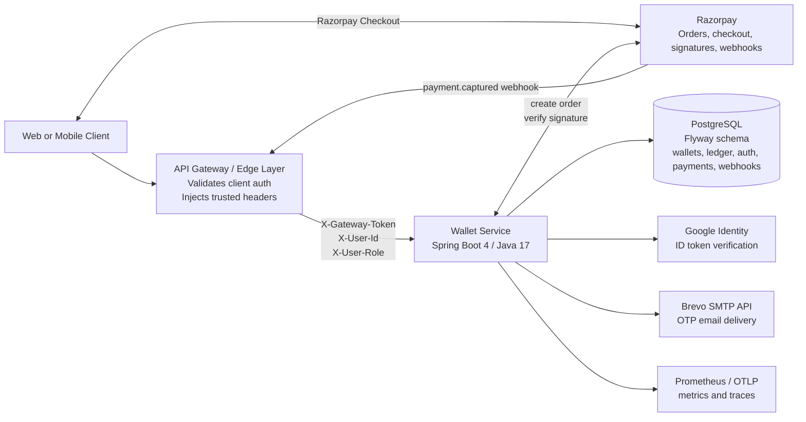

### Main Capabilities

| Area            | Current implementation                                                         |
|-----------------|--------------------------------------------------------------------------------|
| Wallet assets   | Seeded asset types: `GOLD`, `DIAMOND`, `LOYALTY`                               |
| Wallet movement | `TOPUP`, `BONUS`, `SPEND`, `FORFEIT` strategy beans                            |
| Accounting      | Double-entry ledger with debit and credit rows                                 |
| Concurrency     | `READ_COMMITTED` transaction boundaries plus `PESSIMISTIC_WRITE` wallet locks  |
| Idempotency     | Unique `transactions.idempotency_key`; deterministic Razorpay wallet keys      |
| Payments        | Razorpay order creation, signature verification, status tracking               |
| Reconciliation  | Razorpay webhook transactional inbox with polling and strategy dispatch        |
| Auth            | Email/password signup, OTP verification, Google ID token login, refresh tokens |
| Account closure | Positive balance forfeiture flow, PII scrubbing, refresh token revocation      |
| Notifications   | Async OTP email through Brevo HTTP API                                         |
| Scheduling      | Webhook poller every 500 ms; stale payment sweeper every 2 hours               |
| Observability   | Actuator, Prometheus registry, Micrometer metrics, OTLP support                |
| Deployment      | Dockerfile and GitHub Actions production pipeline                              |

## 🐵 Technology Stack

| Component             | Version or source                          | Used for                                                                |
|-----------------------|--------------------------------------------|-------------------------------------------------------------------------|
| Java                  | 17 target                                  | Application runtime and compilation target                              |
| Spring Boot           | `4.0.6` parent                             | Web, validation, JPA, security, actuator, Flyway, OpenTelemetry support |
| Maven wrapper         | Maven `3.9.15`                             | Reproducible local builds                                               |
| PostgreSQL            | Runtime driver from Spring Boot BOM        | Primary transactional database                                          |
| H2                    | Test scope                                 | Unit and Spring context tests                                           |
| Flyway                | Spring Boot starter plus PostgreSQL plugin | Versioned database migrations                                           |
| Hibernate / JPA       | Spring Data JPA                            | Entity mapping, repositories, transactions, row locks                   |
| Hypersistence Utils   | `3.15.2`                                   | TSID entity ids and JSON support                                        |
| JJWT                  | `0.13.0`                                   | JWT generation and validation helper                                    |
| Razorpay Java SDK     | `1.4.8`                                    | Order creation and signature verification                               |
| Google API Client     | `2.7.0`                                    | Google ID token verification                                            |
| OkHttp                | `4.12.0`                                   | Brevo HTTP API calls                                                    |
| org.json              | `20240303`                                 | JSON request construction for Razorpay and Brevo                        |
| ShedLock              | `5.13.0`                                   | Distributed scheduled-job locks                                         |
| Springdoc OpenAPI     | `2.8.13`                                   | OpenAPI JSON and Swagger UI                                             |
| Micrometer Prometheus | Spring Boot managed                        | Prometheus metrics export                                               |
| OpenTelemetry / OTLP  | Spring Boot managed                        | Tracing and production OTLP metrics hooks                               |
| Lombok                | Spring Boot managed                        | DTO, entity, and builder boilerplate reduction                          |
| Mockito               | `5.20.0`                                   | Unit tests                                                              |

## 🐵 Project Structure

```text
.
|-- Dockerfile
|-- pom.xml
|-- mvnw / mvnw.cmd
|-- src
|   |-- main
|   |   |-- java/com/wallet/walletservice
|   |   |   |-- config
|   |   |   |-- controller
|   |   |   |-- domain
|   |   |   |-- dto
|   |   |   |-- exception
|   |   |   |-- repository
|   |   |   `-- service
|   |   |       |-- auth
|   |   |       |-- notification
|   |   |       |-- payment
|   |   |       |-- wallet
|   |   |       `-- webhook
|   |   `-- resources
|   |       |-- application.yaml
|   |       |-- application-dev.yaml
|   |       |-- application-prod.yaml
|   |       `-- db/migration
|   `-- test
|       |-- java/com/wallet/walletservice
|       `-- resources/application-test.yaml
`-- .github/workflows
```

### Package Responsibilities

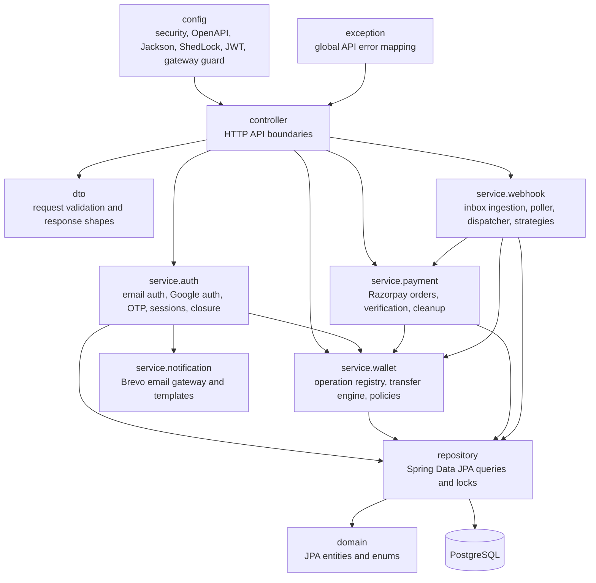

## 🐵 Runtime Request Model

This service is currently designed to sit behind an edge gateway.

`GatewayIngressGuardFilter` runs first and blocks direct traffic unless the request contains:

```text
X-Gateway-Token: <gateway.internal-secret>
```

Only the configured health probe path bypasses this guard. In `prod`, the secret comes from `GATEWAY_INTERNAL_SECRET`. In other profiles, the filter falls back to `default-edge-secret-string-123`.

For protected endpoints, `GatewayIdentityAuthenticationFilter` rebuilds Spring Security authentication from trusted gateway headers:

```text
X-User-Id: <domain user id or system id>
X-User-Role: USER | SYSTEM
```

The service issues JWT access tokens and database-backed refresh tokens, but the current in-service authorization filter does not parse the `Authorization: Bearer ...` header. The deployment pattern is:

1. Client authenticates and receives access/refresh tokens.
2. Gateway validates the client token.
3. Gateway forwards trusted identity headers to Wallet Service.
4. Wallet Service applies role and ownership checks through Spring Security method rules.

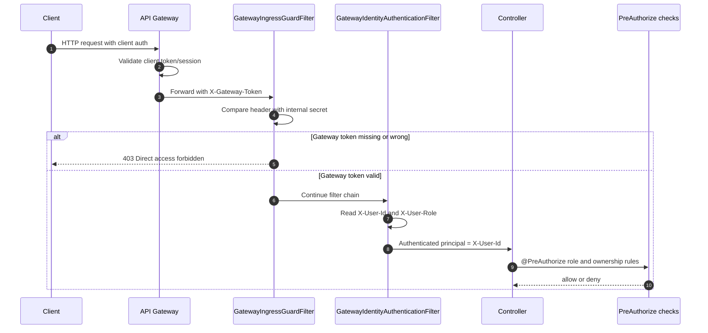

### Access Model

| Endpoint group                           | Security rule after ingress guard                                        |
|------------------------------------------|--------------------------------------------------------------------------|
| Auth signup, login, OTP, Google, refresh | Public in Spring Security, but still behind gateway token                |
| Wallet balance                           | `ROLE_USER` and path `userId == authentication.name`                     |
| Wallet spend                             | `ROLE_USER`, request `userId` must match principal                       |
| Wallet ledger                            | `ROLE_SYSTEM` or owning `ROLE_USER`                                      |
| Wallet top-up and bonus                  | `ROLE_SYSTEM` plus optional `AUTHORIZED_SYSTEM_IDS` allow-list           |
| Payment create, verify, status           | `ROLE_USER`                                                              |
| Account close                            | `ROLE_USER`                                                              |
| Logout                                   | `ROLE_USER` or `ROLE_SYSTEM`, token ownership checked                    |
| Webhook ingestion                        | Intended for gateway/Razorpay ingress; configure gateway route carefully |

## 🐵 Domain Model

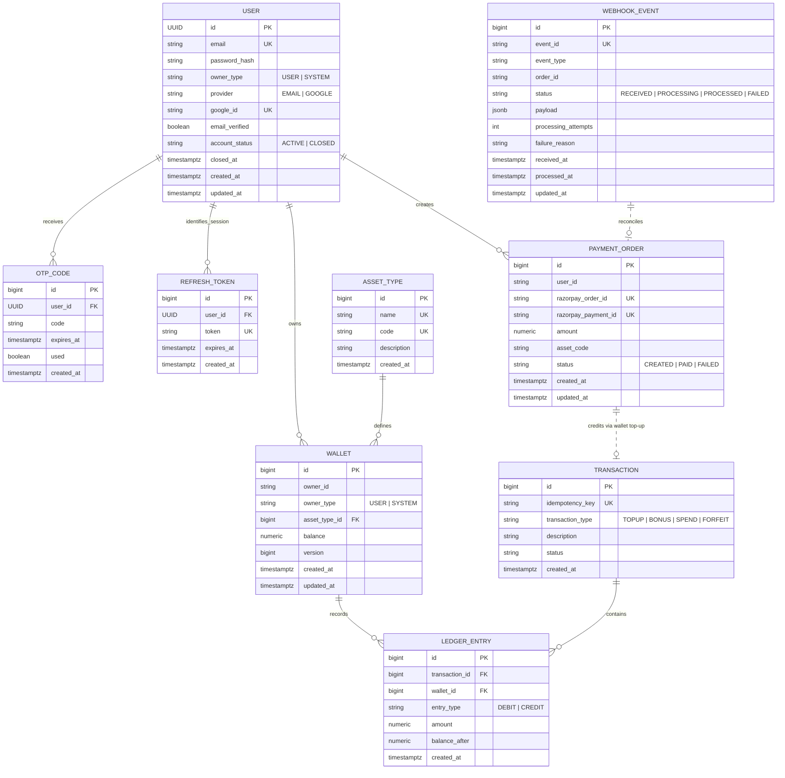

### Entity Details

| Entity         | Important details                                                                                         |
|----------------|-----------------------------------------------------------------------------------------------------------|
| `AssetType`    | Stable catalog of supported wallet assets. Seeded with `GOLD`, `DIAMOND`, `LOYALTY`.                      |
| `Wallet`       | One wallet per `owner_id` and asset type. Stores `balance`, `owner_type`, timestamps, and JPA `@Version`. |
| `Transaction`  | Business-level wallet event. `idempotency_key` is unique and checked before mutation.                     |
| `LedgerEntry`  | Immutable accounting row with `DEBIT` or `CREDIT`, amount, and `balance_after`.                           |
| `PaymentOrder` | Local representation of a Razorpay payment intent and verification state.                                 |
| `WebhookEvent` | Transactional inbox row containing verified raw Razorpay JSON payload as `jsonb`.                         |
| `User`         | Auth profile, owner role, provider, Google link, verification state, and closure state.                   |
| `RefreshToken` | Database-backed session token. Current implementation keeps one active refresh token per user.            |
| `OtpCode`      | 6-digit email verification code with 10-minute expiry and `used` flag.                                    |

## 🐵 Wallet Engine

The wallet engine is centered around `WalletTransferService`. Business operations are thin strategy beans that convert request DTOs into a common `TransferCommand`.

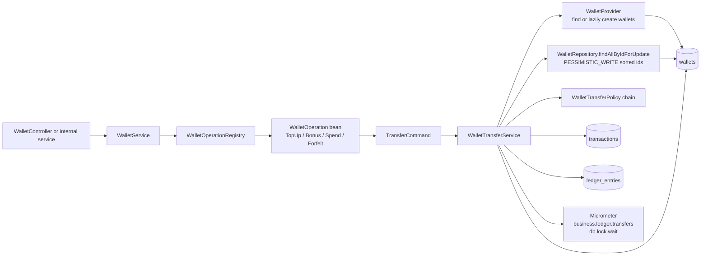

### Operation Mapping

| Transaction type | Debit wallet      | Credit wallet     | Extra policy              |
|------------------|-------------------|-------------------|---------------------------|
| `TOPUP`          | `SYSTEM_TREASURY` | User wallet       | None                      |
| `BONUS`          | `SYSTEM_TREASURY` | User wallet       | None                      |
| `SPEND`          | User wallet       | `SYSTEM_TREASURY` | `SufficientBalancePolicy` |
| `FORFEIT`        | User wallet       | `SYSTEM_TREASURY` | None                      |

### Transfer Sequence

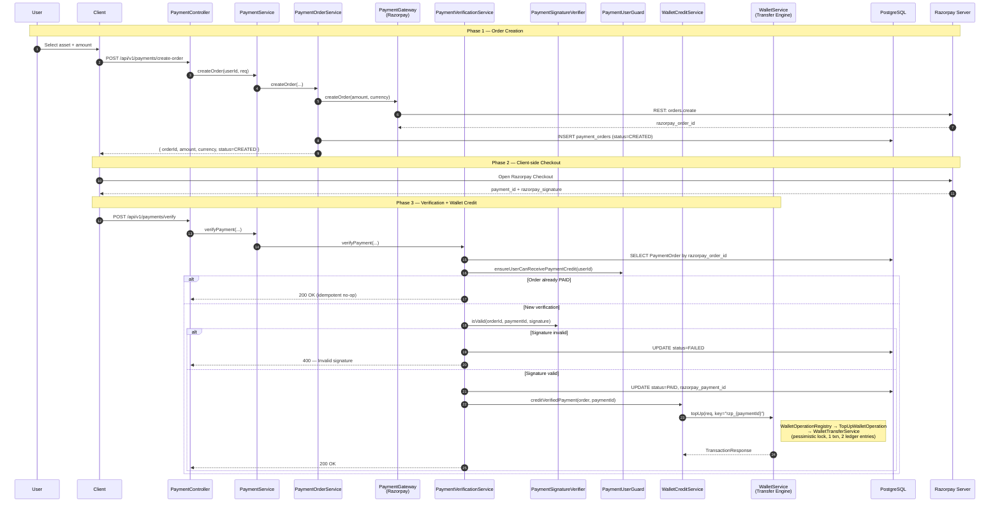

### Financial Invariants

- A successful transfer creates exactly two ledger entries: one `DEBIT`, one `CREDIT`.
- Wallet rows are locked in ascending wallet id order to reduce deadlock risk.
- Spend balance validation happens after locks are acquired.
- `wallets.balance` has a database `CHECK (balance >= 0)` safeguard.
- `ledger_entries.amount` has a database `CHECK (amount > 0)` safeguard.
- `transactions.idempotency_key` is unique.
- `wallets` has a uniqueness rule across owner and asset.
- Lazy wallet creation creates a zero-balance wallet only after the asset code is validated.

## 🐵 Payment Flow

Payments are split into small components under `service/payment`.

| Component                    | Responsibility                                                                      |
|------------------------------|-------------------------------------------------------------------------------------|
| `PaymentController`          | HTTP API for create, verify, and order status                                       |
| `PaymentService`             | Transactional facade                                                                |
| `PaymentOrderService`        | Creates Razorpay orders and stores local `PaymentOrder` rows                        |
| `PaymentGateway`             | Gateway abstraction                                                                 |
| `RazorpayPaymentGateway`     | Razorpay SDK implementation for order creation                                      |
| `PaymentSignatureVerifier`   | Signature verification abstraction                                                  |
| `PaymentVerificationService` | Verifies ownership, signature, duplicate payment id, status transition, and metrics |
| `PaymentUserGuard`           | Rejects payment credits for missing or closed users                                 |
| `WalletCreditService`        | Converts paid orders into wallet `TOPUP` requests                                   |
| `PaymentCleanupService`      | Fails stale `CREATED` orders older than 2 hours                                     |
| `PaymentSweeperJob`          | Runs cleanup every 2 hours with ShedLock                                            |

### Create And Verify

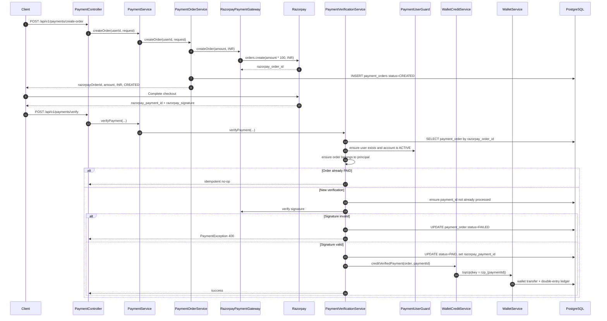

### Payment State Machine

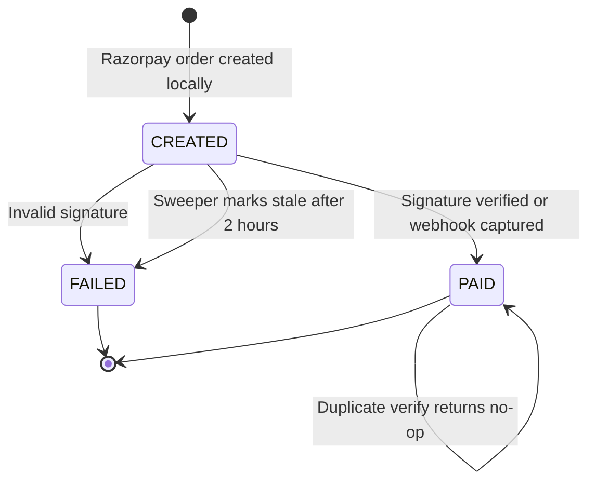

### Payment Idempotency

| Layer                             | Key or guard                                                              |
|-----------------------------------|---------------------------------------------------------------------------|
| Payment order                     | `razorpay_order_id` unique                                                |
| Payment capture                   | `razorpay_payment_id` unique                                              |
| Client verification wallet credit | `rzp_{razorpayPaymentId}`                                                 |
| Webhook wallet credit             | `rzp_webhook_{razorpayPaymentId}` plus payment order `PAID` short-circuit |
| Stale cleanup                     | Bulk updates only `CREATED` orders older than cutoff                      |


### Why Verification Is Split into Small Collaborators

`PaymentVerificationService` is intentionally a thin orchestrator that delegates to single-purpose collaborators (`PaymentSignatureVerifier`, `PaymentUserGuard`, `WalletCreditService`). Each collaborator can be unit-tested in isolation, and swapping the gateway later (Stripe, PayU, etc.) is a matter of providing alternative `PaymentGateway` / `PaymentSignatureVerifier` beans — no changes to controllers or the wallet engine.

### Stale Payment Order Sweeper (Cron Job)

To prevent abandoned checkouts or orphaned payment intents from lingering indefinitely, `PaymentSweeperJob` runs every 2 hours (`@Scheduled(cron = "0 0 0/2 * * *")`).

It delegates to `PaymentCleanupService`, which executes a bulk database update to find any `PaymentOrder` stuck in the `CREATED` state past a 2-hour cutoff time and automatically transitions its status to `FAILED`. This ensures:
- The database remains clean of stale pending records.
- Financial reporting accurately reflects failed or abandoned conversion attempts.
- Operators can distinguish abandoned payment intents from successfully paid orders.

Current behavior note: cleanup is an operational state transition, not a strict TTL enforcement boundary. The verification path should be reviewed if the product requires hard rejection of every previously `FAILED` order.

Current amount behavior: `PaymentOrderRequest.amount` is stored as given, and `RazorpayPaymentGateway` multiplies it by `100` before calling Razorpay. That means the implementation currently treats the request amount as INR major units, then converts it to paise for Razorpay.

## 🐵 Webhook Reconciliation

The webhook pipeline uses a transactional inbox pattern. The controller acknowledges Razorpay quickly after signature verification and persistence. A scheduled worker processes stored events asynchronously.

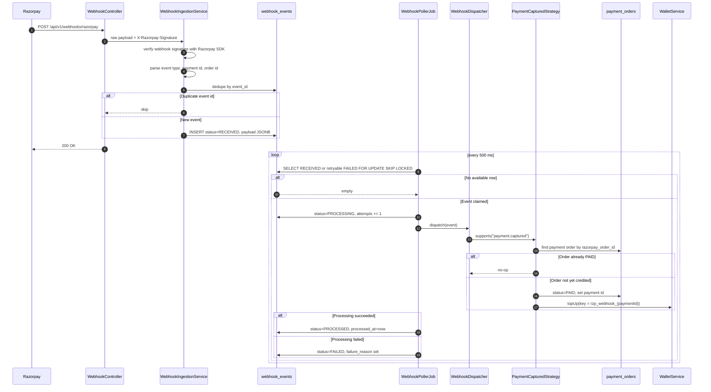

### Webhook Components

| Component                                       | Detail                                                                           |
|-------------------------------------------------|----------------------------------------------------------------------------------|
| `WebhookController`                             | Receives raw payload and `X-Razorpay-Signature`.                                 |
| `WebhookIngestionService`                       | Verifies signature, parses JSON, extracts order id, dedupes, persists inbox row. |
| `WebhookEventRepository.findNextAvailableEvent` | Uses native SQL `FOR UPDATE SKIP LOCKED`.                                        |
| `WebhookPollerJob`                              | Scheduled every 500 ms, retries failed rows while `processing_attempts < 3`.     |
| `WebhookDispatcher`                             | Finds the first `WebhookHandlerStrategy` supporting the event type.              |
| `PaymentCapturedStrategy`                       | Handles `payment.captured`, marks order `PAID`, and credits wallet if needed.    |

### Transactional Inbox for Guaranteed Reconciliation

Relying solely on client-side confirmation creates a critical vulnerability: if a user's browser crashes after payment but before the `/verify` call, funds are deducted without crediting the wallet. To ensure absolute ledger reconciliation, this project implements the **Transactional Inbox Pattern**:

*   **Atomic Ingestion:** Raw JSONB payloads are cryptographically verified (HMAC-SHA256) and immediately persisted as `RECEIVED`. This ensures a near-instant 200 OK response to Razorpay, preventing gateway timeouts.
*   **Scalable Processing:** `WebhookPollerJob` uses PostgreSQL's `SELECT FOR UPDATE SKIP LOCKED` to process events asynchronously and horizontally across service instances without lock contention.
*   **Bounded Retries:** Each event has a `processing_attempts` counter; the poller stops claiming rows that have already hit `MAX_ATTEMPTS = 3`, parking them as `FAILED` for manual reconciliation (a future DLQ hook).
*   **Idempotent Credits:** The strategy uses `rzp_webhook_{paymentId}` as the wallet idempotency key (distinct from `rzp_{paymentId}` used by the client-side `/verify` flow). Combined with the `PaymentOrder.status == PAID` short-circuit, the wallet is credited exactly once even if both paths race.
*   **Open for Extension:** Handling a new Razorpay event (`refund.processed`, `order.paid`, etc.) is just a new `WebhookHandlerStrategy` bean — the dispatcher and poller stay untouched.


Current ingestion detail: `event_id` is populated from the Razorpay payment entity id in the payload, so duplicate detection is effectively payment-id based for payment webhooks.

## 🐵 Authentication And Account Lifecycle

Auth is exposed by `AuthController` and orchestrated through `AuthService`.

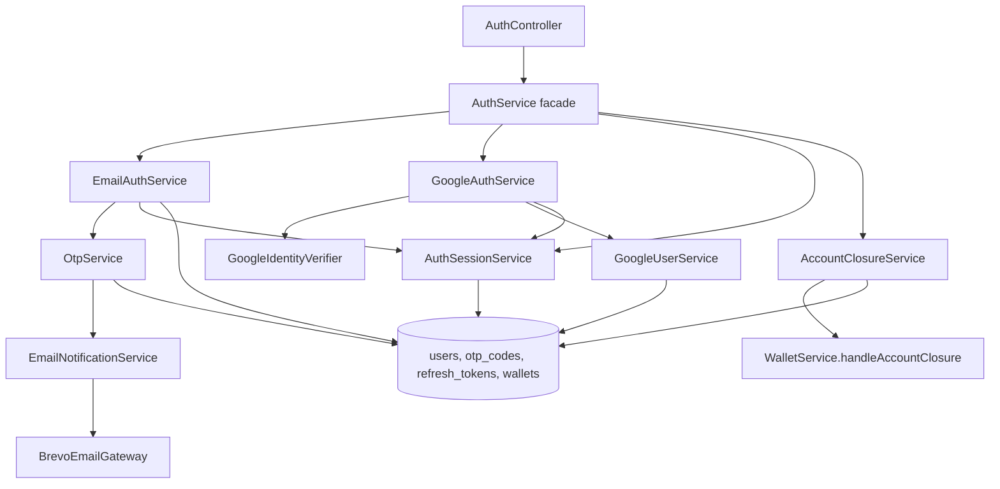

### Email Signup And OTP

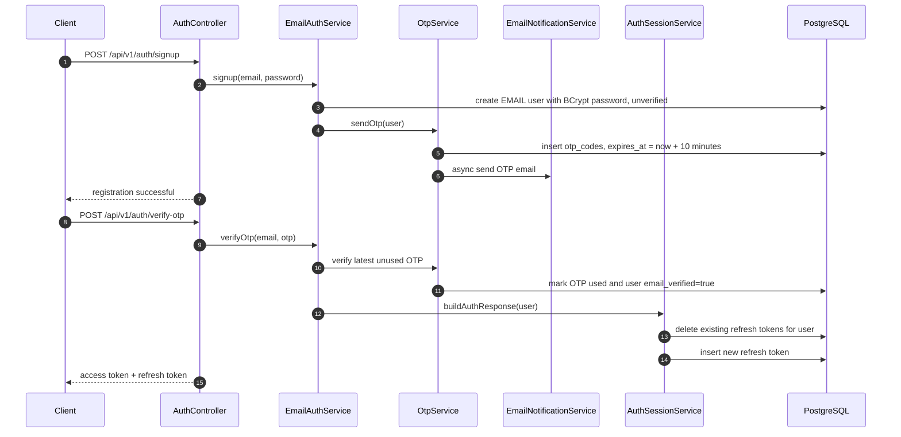

### Login, Refresh, Logout

| Flow                  | Behavior                                                                                                                                  |
|-----------------------|-------------------------------------------------------------------------------------------------------------------------------------------|
| Email login           | Requires password match and `email_verified=true`; Google-only accounts are rejected from password login.                                 |
| Google ID token login | Verifies Google token audience, finds by Google id, links existing email account, or creates a Google user.                               |
| Refresh token         | Looks up DB token, rejects expired token, rejects closed account, returns a new access token.                                             |
| Logout                | Deletes the provided refresh token only when it belongs to the authenticated principal.                                                   |
| Session model         | `AuthSessionService.createRefreshToken` deletes existing refresh tokens first, so the current model is one active refresh token per user. |

### Account Closure

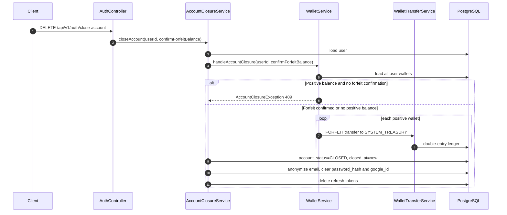

## 🐵 Notification Flow

OTP email is intentionally isolated from auth logic:

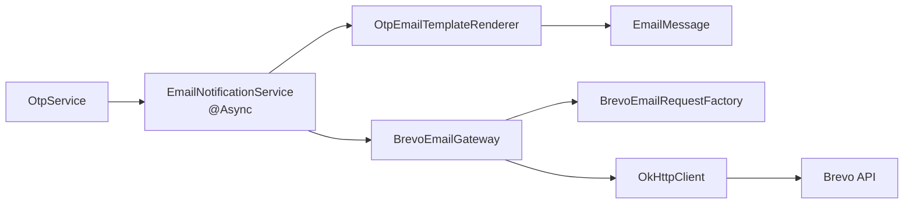

If Brevo configuration is missing, the gateway logs an error and returns without throwing. That avoids breaking the request thread, but production should alert on email delivery failures.

## 🐵 API Reference

All response bodies use:

```json
{
  "success": true,
  "message": "optional message",
  "data": {}
}
```

### Authentication

| Method   | Endpoint                      | Access                | Request               | Response             |
|----------|-------------------------------|-----------------------|-----------------------|----------------------|
| `POST`   | `/api/v1/auth/signup`         | Public behind gateway | `SignUpRequest`       | Message              |
| `POST`   | `/api/v1/auth/verify-otp`     | Public behind gateway | `VerifyOtpRequest`    | `AuthResponse`       |
| `POST`   | `/api/v1/auth/login`          | Public behind gateway | `LoginRequest`        | `AuthResponse`       |
| `POST`   | `/api/v1/auth/resend-otp`     | Public behind gateway | `ResendOtpRequest`    | Message              |
| `POST`   | `/api/v1/auth/google`         | Public behind gateway | `GoogleAuthRequest`   | `AuthResponse`       |
| `POST`   | `/api/v1/auth/refresh-token`  | Public behind gateway | `TokenRefreshRequest` | `AuthResponse`       |
| `POST`   | `/api/v1/auth/oauth2/success` | Public behind gateway | `token` query param   | Access token wrapper |
| `POST`   | `/api/v1/auth/logout`         | User/System           | `LogoutRequest`       | Message              |
| `DELETE` | `/api/v1/auth/close-account`  | User                  | `AccountCloseRequest` | Message              |

### Wallet

| Method | Endpoint                                         | Access                | Description                                      |
|--------|--------------------------------------------------|-----------------------|--------------------------------------------------|
| `GET`  | `/api/v1/wallets/{userId}/balance`               | Owning user           | Return all wallets for user                      |
| `GET`  | `/api/v1/wallets/{userId}/ledger?assetCode=GOLD` | System or owning user | Return ledger entries newest first               |
| `POST` | `/api/v1/wallets/topUp`                          | System                | Credit user from `SYSTEM_TREASURY`               |
| `POST` | `/api/v1/wallets/bonus`                          | System                | Issue promotional credits from `SYSTEM_TREASURY` |
| `POST` | `/api/v1/wallets/spend`                          | User                  | Debit user wallet and credit `SYSTEM_TREASURY`   |

### Payments

| Method | Endpoint                                  | Access | Description                                     |
|--------|-------------------------------------------|--------|-------------------------------------------------|
| `POST` | `/api/v1/payments/create-order`           | User   | Create Razorpay order and local `PaymentOrder`  |
| `POST` | `/api/v1/payments/verify`                 | User   | Verify payment signature and credit wallet      |
| `GET`  | `/api/v1/payments/order-status/{orderId}` | User   | Return order status for the authenticated owner |

### Webhooks

| Method | Endpoint                    | Access                 | Description                                    |
|--------|-----------------------------|------------------------|------------------------------------------------|
| `POST` | `/api/v1/webhooks/razorpay` | Gateway/Razorpay route | Verify signature and persist webhook inbox row |

### Important Request DTOs

| DTO                    | Required fields                                             |
|------------------------|-------------------------------------------------------------|
| `TopUpRequest`         | `userId`, `assetCode`, `amount > 0`, `idempotencyKey`       |
| `BonusRequest`         | `userId`, `assetCode`, `amount > 0`, `idempotencyKey`       |
| `SpendRequest`         | `userId`, `assetCode`, `amount > 0`, `idempotencyKey`       |
| `PaymentOrderRequest`  | `amount >= 100`, `assetCode`                                |
| `PaymentVerifyRequest` | `razorpayPaymentId`, `razorpayOrderId`, `razorpaySignature` |
| `AccountCloseRequest`  | `confirmForfeitBalance`                                     |

### Error Handling

`GlobalExceptionHandler` normalizes failures into the same `ApiResponse` wrapper.

| Exception or failure                     | HTTP status                  | Notes                                                                                                                        |
|------------------------------------------|------------------------------|------------------------------------------------------------------------------------------------------------------------------|
| `InsufficientBalanceException`           | `422 Unprocessable Content`  | Spend policy rejected after wallet lock acquisition.                                                                         |
| `WalletNotFoundException`                | `404 Not Found`              | Balance or ledger wallet lookup failed.                                                                                      |
| `AssetTypeNotFoundException`             | `400 Bad Request`            | Unknown asset code.                                                                                                          |
| `DuplicateTransactionException`          | `409 Conflict`               | Defined for mismatched idempotency replay, though current transfer service returns existing identical transactions directly. |
| `AuthException`                          | `400 Bad Request`            | Signup/login/session domain auth failures.                                                                                   |
| `GoogleAuthException`                    | `401 Unauthorized`           | Invalid or unverifiable Google ID token.                                                                                     |
| `PaymentException`                       | Custom status from exception | Payment services attach the correct status, such as `400`, `403`, `404`, `409`, or `502`.                                    |
| `SecurityException`                      | `401 Unauthorized`           | Webhook signature and security boundary failures.                                                                            |
| `AuthenticationException`                | `401 Unauthorized`           | Spring Security authentication failure.                                                                                      |
| `AccessDeniedException`                  | `403 Forbidden`              | Role, ownership, or session ownership mismatch.                                                                              |
| `UserNotFoundException`                  | `404 Not Found`              | User lookup failed.                                                                                                          |
| `AccountClosureException`                | `409 Conflict`               | Positive balance without explicit forfeit confirmation.                                                                      |
| `MethodArgumentNotValidException`        | `400 Bad Request`            | Field-level validation errors returned as a map.                                                                             |
| `HttpMessageNotReadableException`        | `400 Bad Request`            | Malformed JSON or missing body.                                                                                              |
| `HttpMediaTypeNotSupportedException`     | `415 Unsupported Media Type` | Non-JSON content type where JSON is expected.                                                                                |
| `HttpRequestMethodNotSupportedException` | `405 Method Not Allowed`     | Wrong HTTP method.                                                                                                           |
| `NoResourceFoundException`               | `404 Not Found`              | Unknown endpoint or static resource.                                                                                         |
| Any other `Exception`                    | `500 Internal Server Error`  | Generic fallback hides implementation details from clients.                                                                  |

## Persistence And Migrations

Flyway is enabled in normal profiles and disabled in tests. Hibernate runs with `ddl-auto=validate`, so the application expects Flyway to own schema creation.

| Migration                            | Purpose                                                                            |
|--------------------------------------|------------------------------------------------------------------------------------|
| `V1__init_schema.sql`                | Creates `asset_types`, `wallets`, `transactions`, `ledger_entries`, and indexes.   |
| `V2__init_schema.sql`                | Seeds asset types, treasury wallets, sample user wallets, and reward pool wallets. |
| `V3__auth_schema.sql`                | Creates `users` and `otp_codes`.                                                   |
| `V4__payment_orders_schema.sql`      | Creates `payment_orders` and a local/dev seed order.                               |
| `V5__auth_and_closure_schema.sql`    | Adds user closure state and creates `refresh_tokens`.                              |
| `V6__webhook_idempotency_schema.sql` | Creates `webhook_events` JSONB inbox and polling indexes.                          |
| `V7__shedlock_and_cleanup.sql`       | Creates `shedlock` and payment cleanup index.                                      |

### Seeded Assets

| Code      | Name           | Purpose                  |
|-----------|----------------|--------------------------|
| `GOLD`    | Gold Coins     | Primary in-game currency |
| `DIAMOND` | Diamonds       | Premium currency         |
| `LOYALTY` | Loyalty Points | Activity/reward points   |

### Seeded System Owners

| Owner id             | Purpose                                                                  |
|----------------------|--------------------------------------------------------------------------|
| `SYSTEM_TREASURY`    | Counterparty for current top-up, bonus, spend, and forfeit operations    |
| `SYSTEM_REWARD_POOL` | Seeded system wallet owner, not currently used by wallet operation beans |

## 🐵 Configuration

### Core Application

| Property or env var             | Purpose                                       |
|---------------------------------|-----------------------------------------------|
| `SPRING_PROFILES_ACTIVE`        | Profile selection. Default profile is `dev`.  |
| `SERVER_PORT`                   | Service port. Defaults to `8081`.             |
| `SPRING_DATASOURCE_URL`         | PostgreSQL JDBC URL.                          |
| `SPRING_DATASOURCE_USERNAME`    | PostgreSQL username.                          |
| `SPRING_DATASOURCE_PASSWORD`    | PostgreSQL password.                          |
| `DB_POOL_NAME`                  | Hikari pool name.                             |
| `DB_POOL_AUTO_COMMIT`           | Hikari auto-commit flag. Recommended `false`. |
| `DB_POOL_MAX_SIZE`              | Max Hikari pool size.                         |
| `DB_POOL_MIN_IDLE`              | Min idle Hikari connections.                  |
| `DB_POOL_CONNECTION_TIMEOUT_MS` | Connection acquisition timeout.               |
| `DB_POOL_IDLE_TIMEOUT_MS`       | Idle connection timeout.                      |
| `DB_POOL_MAX_LIFETIME_MS`       | Max connection lifetime.                      |
| `DB_POOL_VALIDATION_TIMEOUT_MS` | Validation timeout.                           |
| `HIBERNATE_JDBC_FETCH_SIZE`     | Hibernate JDBC fetch size.                    |

### Security And Auth

| Property or env var       | Purpose                                                                     |
|---------------------------|-----------------------------------------------------------------------------|
| `GATEWAY_INTERNAL_SECRET` | Production ingress secret expected in `X-Gateway-Token`.                    |
| `AUTHORIZED_SYSTEM_IDS`   | Optional comma-separated allow-list for sensitive system wallet operations. |
| `JWT_SECRET`              | Base64 secret used by `JwtTokenProvider`.                                   |
| `JWT_EXPIRATION_ACCESS`   | Access token lifetime in ms.                                                |
| `JWT_EXPIRATION_REFRESH`  | Refresh token lifetime in ms.                                               |
| `GOOGLE_CLIENT_ID`        | Google OAuth/ID token audience.                                             |
| `GOOGLE_CLIENT_SECRET`    | Google OAuth client secret.                                                 |

### External Providers

| Property or env var       | Purpose                                           |
|---------------------------|---------------------------------------------------|
| `RAZORPAY_KEY_ID`         | Razorpay API key id.                              |
| `RAZORPAY_KEY_SECRET`     | Razorpay API secret and payment signature secret. |
| `RAZORPAY_WEBHOOK_SECRET` | Razorpay webhook signature secret.                |
| `BREVO_API_KEY`           | Brevo API key.                                    |
| `BREVO_SENDER_EMAIL`      | Verified sender email.                            |
| `MAIL_SENDER_NAME`        | Sender display name.                              |

### Observability

| Property or env var        | Purpose                              |
|----------------------------|--------------------------------------|
| `ACTUATOR_OBSCURE_PATH`    | Production actuator base path.       |
| `OTLP_GRAFANA_URL`         | OTLP metrics endpoint in production. |
| `OTLP_GRAFANA_AUTH_HEADER` | OTLP authorization header value.     |

### JWT Secret Generation

`JwtTokenProvider` Base64-decodes `JWT_SECRET`, so provide a Base64 value with enough entropy:

```bash
openssl rand -base64 64
```

## 🐵 Running Locally

### Prerequisites

- Java 17
- PostgreSQL
- Maven wrapper from this repo
- Razorpay credentials if testing payments
- Brevo credentials if testing OTP email delivery
- Google client id if testing Google login

### Start PostgreSQL

Create a local database, for example:

```sql
CREATE DATABASE walletdb;
```

### Configure Environment

The `dev` profile imports `.env` through:

```yaml
spring:
  config:
    import: "optional:file:.env[.properties]"
```

Create `.env` with the variables listed above.
### Run

```bash
./mvnw spring-boot:run
```

The service defaults to:

```text
http://localhost:8081
```

### Local Request Headers

Because the ingress guard runs locally too, direct API calls need the gateway token header:

```bash
curl -H "X-Gateway-Token: default-edge-secret-string-123" \
  http://localhost:8081/actuator/health
```

Protected endpoint calls also need trusted identity headers when bypassing the real gateway:

```bash
curl -H "X-Gateway-Token: default-edge-secret-string-123" \
  -H "X-User-Id: <user-uuid>" \
  -H "X-User-Role: USER" \
  http://localhost:8081/api/v1/wallets/<user-uuid>/balance
```

Swagger is configured at `/swagger-ui.html`, but direct browser access will be blocked by the ingress guard unless requests are routed through a gateway/proxy that injects `X-Gateway-Token`.

## 🐵 Docker And CI/CD

### Docker Image

The repo contains a multi-stage `Dockerfile`:

1. Build stage uses `maven:3.9.6-eclipse-temurin-17`.
2. Runtime stage uses `eclipse-temurin:17-jre-jammy`.
3. Runs as non-root `appuser`.
4. Maps Render-style `PORT` into `SERVER_PORT`.
5. Uses memory-conscious JVM flags: `UseSerialGC`, `-Xmx256m`, `-Xss512k`, `MaxMetaspaceSize=128m`.

Build locally:

```bash
docker build -t wallet-service .
```

Run with environment variables:

```bash
docker run --rm -p 8081:8081 --env-file .env wallet-service
```

There is currently no `docker-compose.yml` in the repository, so database orchestration must be handled separately. Since this service is behind an edge gateway, local development is orchestrated using a separate directory `wallet-infra-local` which contains centralized/unified [`docker-compose.yaml`](https://drive.google.com/file/d/1cLtWTUniKKf_XbewHfhwUv7DNIrsaYro/view?usp=sharing) configuration.

### CI/CD Pipeline

```mermaid
flowchart LR
    Push["Push to production branch"]
    Checkout["actions/checkout"]
    Java["Setup Java 17<br/>Maven cache"]
    Test["mvn test"]
    Package["mvn clean package -DskipTests"]
    Login["Docker Hub login"]
    Build["docker build<br/>tag sha and latest"]
    PushImage["docker push"]
    Deploy["POST DEPLOY_WEBHOOK_URL"]

    Push --> Checkout --> Java --> Test --> Package --> Login --> Build --> PushImage --> Deploy
```

The workflow runs only on pushes to the `production` branch.

## 🐵 Observability

### Actuator

Default profile exposes:

```text
/actuator/health
/actuator/info
/actuator/prometheus
/v3/api-docs
/swagger-ui.html
```

Production profile hardens actuator behavior:

- Base path becomes `/${ACTUATOR_OBSCURE_PATH:internal-probe-849284}`.
- Only `health` is exposed.
- Health details are hidden.
- Graceful shutdown is enabled with a 30-second shutdown phase timeout.

### Business Metrics

| Metric                              | Tags                                       | Emitted by                   |
|-------------------------------------|--------------------------------------------|------------------------------|
| `business.ledger.transfers`         | `operation`, `status`, `error`             | `WalletTransferService`      |
| `db.lock.wait`                      | `lock_type`, `entity`                      | `WalletTransferService`      |
| `business.payment.orders`           | `status`, `gateway`, `reason`              | `PaymentVerificationService` |
| `business.webhook.processing`       | `event_type`, `status`, `attempt`, `error` | `WebhookPollerJob`           |
| `business.webhook.latency`          | `event_type`                               | `WebhookPollerJob`           |
| `business.webhook.strategy.latency` | `strategy`                                 | `WebhookDispatcher`          |

### Serialization

`JacksonConfig` registers Java time support, writes dates as ISO values, writes `BigDecimal` values plainly, and deserializes floating point JSON numbers as `BigDecimal` for financial precision.

## 🐵 Tests

Run all tests:

```bash
./mvnw test
```

The test profile uses H2 in PostgreSQL compatibility mode and disables Flyway.

Current test coverage includes:

| Test class                       | Coverage                                                              |
|----------------------------------|-----------------------------------------------------------------------|
| `WalletServiceApplicationTests`  | Spring context load                                                   |
| `GlobalExceptionHandlerTest`     | Google auth error mapping                                             |
| `WalletServiceTest`              | Missing wallet ledger lookup                                          |
| `GoogleIdentityVerifierTest`     | Malformed Google token handling                                       |
| `GoogleUserServiceTest`          | Google account linking and closed account rejection                   |
| `BrevoEmailRequestFactoryTest`   | Brevo JSON payload construction                                       |
| `EmailNotificationServiceTest`   | OTP email composition and gateway delegation                          |
| `PaymentVerificationServiceTest` | Valid signature, invalid signature, already-paid idempotency          |
| `WalletTransferServiceTest`      | Idempotent duplicate return, sorted wallet locks, double-entry writes |

## 🐵 Technical Integrity Checklist

- [x] Versioned schema through Flyway.
- [x] Double-entry ledger for wallet movement.
- [x] Pessimistic wallet locks for balance mutation.
- [x] Consistent lock ordering for deadlock reduction.
- [x] Idempotency keys for wallet operations.
- [x] Payment order tracking through `CREATED`, `PAID`, and `FAILED`.
- [x] Razorpay server-side signature verification.
- [x] Asynchronous webhook inbox with `FOR UPDATE SKIP LOCKED`.
- [x] ShedLock for distributed stale payment cleanup.
- [x] Email OTP verification with async Brevo delivery.
- [x] Google ID token login and account linking.
- [x] Account closure with balance forfeiture and PII scrubbing.
- [x] Actuator, Prometheus metrics, and OTLP production hooks.


## 🐵 Future Roadmap

- [x] Add a Flyway migration dedicated to the `payment_orders` table if not already applied in the target environment.
- [x] Add Razorpay webhook handling for asynchronous reconciliation of paid, failed, and captured payment events.
- [x] Add payment order expiry and stale order cleanup.
- [x] Add a payment order status endpoint so clients can poll order state safely.
- [ ] Add refund support and reverse-ledger entries for failed fulfillment or customer refunds.
- [ ] Add stronger reconciliation reports between Razorpay payments, `payment_orders`, wallet `transactions`, and `ledger_entries`.
- [x] Add integration tests for payment verification, duplicate verification, invalid signatures, and wallet credit idempotency.
- [ ] Add admin APIs for payment investigation and manual reconciliation.
- [x] Add rate limiting for auth, payment creation, and verification endpoints.
- [x] Add webhook signature verification and replay protection.
- [x] Add observability dashboards for payment success rate, ledger failures, lock wait time, and retry patterns.
