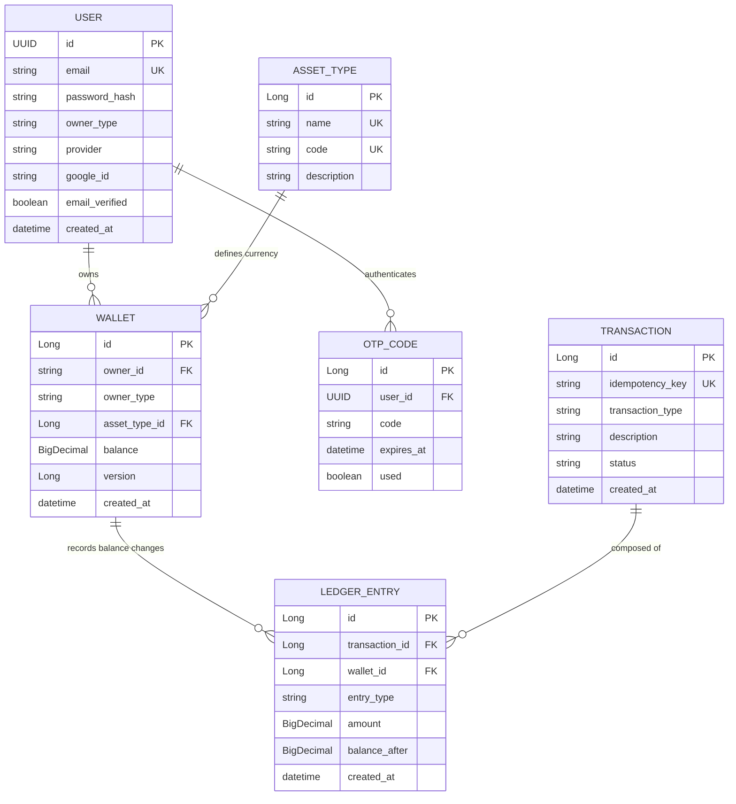

# 💰 Wallet Service

A high-performance, financially rigorous digital wallet service built with Spring Boot 3. Designed for high concurrency, absolute data integrity, and complete auditability using a double-entry ledger system.

---

## 🏗 System Architecture & Entity Relationships

The following diagram illustrates the relationship between users, their wallets, and the immutable audit trail created by transactions and ledger entries.



---

## 🚀 Quick Start (Docker - Recommended)

### Prerequisites
- Docker and Docker Compose installed

### Run everything in one command
```bash
docker-compose up --build
```

This will:
1. Start PostgreSQL.
2. Run Flyway migrations (schema and seed data).
3. Start the Wallet Service on http://localhost:8080.

### Swagger UI
Explore and test all endpoints interactively at:
http://localhost:8080/swagger-ui.html

---

## 🛠 Local Development (Manual Setup)

### Prerequisites
- Java 17+
- PostgreSQL running locally

### Setup
1. Database: Create a database named "walletdb".
2. Environment: Copy .env.example to .env and configure your database credentials and secrets.
3. Run:
   ./mvnw spring-boot:run

---

## 🛡 Key Financial Features

### 1. Double-Entry Ledger (Auditability)
Every transaction follows the fundamental rule of accounting: for every debit, there is an equal and opposite credit. This ensures the total money in the system is always balanced and provides an immutable audit trail.
- Wallet Balance: authoritative fast-read cache.
- Ledger Entries: Immutable history used to reconstruct balances if needed.

### 2. Concurrency and Race Condition Prevention
We use Pessimistic Write Locking (SELECT FOR UPDATE) to handle high-frequency concurrent updates to the same wallet.
- Lock Ordering: To prevent Deadlocks, the service always sorts wallet IDs in ascending order before acquiring locks.
- Optimistic Locking: Secondary safety layer using @Version fields.

### 3. Absolute Idempotency
Every financial request requires an idempotencyKey.
- First Request: Processes and saves the transaction.
- Duplicate Request: Detects the existing key and returns the original response without re-processing, preventing double-billing.

---

## 📡 API Reference

### Auth API (Public)
| Method | Endpoint | Description |
|--------|----------|-------------|
| POST | /api/v1/auth/signup | Register with email/password (sends OTP) |
| POST | /api/v1/auth/verify-otp | Verify OTP and receive JWT |
| POST | /api/v1/auth/login | Login with credentials and receive JWT |
| POST | /api/v1/auth/resend-otp | Resend OTP verification email |
| POST | /api/v1/auth/google | Login/Signup with Google ID Token (Frontend) |
| POST | /api/v1/auth/oauth2/success | OAuth2 landing (returns JWT) |

### Wallet API (Protected)
| Method | Endpoint | Description |
|--------|----------|-------------|
| GET | /api/v1/wallets/{userId}/balance | Get all balances for a user |
| POST | /api/v1/wallets/spend | USER: Spend credits from own wallet |
| POST | /api/v1/wallets/topUp | SYSTEM: Credit a user (Simulate purchase) |
| POST | /api/v1/wallets/bonus | SYSTEM: Issue free incentive credits |
| GET | /api/v1/wallets/{userId}/ledger | View audit trail for a specific asset |

---

## ✅ Technical Integrity Checklist

- [x] Pessimistic Locking for balance safety.
- [x] Deadlock Avoidance via consistent lock ordering.
- [x] Idempotent API design.
- [x] Flyway managed schema migrations.
- [x] TSID (Time-Sorted Unique Identifiers) for efficient DB indexing.
- [x] JWT and OAuth2 security integration.

---

## 🔮 Future Roadmap
- [ ] Payment Gateway Integration: Direct integration with Razorpay/Stripe for automated Top-Ups.
- [ ] Webhook System: Notify external services upon transaction success/failure.
- [ ] Multi-Currency Support: Automated conversion between asset types.
