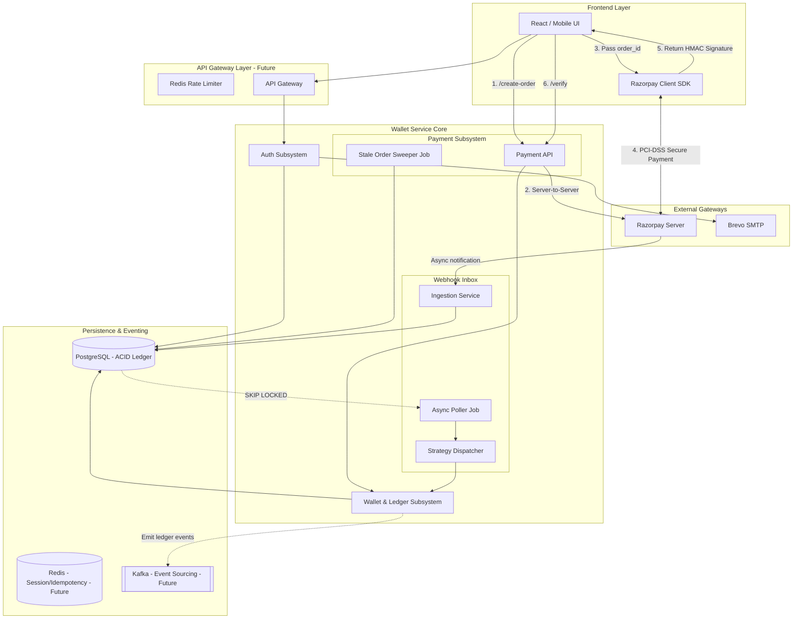
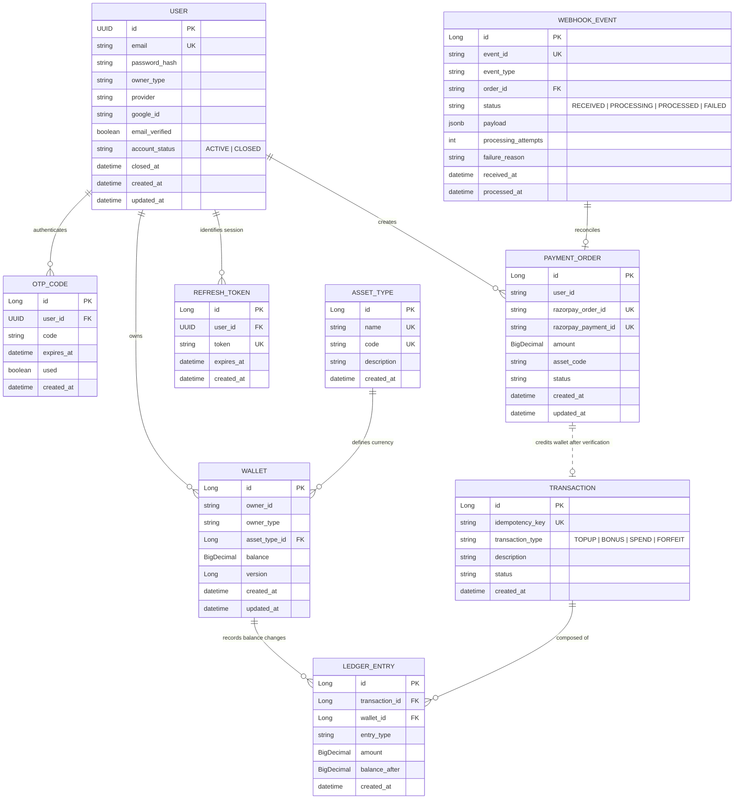
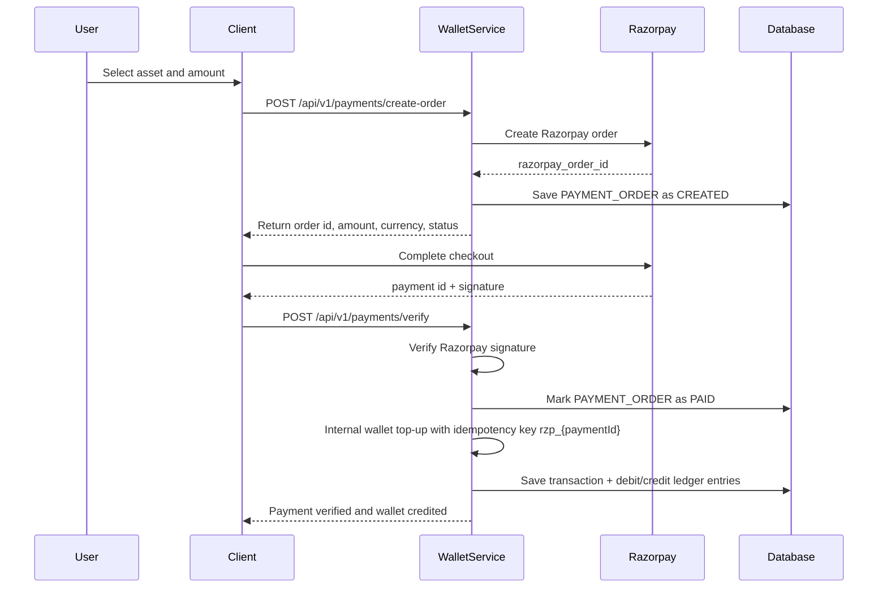

# 💰 Wallet Service

A high-performance, financially rigorous digital wallet service built with Spring Boot 4. The service manages user wallets, supports multiple asset types, records every balance movement through a double-entry ledger, integrated with Razorpay so authenticated users can purchase wallet credits through real payment orders, and provides a secure session management system using JWT and Refresh Tokens.

* [Initial Requirement](https://drive.google.com/file/d/1PTFW5_xbD04Lx3RW_QgvM-MmMYp23y78/view?usp=sharing)
---

## 📌 What This Project Is

Wallet Service is a backend application for managing prepaid digital balances such as Gold Coins, Diamonds, and Loyalty Points. It is designed for products where users buy credits, receive promotional bonuses, and spend those credits inside an application.

The important design goal is that wallet balance must be fast to read, safe to update, and fully auditable. To achieve that, the project stores the current wallet balance on the `wallets` table for quick reads, while every financial movement is also written to immutable `ledger_entries`. The ledger is the source of truth for audit and reconciliation, and the wallet balance acts as an optimized projection of that ledger. 

The app now also includes payment integration. A user does not directly call the internal system top-up endpoint. Instead, the user creates a Razorpay order, completes payment on the client side, and sends the Razorpay payment details back to this service. The service verifies the Razorpay signature server-side, marks the payment order as paid, and then credits the wallet using the same internal double-entry wallet flow used by trusted system top-up. It also supports account lifecycle management, including secure logout and GDPR-compliant account closure.


---

## 🧭 How The Application Works

1. A user signs up using email and password, verifies OTP, or logs in through Google.
2. The service issues a short-lived **Access Token** (`5` mins) and a long-lived **Refresh Token** (7 days).
3. Protected wallet and payment endpoints use Spring Security and JWT authentication.
4. Each user can own one wallet per asset type, such as `GOLD`, `DIAMOND`, or `LOYALTY`.
5. Wallet operations are modeled as financial transfers between two wallets:
   - Top-up: `SYSTEM_TREASURY` debits, user wallet credits.
   - Bonus: `SYSTEM_TREASURY` debits, user wallet credits.
   - Spend: user wallet debits, `SYSTEM_TREASURY` credits.
6. Every successful transfer creates one transactions row and exactly two ledger_entries rows.
7. Payment purchases use a payment_orders table to track the external Razorpay order lifecycle before wallet credit happens.
8. Account Closure Flow:
   - Verifies that all wallets are empty or explicitly confirmed for forfeiture.
   - Forfeits remaining balances to the treasury.
   - Scrubs PII (email/password) and marks the account as `CLOSED`.
   - Revokes all active refresh tokens immediately.

This separation keeps payment processing and wallet accounting clean. Razorpay integration answers the question, "Did real money payment succeed?" Wallet Service answers the question, "How should credits move inside our system after that payment succeeds?"




---

## 🏗 System Architecture & Entity Relationships

The following diagram shows users, authentication records, wallets, payment orders, transactions, and the immutable ledger trail.



---

## 💳 Payment Integration Flow

Payment integration is built around Razorpay orders and server-side signature verification.



### Why Payment Orders Exist

`PaymentOrder` is the bridge between the external payment gateway and the internal wallet ledger. It records the payment intent before money is captured and keeps Razorpay identifiers separate from wallet accounting identifiers.

The status moves through:

- `CREATED`: Razorpay order was created and stored locally.
- `PAID`: Razorpay signature was verified and wallet credit was triggered.
- `FAILED`: Signature verification failed.

This makes payment reconciliation easier because the system can answer whether a Razorpay order was created, whether it was verified, and whether the wallet was credited.

### 🧹 Stale Payment Order Sweeper (Cron Job)

To prevent abandoned checkouts or orphaned payment intents from lingering indefinitely, the service runs a background scheduled job every 15 minutes (`@Scheduled(cron = "0 0/15 * * * *")`). 

This job executes a bulk database update to find any `PaymentOrder` stuck in the `CREATED` state past a designated cutoff time and automatically transitions its status to `FAILED`. This ensures:
- The database remains clean of stale pending records.
- Financial reporting accurately reflects failed or abandoned conversion attempts.
- Late-arriving webhooks or client verifications are cleanly rejected if they exceed the payment time-to-live (TTL).

---


### 💳🪝 Payment Webhook Architecture

```mermaid
sequenceDiagram
    autonumber
    participant RZP as Razorpay Gateway
    participant API as WebhookController
    participant IS as WebhookIngestionService
    participant DB as PostgreSQL (Inbox)
    participant Worker as WebhookPollerJob
    participant Strat as PaymentCapturedStrategy
    participant Wallet as WalletService

    Note over RZP, API: Phase 1: High-Throughput Ingestion
    RZP->>API: POST /webhooks/razorpay (Raw Payload + Signature)
    API->>IS: ingestRazorpayWebhook(rawPayload, signature)
    
    rect rgb(30, 30, 30)
    Note right of IS: Cryptographic Validation
    IS->>IS: Utils.verifyWebhookSignature(HMAC-SHA256)
    end
    
    IS->>DB: INSERT INTO webhook_events (JSONB, status='RECEIVED')
    DB-->>IS: Acknowledge Insert (Idempotent UNIQUE constraint)
    IS-->>API: Webhook Saved Successfully
    API-->>RZP: 200 OK (Instant Response)
    
    Note over DB, Wallet: Phase 2: Asynchronous Idempotent Processing
    loop Every 500ms
        Worker->>DB: SELECT ... FOR UPDATE SKIP LOCKED
        DB-->>Worker: Lock acquired on Row (status='RECEIVED')
        Worker->>DB: UPDATE status='PROCESSING'
        
        Worker->>Strat: dispatch(WebhookEvent)
        Strat->>DB: SELECT status FROM payment_orders WHERE order_id = ?
        DB-->>Strat: PaymentOrder details
        
        alt is status == 'PAID' (Race Condition Won by Client)
            Strat->>Strat: Skip Execution (Idempotent)
        else is status != 'PAID'
            Strat->>Wallet: topUp(userId, amount, idempotencyKey)
            Note right of Wallet: Pessimistic Write Lock on Wallets<br/>Insert 1 Transaction<br/>Insert 2 Ledger Entries
            Wallet-->>Strat: Success
        end
        
        Worker->>DB: UPDATE status='PROCESSED', processed_at=NOW()
        Note right of Worker: Transaction Commits, Row Lock Released
    end
```




### Transactional Inbox for Guaranteed Reconciliation

Relying solely on client-side confirmation creates a critical vulnerability: if a user's browser crashes after payment but before the `/verify` call, funds are deducted without crediting the wallet. To ensure absolute ledger reconciliation, this project implements the **Transactional Inbox Pattern**:

*   **Atomic Ingestion:** Raw JSONB payloads are cryptographically verified (HMAC-SHA256) and immediately persisted as `RECEIVED`. This ensures a near-instant 200 OK response to Razorpay, preventing gateway timeouts.
*   **Scalable Processing:** A background engine uses PostgreSQL's `SELECT FOR UPDATE SKIP LOCKED` to process events asynchronously and horizontally across service instances.
*   **Zero-Loss Resilience:** The architecture guarantees zero data loss, handles transient failures via a Dead Letter Queue (DLQ), and ensures idempotent wallet crediting even during severe network partitions or client drop-offs.


---

## 🚀 Quick Start With Docker

### Prerequisites

- Docker
- Docker Compose

### Run Everything

```bash
docker-compose up --build
```

This starts PostgreSQL, runs Flyway migrations, and starts Wallet Service on:

```text
http://localhost:8080
```

### Swagger UI

Explore and test endpoints at:

```text
http://localhost:8080/swagger-ui.html
```

---

## 🛠 Local Development

### Prerequisites

- Java 17+
- PostgreSQL
- Maven wrapper included in the project

### Setup

1. Create a local PostgreSQL database named `walletdb`.
2. Copy `.env.example` to `.env`.
3. Configure database, JWT, Brevo API, Google OAuth, and Razorpay values.
4. Start the service:

```bash
./mvnw spring-boot:run
```

### Important Environment Variables

| Variable                     | Purpose                                                    |
|------------------------------|------------------------------------------------------------|
| `SPRING_DATASOURCE_USERNAME` | PostgreSQL username for local app connection               |
| `SPRING_DATASOURCE_PASSWORD` | PostgreSQL password for local app connection               |
| `JWT_SECRET`                 | Secret used to sign JWT access tokens                      |
| `BREVO_API_KEY`              | API key for Brevo HTTP email delivery                      |
| `BREVO_SENDER_EMAIL`         | Verified sender email address on Brevo                     |
| `MAIL_SENDER_NAME`           | Display name for the email sender                          |
| `GOOGLE_CLIENT_ID`           | Google OAuth client id                                     |
| `GOOGLE_CLIENT_SECRET`       | Google OAuth client secret                                 |
| `RAZORPAY_KEY_ID`            | Razorpay API key id                                        |
| `RAZORPAY_KEY_SECRET`        | Razorpay API key secret used for signature verification    |
| `AUTHORIZED_SYSTEM_IDS`      | Optional allow-list for sensitive system wallet operations |

* `.env.example` file consist a list of env varibales used in application.

---

## 📡 API Reference

### Auth API

| Method   | Endpoint                      | Access | Description                                                           |
|----------|-------------------------------|--------|-----------------------------------------------------------------------|
| `POST`   | `/api/v1/auth/signup`         | Public | Register with email and password                                      |
| `POST`   | `/api/v1/auth/verify-otp`     | Public | Verify OTP and receive tokens                                         |
| `POST`   | `/api/v1/auth/login`          | Public | Login and receive JWT + Refresh Token                                 |
| `POST`   | `/api/v1/auth/resend-otp`     | Public | Send a fresh OTP for email verification                               |
| `POST`   | `/api/v1/auth/google`         | Public | Login or signup using a Google ID token                               |
| `POST`   | `/api/v1/auth/refresh-token`  | Public | Exchange Refresh Token for new Access Token                           |
| `POST`   | `/api/v1/auth/logout`         | User   | Revoke a specific refresh token session                               |
| `POST`   | `/api/v1/auth/oauth2/success` | User   | Handles successful Google OAuth2 login and returns the generated JWT. |
| `DELETE` | `/api/v1/auth/close-account`  | User   | Close account, forfeit funds, and scrub data                          |

### Wallet API

| Method | Endpoint                           | Access      | Description                                  |
|--------|------------------------------------|-------------|----------------------------------------------|
| `GET`  | `/api/v1/wallets/{userId}/balance` | User        | Get all balances for authenticated user      |
| `POST` | `/api/v1/wallets/spend`            | User        | Spend credits from authenticated user wallet |
| `POST` | `/api/v1/wallets/topUp`            | System      | Credit a user wallet from treasury           |
| `POST` | `/api/v1/wallets/bonus`            | System      | Issue promotional credits from treasury      |
| `GET`  | `/api/v1/wallets/{userId}/ledger`  | User/System | View auditable ledger history                |

### Payment API

| Method | Endpoint                        | Access | Description                                   |
|--------|---------------------------------|--------|-----------------------------------------------|
| `POST` | `/api/v1/payments/create-order` | User   | Create Razorpay order and local payment order |
| `POST` | `/api/v1/payments/verify`       | User   | Verify signature and credit wallet            |
| `GET`  | `/api/v1/payments/order-status/{orderId}` | User   | Poll order status for safe client-side verification |


### Webhook API

| Method | Endpoint                    | Access         | Description                                         |
|--------|-----------------------------|----------------|-----------------------------------------------------|
| `POST` | `/api/v1/webhooks/razorpay` | Public/Gateway | Ingest and cryptographically verify Razorpay events |
---

## 🛡 Key Financial Features

### Double-Entry Ledger

Every wallet movement creates two ledger rows:

- A `DEBIT` entry for the wallet losing value.
- A `CREDIT` entry for the wallet receiving value.

This gives the system an auditable trail and makes it possible to reconstruct wallet balances from historical ledger entries. The current wallet balance is kept for performance, but the ledger explains how that balance was reached.

### Idempotency

Financial APIs use idempotency keys, so duplicate requests do not double-credit or double-spend funds.

For direct wallet top-ups, bonuses, and spends, the client or system provides an `idempotencyKey`. For Razorpay wallet credits, the service generates the wallet top-up idempotency key from the Razorpay payment id:

```text
rzp_{razorpayPaymentId}
```

This means repeated verification calls for the same paid Razorpay payment do not create multiple wallet credits.

### Dual-Token System
- **Access Tokens**: Short-lived (5 m) JWTs used for API authorization.
- **Refresh Tokens**: Long-lived (7d) database-backed tokens. This allows the system to revoke specific device sessions instantly (logout) without waiting for a JWT to expire.

### Lazy Wallet Initialization

If a wallet does not yet exist for a valid asset code, the service can initialize a zero-balance wallet just in time. This keeps onboarding simple while still preserving the invariant that each owner has at most one wallet per asset type.

---

## ⚙️ Choice Of Technology And Why

### Spring Boot 4

Spring Boot provides a strong foundation for REST APIs, configuration, validation, dependency injection, transaction management, and production-ready conventions. It is a good fit for wallet systems because financial operations need clear service boundaries, reliable transaction demarcation, and mature database integration.

### Spring Data JPA and Hibernate

JPA keeps persistence code readable while still allowing explicit locking where financial correctness requires it. The service uses repositories for normal lookup operations and `PESSIMISTIC_WRITE` locking for critical wallet balance updates.

### PostgreSQL

PostgreSQL is used because wallet data needs transactional guarantees, row-level locks, unique constraints, numeric precision, and reliable indexing. Features like `NUMERIC(20, 4)`, unique constraints, foreign keys, and `SELECT FOR UPDATE` style locking are important for money-like systems.

### Flyway

Flyway gives the schema a versioned migration history. That matters because database changes are part of application behavior in a wallet service, not just storage details. Tables, constraints, indexes, and seed data must evolve in a controlled way across environments.

### Spring Security, JWT, OAuth2, and Google ID Token Login

The app supports stateless JWT authentication for APIs, email OTP verification for local signup, and Google-based authentication for smoother user onboarding. This combination supports frontend applications while keeping protected wallet and payment APIs tied to authenticated principals.

### Razorpay Java SDK

Razorpay integration is handled server-side through the official Java SDK. The service creates orders through Razorpay and verifies payment signatures using the Razorpay secret. Signature verification stays on the backend because client-side verification would expose trust decisions to an untrusted environment.

### Lombok

Lombok reduces repetitive DTO, entity, and builder code. That keeps domain and request/response objects concise while preserving strongly typed Java models.

### Hypersistence TSID

TSID identifiers provide time-sortable unique ids. They are friendlier to database indexes than fully random identifiers and still avoid exposing predictable sequential ids in the same way as plain auto-increment ids.

### Springdoc OpenAPI

Swagger UI is included so developers can inspect and test the API contract quickly. This is especially useful for payment and wallet flows where request structure and authentication expectations must be clear.

---

## 🔐 Concurrency Strategy

Wallet systems fail when two requests update the same balance at the same time without coordination. This project handles concurrency at multiple layers.

### Database Transaction Boundary

Wallet mutations run inside Spring-managed transactions. A spend, bonus, or top-up is treated as one atomic unit: lock wallets, validate rules, update balances, save transaction, and save ledger entries. If any step fails, the transaction rolls back.

### Pessimistic Wallet Locks

The service uses `PESSIMISTIC_WRITE` locking when loading wallet rows for mutation. This maps to database-level row locking and prevents two concurrent transactions from modifying the same wallet balance at the same time.

This is intentionally conservative. For financial balance updates, waiting briefly is better than allowing race conditions that could overspend a wallet or double-apply credits.

### Consistent Lock Ordering

Every transfer touches two wallets: debit wallet and credit wallet. If two concurrent transfers lock those wallets in different orders, a deadlock can occur.

To avoid that, the service sorts wallet ids in ascending order before acquiring locks. That gives every concurrent transaction the same lock acquisition order and removes circular waits.

### Validate Under Lock

Spend balance checks happen after wallet rows are locked. This is critical because checking balance before locking can produce stale reads. The system only decides whether a user has enough balances once it owns the write lock for that wallet row.

### Optimistic Version Field

Wallet entities include a `version` field as a secondary safety mechanism. The main protection is pessimistic locking, but versioned entities provide another guardrail for detecting conflicting updates if persistence behavior changes in the future.

### Idempotency Keys

Locking handles simultaneous updates. Idempotency handles duplicate requests. Both are required.

For example, a payment verification request might be retried because of a client timeout. The system should not credit the wallet twice just because the client sent the same verification request twice. The payment flow handles that by:

- returning early when a `PaymentOrder` is already `PAID`;
- using `rzp_{razorpayPaymentId}` as the internal wallet top-up idempotency key.

---

## ✅ Technical Integrity Checklist

- [x] Double-entry ledger for auditable wallet movement.
- [x] Pessimistic write locking for balance safety.
- [x] Consistent wallet lock ordering to reduce deadlock risk.
- [x] Idempotent financial operation design.
- [x] Razorpay order creation and payment signature verification.
- [x] Payment order tracking through `CREATED`, `PAID`, and `FAILED`.
- [x] JWT-protected user wallet and payment APIs.
- [x] System-only top-up and bonus endpoints.
- [x] Flyway-managed schema migrations.
- [x] Swagger/OpenAPI documentation.
- [x] TSID-based entity ids.

---

## 🔮 Future Roadmap

- [ ] Add a Flyway migration dedicated to the `payment_orders` table if not already applied in the target environment.
- [x] Add Razorpay webhook handling for asynchronous reconciliation of paid, failed, and captured payment events.
- [x] Add payment order expiry and stale order cleanup.
- [x] Add a payment order status endpoint so clients can poll order state safely.
- [ ] Add refund support and reverse-ledger entries for failed fulfillment or customer refunds.
- [ ] Add stronger reconciliation reports between Razorpay payments, `payment_orders`, wallet `transactions`, and `ledger_entries`.
- [ ] Add integration tests for payment verification, duplicate verification, invalid signatures, and wallet credit idempotency.
- [ ] Add admin APIs for payment investigation and manual reconciliation.
- [ ] Add rate limiting for auth, payment creation, and verification endpoints.
- [x] Add webhook signature verification and replay protection.
- [ ] Add multi-currency payment support and configurable asset purchase rules.
- [ ] Add observability dashboards for payment success rate, ledger failures, lock wait time, and retry patterns.
