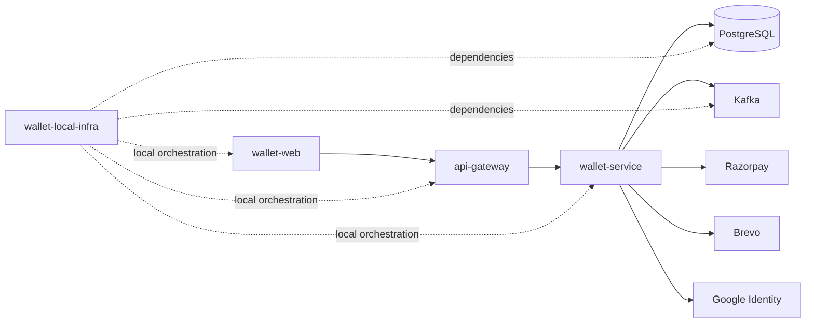

# Documentation reading guide

This documentation is intentionally split by system concern. Read it in this order when onboarding, debugging, or preparing a production change.

## Recommended reading order

1. [`19-complete-system-overview.md`](19-complete-system-overview.md): complete architecture, runtime topology, transaction boundaries, and system flows.
2. [`01-system-overview.md`](01-system-overview.md): overall system purpose and invariants.
3. [`02-architecture.md`](02-architecture.md): service boundaries, modules, and flow diagrams.
4. [`03-runtime-security-and-access-control.md`](03-runtime-security-and-access-control.md): gateway, JWT, trusted headers, `ownerType`, and endpoint access rules.
5. [`04-domain-model-and-er.md`](04-domain-model-and-er.md): entities, tables, ER diagrams, and relationship meaning.
6. [`05-wallet-ledger-engine.md`](05-wallet-ledger-engine.md): balance mutation, double-entry ledger, locking, idempotency.
7. [`20-concurrency-transactions-and-consistency.md`](20-concurrency-transactions-and-consistency.md): concurrent transfers, row locks, idempotency, retries, and consistency across accounts.
8. [`06-payments-razorpay.md`](06-payments-razorpay.md): create-order, checkout, verify, status.
9. [`07-webhook-reconciliation.md`](07-webhook-reconciliation.md): asynchronous Razorpay recovery path.
10. [`08-kafka-outbox-and-audit.md`](08-kafka-outbox-and-audit.md): committed wallet events, Kafka publishing, audit consumer, admin views.
11. [`09-authentication-and-account-lifecycle.md`](09-authentication-and-account-lifecycle.md): signup, OTP, Google, refresh, logout, account closure.
12. [`11-api-reference.md`](11-api-reference.md): endpoint catalog.
13. [`../contributing.md`](../contributing.md): contribution workflow, standards, and review checklist.

## Where to change things

| Change type                 | Start in                                                              |
|-----------------------------|-----------------------------------------------------------------------|
| Add wallet movement type    | `05-wallet-ledger-engine.md`                                          |
| Change concurrency behavior | `20-concurrency-transactions-and-consistency.md`                      |
| Add payment gateway         | `06-payments-razorpay.md`                                             |
| Add Razorpay event handling | `07-webhook-reconciliation.md`                                        |
| Add event to Kafka          | `08-kafka-outbox-and-audit.md`                                        |
| Add user/admin endpoint     | `03-runtime-security-and-access-control.md` and `11-api-reference.md` |
| Add migration               | `12-persistence-and-migrations.md`                                    |
| Add metric/dashboard        | `15-observability.md`                                                 |
| Add test class              | `16-testing-strategy.md`                                              |

## System ownership boundaries

## Documentation maintenance rule

Whenever the code changes a runtime behavior, update the matching documentation file in the same pull request. The README stays short and links to the detailed document.
