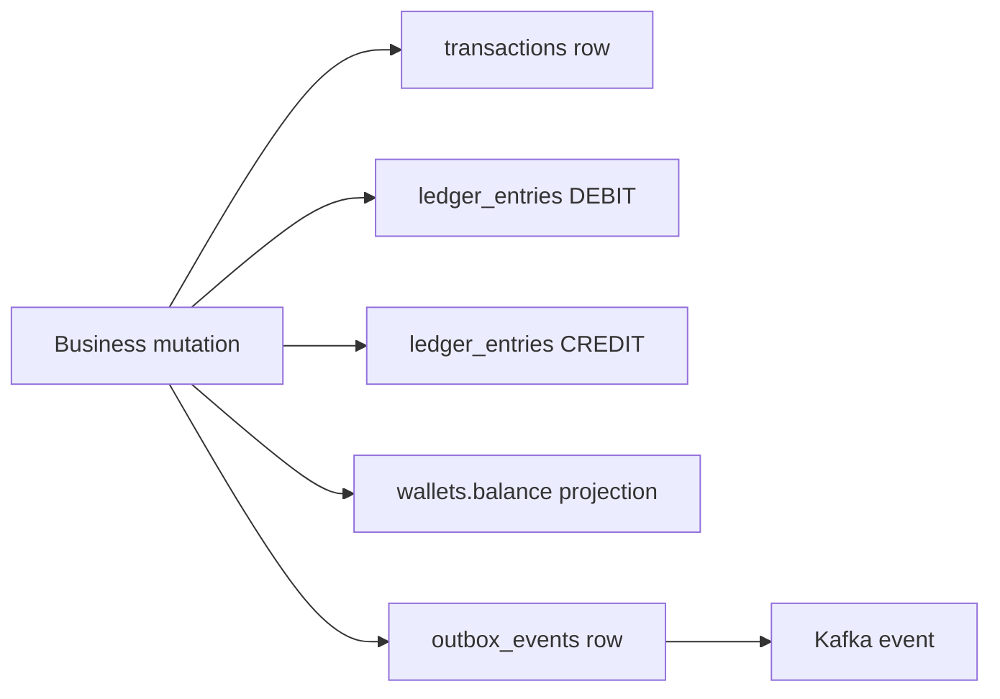
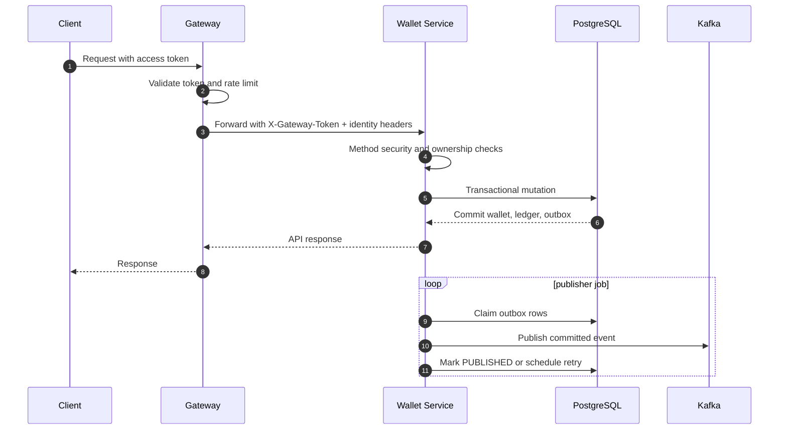

# System overview

Wallet Service manages closed-loop digital assets for a product where users can buy, receive, and spend internal credits. Assets are not real money and are not transferable between users. Data integrity is still strict: every credit and debit must be explainable, idempotent, and recoverable.

## Supported asset model

| Asset     | Meaning                       | Can user buy? | Can user spend? | Can SYSTEM issue? |
|-----------|-------------------------------|--------------:|----------------:|------------------:|
| `GOLD`    | Standard purchasable currency |           Yes |             Yes |               Yes |
| `DIAMOND` | Premium purchasable currency  |           Yes |             Yes |               Yes |
| `LOYALTY` | Reward-only points            |            No |             Yes |               Yes |

## Core invariant

Every successful wallet mutation must produce:

1. One business transaction row.
2. Exactly two ledger entries.
3. A current wallet balance projection.
4. A committed outbox event for Kafka publication.

## Reliability layers

| Layer                  | Purpose                                                                                     |
|------------------------|---------------------------------------------------------------------------------------------|
| Database transaction   | Ensures wallet, transaction, ledger, and outbox rows commit or rollback together            |
| Pessimistic row locks  | Prevent concurrent balance corruption                                                       |
| Idempotency keys       | Allow safe retry of mutations                                                               |
| Razorpay webhook inbox | Recovers payment capture when client-side verification is interrupted                       |
| Kafka outbox           | Publishes committed wallet events without coupling Kafka availability to transaction commit |
| Kafka audit consumer   | Verifies consumed event stream and gives operator visibility                                |
| Admin messaging APIs   | Inspect outbox and Kafka audit without direct DB access                                     |

## Request lifecycle summary

## User and SYSTEM behavior

| Operation                  | USER |                         SYSTEM |
|----------------------------|-----:|-------------------------------:|
| View own balance           |  Yes | No; SYSTEM selects target user |
| View any user balance      |   No | Yes through admin user options |
| View own ledger            |  Yes | No; SYSTEM selects target user |
| View any user ledger       |   No |                            Yes |
| Spend credits              |  Yes |                             No |
| Create payment order       |  Yes |                             No |
| Check payment order status |  Yes |                            Yes |
| Issue bonus                |   No |                            Yes |
| Close account              |  Yes |                             No |
| Inspect messaging/outbox   |   No |                            Yes |

## Non-goals

- No peer-to-peer transfer between users.
- No withdrawal to bank account.
- No cryptocurrency behavior.
- No frontend-created idempotency key input fields for end users.
- No direct client access to wallet-service in production.
