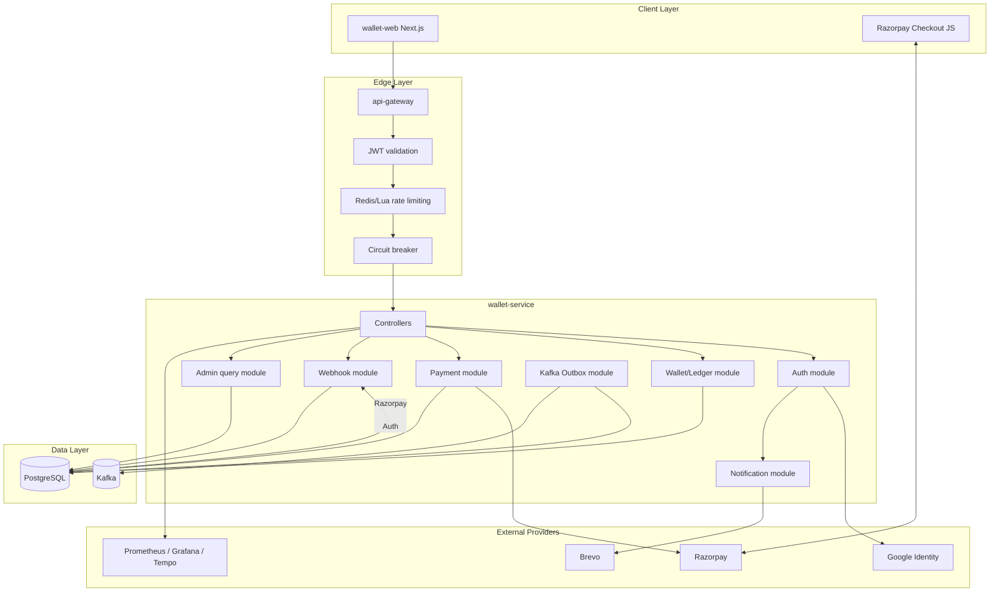
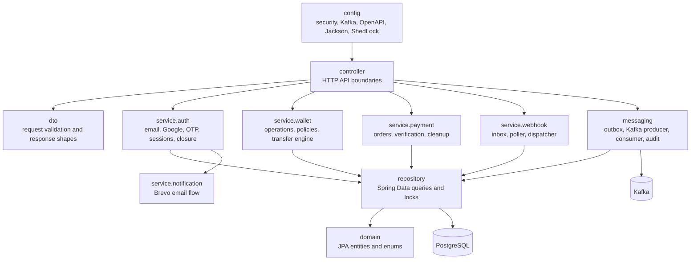
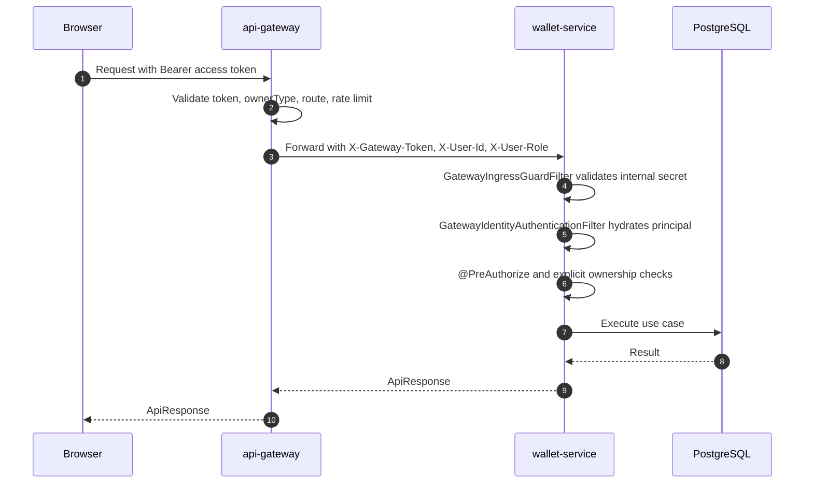
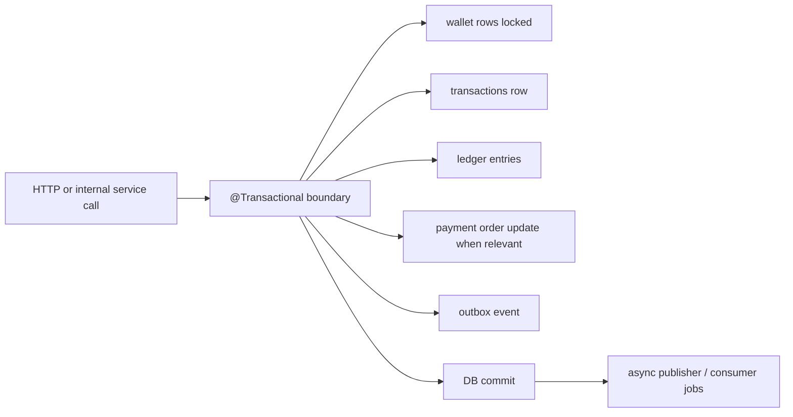

# Architecture

Wallet Service uses a layered modular architecture inside one Spring Boot service. The system is intentionally a modular monolith: domain consistency is easier to enforce inside one database transaction, while module boundaries keep future microservice extraction possible.

## High-level topology

## Package responsibility model

## Why modular monolith first

| Option                                         | Benefit                                                                          | Cost                                                                          | Decision |
|------------------------------------------------|----------------------------------------------------------------------------------|-------------------------------------------------------------------------------|----------|
| Modular monolith                               | Strong DB transaction boundaries, lower operational overhead, easier consistency | Larger codebase in one deployable                                             | Chosen   |
| Microservices immediately                      | Independent scaling and deployment                                               | Distributed transactions, more failure modes, more infrastructure             | Deferred |
| Database-only triggers for events              | No app-side publisher logic                                                      | Harder to test, DB-specific behavior, less domain context                     | Avoided  |
| Direct Kafka publish inside wallet transaction | Simple code path                                                                 | Kafka outage can break wallet mutation or create rollback/event inconsistency | Avoided  |
| Transactional outbox                           | DB commit is source of truth; Kafka publishing retries                           | Adds outbox table and publisher job                                           | Chosen   |

## Request path through the gateway

## Internal consistency boundary

Wallet mutations, ledger rows, payment state changes, and outbox event creation are kept inside database transactions where possible. Kafka publishing and webhook processing are asynchronous because those are integration concerns, not transaction truth.

## Service deployment relationship

Deploy the backend service before the gateway route that exposes new backend endpoints. The gateway does not route to endpoints that are unavailable in wallet-service.

Recommended sequence for a new backend feature:

1. Add wallet-service endpoint, tests, and migration.
2. Deploy wallet-service to staging/testing.
3. Add api-gateway route/rate-limit rule if needed.
4. Deploy gateway.
5. Wire wallet-web UI.
6. Promote branch from development to testing to production.
