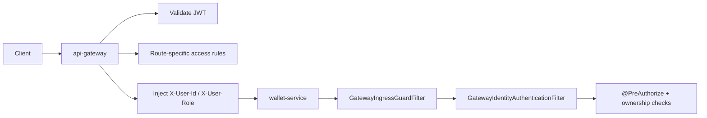
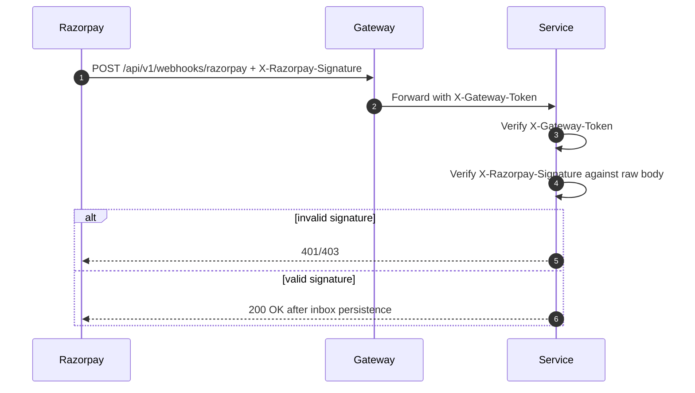

# Runtime security and access control

Security has two layers: the gateway validates the client session and injects trusted headers, while wallet-service enforces domain-level authorization and ownership.

## Security boundary



## Gateway ingress guard

`wallet-service` rejects direct traffic unless the request contains the configured internal token:

```text
X-Gateway-Token: <gateway.internal-secret>
```

This prevents a client from bypassing gateway JWT validation and directly injecting identity headers.

The only intended bypass is the internal health probe path. Public auth endpoints are public only after ingress validation; they are not meant to be open as direct service access in production.

## Trusted identity headers

For protected endpoints, the gateway forwards:

```text
X-User-Id: <user uuid or system id>
X-User-Role: USER | SYSTEM
```

The service maps those into Spring Security authentication. Controller methods and services then perform role and ownership checks.

## JWT claims used by frontend and gateway

Current access token claims are expected to include:

```json
{
  "sub": "5e23b834-774b-4dba-a778-e52b306832ce",
  "email": "something@gmail.com",
  "ownerType": "SYSTEM",
  "iat": 1783262251,
  "exp": 1783263151
}
```

| Claim       | Meaning                                                 |
|-------------|---------------------------------------------------------|
| `sub`       | Internal user id; do not display as primary UI identity |
| `email`     | User-visible identity                                   |
| `ownerType` | Authorization class: `USER` or `SYSTEM`                 |
| `iat`       | Issued-at timestamp                                     |
| `exp`       | Access-token expiry timestamp                           |

Frontend displays LDAP or email, not `sub`. LDAP is derived as the string before `@` in email.

## ownerType matrix

| Capability                           |                                           USER |                                               SYSTEM |
|--------------------------------------|-----------------------------------------------:|-----------------------------------------------------:|
| Signup/login/refresh/logout          |                                            Yes |                                                  Yes |
| Close own account                    |                                            Yes |                                                   No |
| Create payment order                 |                                            Yes |                                                   No |
| Verify own payment                   |                                            Yes |                                                   No |
| Check payment status                 |                                            Yes |                                                  Yes |
| View own balance                     |                                            Yes | No direct own-mode; SYSTEM uses target user dropdown |
| View another user's balance          |                                             No |                                                  Yes |
| View own ledger                      |                                            Yes | No direct own-mode; SYSTEM uses target user dropdown |
| View another user's ledger           |                                             No |                                                  Yes |
| Spend wallet credits                 |                                            Yes |                                                   No |
| Issue bonus                          |                                             No |                                                  Yes |
| Top-up through internal API          |                                             No |                                    Yes/internal only |
| Admin user options                   |                                             No |                                                  Yes |
| Admin messaging summary/outbox/audit |                                             No |                                                  Yes |
| Razorpay webhook                     | Public to Razorpay through gateway; no app JWT |

## Endpoint access model

| Endpoint group                                                                             | Rule                                                                |
|--------------------------------------------------------------------------------------------|---------------------------------------------------------------------|
| `/api/v1/auth/signup`, `/login`, `/verify-otp`, `/resend-otp`, `/google`, `/refresh-token` | Public behind gateway token                                         |
| `/api/v1/auth/logout`                                                                      | USER or SYSTEM, refresh token ownership checked                     |
| `/api/v1/auth/close-account`                                                               | USER only                                                           |
| `/api/v1/wallets/{userId}/balance`                                                         | USER when `path.userId == principal`; SYSTEM for target user lookup |
| `/api/v1/wallets/{userId}/ledger`                                                          | USER owner or SYSTEM                                                |
| `/api/v1/wallets/spend`                                                                    | USER only, request userId must equal principal                      |
| `/api/v1/wallets/bonus`                                                                    | SYSTEM only                                                         |
| `/api/v1/wallets/topUp`                                                                    | SYSTEM/internal only                                                |
| `/api/v1/payments/create-order`                                                            | USER only                                                           |
| `/api/v1/payments/verify`                                                                  | USER only; order must belong to principal                           |
| `/api/v1/payments/order-status/{orderId}`                                                  | USER owner or SYSTEM, depending controller policy                   |
| `/api/v1/webhooks/razorpay`                                                                | Gateway/Razorpay route; no app JWT; must verify Razorpay signature  |
| `/api/v1/admin/users/options`                                                              | SYSTEM only                                                         |
| `/api/v1/admin/messaging/**`                                                               | SYSTEM only                                                         |

## Webhook security

Razorpay cannot send application JWTs. The route must therefore be public at the gateway auth layer but protected by Razorpay HMAC verification in wallet-service.



## Deprecated OAuth endpoint

`POST /api/v1/auth/oauth2/success` is legacy if the frontend uses Google Identity Services and calls `POST /api/v1/auth/google` with an ID token. Keep it temporarily only for backward compatibility.
