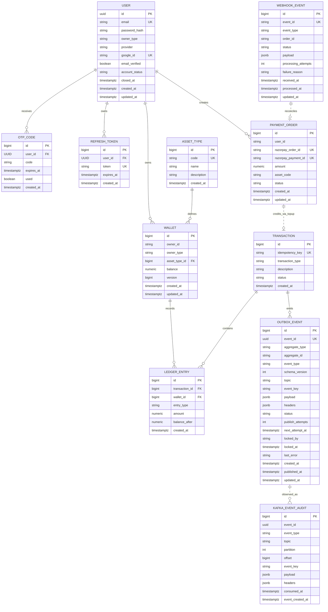

# Domain model and ER diagrams

The database is the source of truth for accounts, wallets, ledger entries, payments, webhooks, outbox publishing, and Kafka audit records.

## Core ER diagram



## Entity responsibilities

| Entity/table        | Responsibility                                                                  |
|---------------------|---------------------------------------------------------------------------------|
| `user`              | Auth profile, email identity, owner type, provider, Google link, account status |
| `otp_code`          | Email verification OTPs with expiry and used state                              |
| `refresh_token`     | Database-backed session tokens; revocable and checked during refresh/logout     |
| `asset_type`        | Stable asset catalog: `GOLD`, `DIAMOND`, `LOYALTY`                              |
| `wallet`            | Current balance projection per owner and asset                                  |
| `transaction`       | Business-level wallet mutation event                                            |
| `ledger_entrie`     | Immutable debit/credit accounting rows                                          |
| `payment_order`     | Local Razorpay order and verification state                                     |
| `webhook_event`     | Verified Razorpay webhook inbox for async processing                            |
| `outbox_event`      | Committed domain events waiting for Kafka publish                               |
| `kafka_event_audit` | Consumed Kafka event audit trail for observability                              |
| `shedlock`          | Distributed scheduled-job lock table                                            |

## Wallet identity model

A user can have zero to three wallets, one per asset code. A balance response can therefore return an empty `wallets` array or up to three entries.

Example:

```json
{
  "data": {
    "userId": "de8e9ca5-607d-4c87-8772-636b48673f94",
    "wallets": [
      {
        "assetCode": "LOYALTY",
        "assetName": "Loyalty Points",
        "balance": 1098,
        "walletId": 860836359529890400
      },
      {
        "assetCode": "DIAMOND",
        "assetName": "Diamonds",
        "balance": 1999,
        "walletId": 861350215775380200
      },
      {
        "assetCode": "GOLD",
        "assetName": "Gold Coins",
        "balance": 497,
        "walletId": 861356007131931400
      }
    ]
  },
  "message": null,
  "success": true
}
```

## Ledger response model

```json
{
  "success": true,
  "message": "Operation successful",
  "data": [
    {
      "entryId": 100,
      "transactionId": 50,
      "transactionType": "SPEND",
      "entryType": "DEBIT",
      "amount": 10,
      "balanceAfter": 90,
      "createdAt": "2026-07-06T13:15:09.581Z"
    }
  ]
}
```

## Integrity constraints

| Constraint                                      | Purpose                                |
|-------------------------------------------------|----------------------------------------|
| `wallets.balance >= 0`                          | Prevent negative persisted balance     |
| `ledger_entries.amount > 0`                     | Prevent zero/negative ledger movements |
| unique `transactions.idempotency_key`           | Idempotent wallet mutations            |
| unique `outbox_events.event_id`                 | Idempotent outbox event identity       |
| unique `payment_orders.razorpay_order_id`       | Payment-order replay protection        |
| unique `payment_orders.razorpay_payment_id`     | Payment capture replay protection      |
| unique webhook event id                         | Webhook replay protection              |
| unique Kafka audit event/topic-partition-offset | Duplicate-consume protection           |

## Design note: balance projection vs. ledger truth

`wallets.balance` is a fast projection for reads. The ledger is the audit trail. If they disagree, treat it as a production incident and reconcile from ledger entries.
