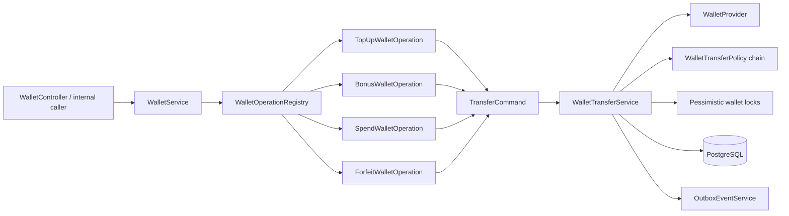
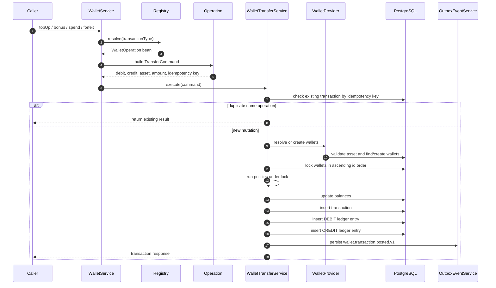
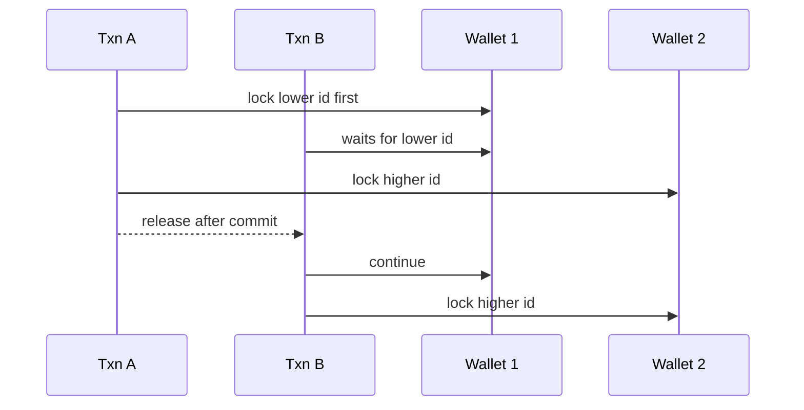

# Wallet and ledger engine

The wallet engine is the financial core of the service. Payment, bonus, spend, webhook, and account closure flows all converge here when value must move.

## Main components

## Operation mapping

| Operation | Debit wallet      | Credit wallet     | Access                  | Policy                        |
|-----------|-------------------|-------------------|-------------------------|-------------------------------|
| `TOPUP`   | `SYSTEM_TREASURY` | User wallet       | SYSTEM/internal/payment | None                          |
| `BONUS`   | `SYSTEM_TREASURY` | User wallet       | SYSTEM                  | None                          |
| `SPEND`   | User wallet       | `SYSTEM_TREASURY` | USER                    | Sufficient balance            |
| `FORFEIT` | User wallet       | `SYSTEM_TREASURY` | Account closure         | Positive balance closure flow |

## Transfer sequence

## Locking strategy

Wallet rows are locked with pessimistic write locks in sorted wallet-id order.

Why sorted order matters:

If transactions lock wallet rows in inconsistent order, deadlocks become likely under load.

## Idempotency model

Every wallet mutation requires an idempotency key. A retried request with the same key must not create duplicate ledger rows.

| Caller                  | Example key                               |
|-------------------------|-------------------------------------------|
| Payment verification    | `rzp_{razorpayPaymentId}`                 |
| Webhook credit          | `rzp_webhook_{razorpayPaymentId}`         |
| User spend              | generated by frontend/action layer        |
| SYSTEM bonus            | generated by frontend/admin action layer  |
| Account closure forfeit | deterministic closure key per wallet/user |

End users cannot type idempotency keys manually. The UI generates them internally.

## Double-entry examples

### TOPUP or BONUS

| Row | Wallet             | Entry type | Amount |
|-----|--------------------|------------|-------:|
| 1   | `SYSTEM_TREASURY`  | `DEBIT`    |    100 |
| 2   | User `GOLD` wallet | `CREDIT`   |    100 |

### SPEND

| Row | Wallet            | Entry type | Amount |
|-----|-------------------|------------|-------:|
| 1   | User wallet       | `DEBIT`    |     10 |
| 2   | `SYSTEM_TREASURY` | `CREDIT`   |     10 |

### FORFEIT

| Row | Wallet                       | Entry type |            Amount |
|-----|------------------------------|------------|------------------:|
| 1   | User positive-balance wallet | `DEBIT`    | remaining balance |
| 2   | `SYSTEM_TREASURY`            | `CREDIT`   | remaining balance |

## Financial invariants

- Successful transfer creates exactly one `transactions` row.
- Successful transfer creates exactly two `ledger_entries` rows.
- Wallet balances cannot go negative.
- Spend validates balance after acquiring locks.
- Unknown asset codes are rejected before mutation.
- Duplicate idempotency keys return or reject safely; they must not mutate twice.
- Outbox event creation is inside the same transaction as ledger creation.

## Tradeoffs

| Decision                        | Benefit                                   | Cost                                                  |
|---------------------------------|-------------------------------------------|-------------------------------------------------------|
| Pessimistic locks               | Strong correctness under concurrent spend | Lower throughput than optimistic update-only approach |
| Double-entry ledger             | Auditable and reconcilable                | More rows per operation                               |
| Wallet balance projection       | Fast balance reads                        | Requires reconciliation monitoring                    |
| Strategy pattern for operations | Extensible operation types                | More classes than a single switch statement           |
| Outbox event after mutation     | Reliable Kafka events                     | Additional table and publisher job                    |
