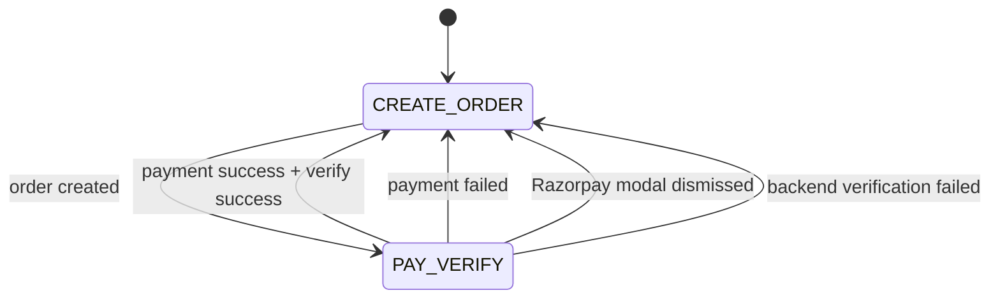
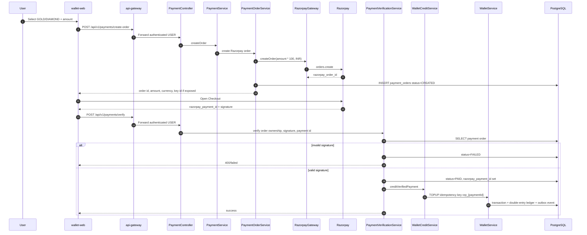
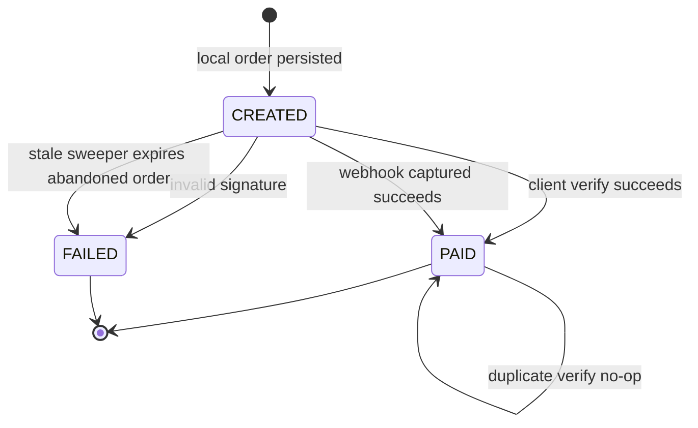

# Razorpay payments

Payment integration converts real payment capture into internal wallet credits. Users buy `GOLD` or `DIAMOND`. `LOYALTY` is reward-only and cannot be bought.

## Access rules

| Operation            | USER | SYSTEM |
|----------------------|-----:|-------:|
| Create payment order |  Yes |     No |
| Complete checkout    |  Yes |     No |
| Verify payment       |  Yes |     No |
| Check order status   |  Yes |    Yes |

SYSTEM accounts can inspect order status for support/admin workflows, but they cannot create user payment orders.

## Payment phases

Frontend behavior:

1. Show create-payment-order card only for `ownerType=USER`.
2. Hide user id and show LDAP/email.
3. After creating order, hide create-order card and show pay/verify card.
4. On payment success, failure, modal dismiss, or verification error, return to create-order phase.
5. Order-status card remains visible for USER and SYSTEM.

## Create and verify sequence

## Payment order state machine

## Payment idempotency

| Layer                      | Guard                                                                            |
|----------------------------|----------------------------------------------------------------------------------|
| Razorpay order             | unique `razorpay_order_id`                                                       |
| Razorpay payment           | unique `razorpay_payment_id`                                                     |
| Client verification credit | wallet idempotency key `rzp_{paymentId}`                                         |
| Webhook credit             | wallet idempotency key `rzp_webhook_{paymentId}` plus order status short-circuit |
| Stale cleanup              | update only `CREATED` orders older than cutoff                                   |

## Amount model

The backend stores amount in major units as requested by the client and sends paise to Razorpay by multiplying by 100. If the product later supports fractional currency or non-INR assets, define a Money value object and store minor units explicitly.

## Why both verify endpoint and webhook exist

| Path                 | Purpose                                           |
|----------------------|---------------------------------------------------|
| `/payments/verify`   | Immediate user experience after checkout          |
| `/webhooks/razorpay` | Recovery when browser closes or verify call fails |

Both paths must be idempotent. It must be safe if both arrive for the same Razorpay payment.

## Failure modes and handling

| Failure                        | Expected handling                                                       |
|--------------------------------|-------------------------------------------------------------------------|
| Razorpay checkout dismissed    | UI returns to create-order phase; existing local order can later expire |
| Payment failed in Razorpay     | UI returns to create-order phase; status can be checked                 |
| Signature invalid              | Payment order becomes `FAILED`                                          |
| Browser closes after capture   | Webhook credits wallet                                                  |
| Duplicate verify request       | Return existing paid result or no-op                                    |
| Kafka unavailable after credit | Wallet mutation commits; outbox row retries publishing                  |
