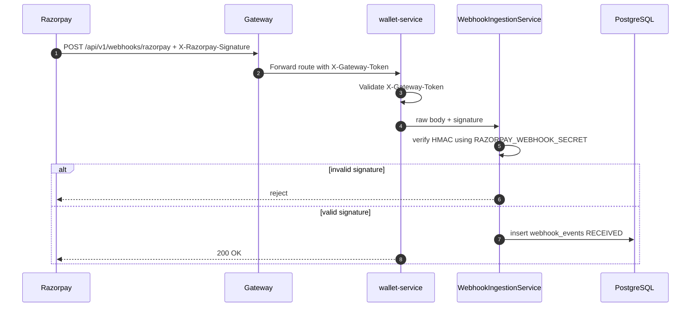
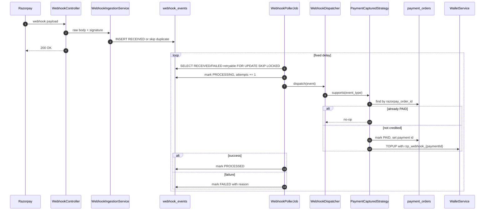
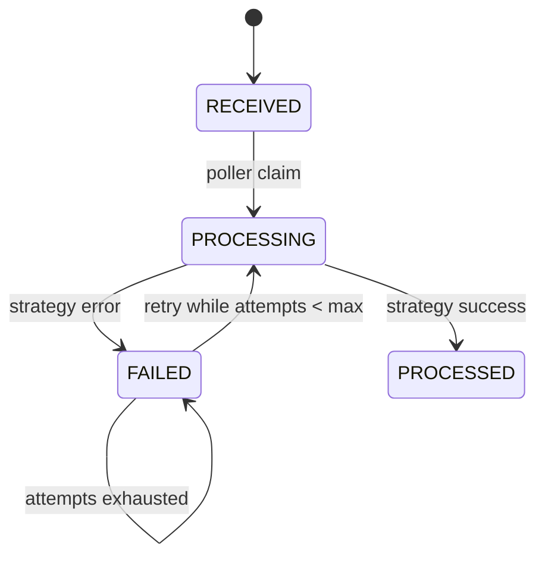

# Webhook reconciliation

Razorpay webhooks are a server-to-server recovery path. They are not called by the frontend. Razorpay calls the public gateway URL and sends `X-Razorpay-Signature`.

## Where to attach the webhook

Configure in Razorpay Dashboard:

```text
Webhook URL: https://<public-gateway-domain>/api/v1/webhooks/razorpay
Secret: <RAZORPAY_WEBHOOK_SECRET>
Events: payment.captured, payment.failed, order.paid as required
```

For local testing, use a public tunnel to the gateway, for example:

```bash
ngrok http 8080
```

Then configure Razorpay test webhook URL:

```text
https://<ngrok-domain>/api/v1/webhooks/razorpay
```

## Security model



The webhook endpoint does not require app JWT because Razorpay cannot provide it. Signature verification is the security control.

## Transactional inbox pattern

The webhook controller performs the minimum synchronous work:

1. Receive raw body string.
2. Verify `X-Razorpay-Signature` against exact raw payload.
3. Extract event identity and relevant payment/order identifiers.
4. Insert a `webhook_events` row.
5. Return `200 OK` quickly.

Actual business processing happens asynchronously.



## Status lifecycle



## Why raw body matters

Do not deserialize the webhook body and then reserialize it before signature verification. HMAC verification must use the exact raw bytes/string received from Razorpay. JSON key order or whitespace changes can invalidate the signature.

## Idempotency strategy

| Layer         | Idempotency guard                                                   |
|---------------|---------------------------------------------------------------------|
| Webhook event | unique event id or payment-id based event identity                  |
| Payment order | if already `PAID`, strategy no-ops                                  |
| Wallet credit | idempotency key `rzp_webhook_{paymentId}`                           |
| Poller        | `FOR UPDATE SKIP LOCKED` prevents two workers claiming the same row |
| Retry         | bounded attempts, then parked as failed                             |

## Operational behavior

| Situation                                   | Expected state                                      |
|---------------------------------------------|-----------------------------------------------------|
| Duplicate webhook                           | Existing inbox row reused/skipped                   |
| Browser verification already credited       | Webhook sees order already PAID and no-ops          |
| Webhook arrives before browser verification | Webhook marks PAID and credits; later verify no-ops |
| Temporary DB error during processing        | Row becomes FAILED and is retried                   |
| Permanent bad payload                       | Row remains FAILED for manual inspection            |

## Future improvements

- Add admin webhook event API for manual inspection.
- Add dead-letter/export mechanism for exhausted webhook rows.
- Support `payment.failed`, `refund.processed`, and `order.paid` strategies explicitly if product requirements need them.
- Add reconciliation report across Razorpay, payment orders, wallet transactions, and ledger entries.
