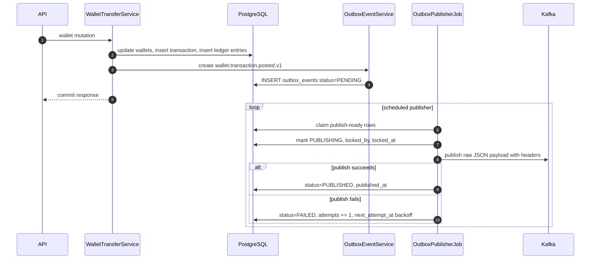
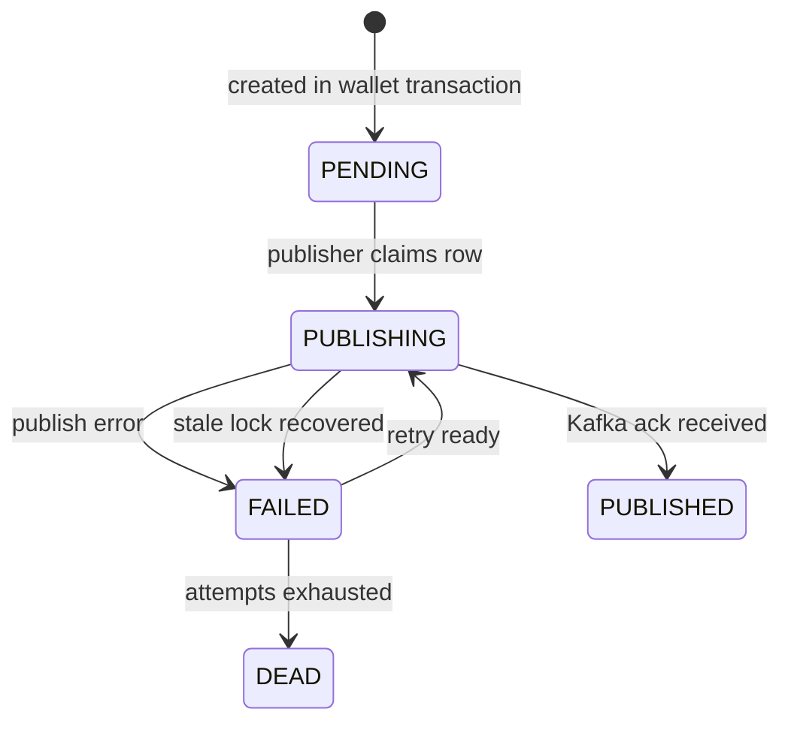
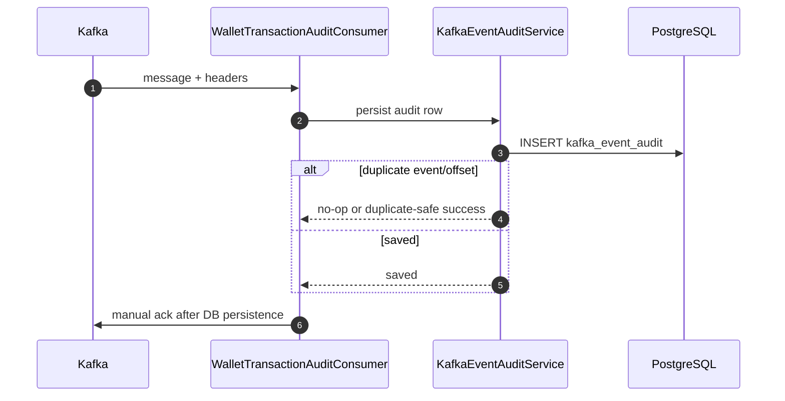

# Kafka transactional outbox and audit

Kafka is used for committed wallet-domain events. It must not become the source of truth for balances. PostgreSQL wallet and ledger tables remain authoritative.

## Why outbox exists

Publishing directly to Kafka inside wallet business logic creates a consistency problem:

| Failure                            | Bad outcome without outbox                      |
|------------------------------------|-------------------------------------------------|
| DB commits but Kafka publish fails | Balance changed but no event published          |
| Kafka publishes but DB rolls back  | Event describes a mutation that never committed |
| Kafka is temporarily unavailable   | Wallet mutation becomes unavailable             |

Transactional outbox solves this by storing the event in PostgreSQL in the same transaction as the wallet mutation. A separate publisher job later sends the event to Kafka.

## Outbox flow



## Outbox table

`outbox_events` stores:

| Column                   | Meaning                                                                     |
|--------------------------|-----------------------------------------------------------------------------|
| `event_id`               | Stable UUID for idempotent event identity                                   |
| `aggregate_type`         | Domain aggregate, usually wallet transaction                                |
| `aggregate_id`           | Transaction id or aggregate id                                              |
| `event_type`             | Example: `wallet.transaction.posted.v1`                                     |
| `schema_version`         | Event schema version                                                        |
| `topic`                  | Kafka topic                                                                 |
| `event_key`              | Kafka key, usually user id or transaction id depending ordering requirement |
| `payload`                | Raw JSON event body                                                         |
| `headers`                | JSON headers copied to Kafka headers                                        |
| `status`                 | `PENDING`, `PUBLISHING`, `PUBLISHED`, `FAILED`, `DEAD`                      |
| `publish_attempts`       | Retry count                                                                 |
| `next_attempt_at`        | Backoff scheduling                                                          |
| `locked_by`, `locked_at` | Crash-safe publisher lock metadata                                          |
| `last_error`             | Last publish failure reason                                                 |
| `published_at`           | Kafka publish success timestamp                                             |

## Event status lifecycle



## Event contract: wallet.transaction.posted.v1

The event represents a committed wallet transaction and its ledger movement.

Recommended event shape:

```json
{
  "eventId": "3e2b5c7a-...",
  "eventType": "wallet.transaction.posted.v1",
  "schemaVersion": 1,
  "occurredAt": "2026-07-06T13:15:09.581Z",
  "transaction": {
    "transactionId": "50",
    "transactionType": "SPEND",
    "idempotencyKey": "spend_...",
    "description": "Spend wallet credits"
  },
  "owner": {
    "userId": "de8e9ca5-607d-4c87-8772-636b48673f94",
    "ownerType": "USER"
  },
  "asset": {
    "assetCode": "GOLD"
  },
  "entries": [
    {
      "entryType": "DEBIT",
      "walletId": "861356007131931400",
      "amount": 10,
      "balanceAfter": 90
    },
    {
      "entryType": "CREDIT",
      "walletId": "SYSTEM_TREASURY_GOLD",
      "amount": 10,
      "balanceAfter": 100000
    }
  ]
}
```

Event changes must increment schema version or create a new event type.

## Kafka producer design

| Choice                               | Reason                                                         |
|--------------------------------------|----------------------------------------------------------------|
| Publisher abstraction                | Keeps KafkaTemplate behind an interface                        |
| String/raw JSON payload              | Avoids escaped JSON and `JsonNode` metadata leaking into Kafka |
| Explicit headers                     | Allows consumers to route/trace without parsing payload        |
| Synchronous send with timeout in job | Allows deterministic row status update                         |
| Backoff retries                      | Kafka outage does not lose events                              |
| Stale PUBLISHING recovery            | Service crash during publish does not park rows forever        |

## Kafka audit consumer

The audit consumer subscribes to wallet event topics and persists consumed messages into `kafka_event_audit`.



Manual acknowledgement is important: the consumer acknowledges the Kafka offset only after audit persistence succeeds.

## Admin messaging APIs

SYSTEM users can inspect messaging state through gateway routes:

| Endpoint                                                   | Purpose                             |
|------------------------------------------------------------|-------------------------------------|
| `GET /api/v1/admin/messaging/summary`                      | Counts and health snapshot          |
| `GET /api/v1/admin/messaging/outbox-events`                | Paginated outbox list               |
| `GET /api/v1/admin/messaging/outbox-events/{eventId}`      | Full outbox event detail            |
| `GET /api/v1/admin/messaging/kafka-audit-events`           | Paginated consumed event audit list |
| `GET /api/v1/admin/messaging/kafka-audit-events/{eventId}` | Full consumed event detail          |

List endpoints return compact rows. Detail endpoints can return full payload and headers.

## Failure handling

| Failure                                    | Handling                                                             |
|--------------------------------------------|----------------------------------------------------------------------|
| Kafka broker unavailable                   | Outbox row becomes `FAILED`, retried later                           |
| Publisher crashes after marking PUBLISHING | Stale lock recovery moves row back to retryable state                |
| Kafka publish succeeds but DB update fails | Event may be republished; consumers must be idempotent by `event_id` |
| Consumer receives duplicate                | Audit table unique constraints prevent duplicate audit rows          |
| Audit DB down                              | Do not ack until persistence succeeds                                |

## Observability signals

Recommended metrics:

| Metric                           | Tags                      |
|----------------------------------|---------------------------|
| `business.outbox.publish`        | status, event_type, topic |
| `business.outbox.lag`            | event_type, status        |
| `business.outbox.dead`           | event_type                |
| `business.kafka.audit.consume`   | status, event_type, topic |
| `business.kafka.audit.duplicate` | event_type                |

## Design tradeoff

Outbox makes event publication eventually consistent. The API can return success before Kafka receives the message. This is intentional: the database transaction is the truth, and Kafka is a distribution channel. Consumers must tolerate delay and duplicates.
