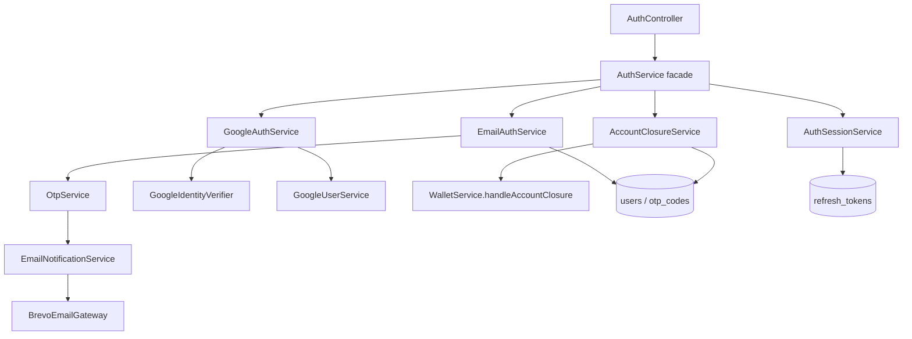
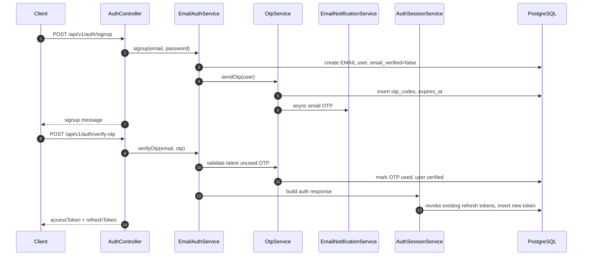
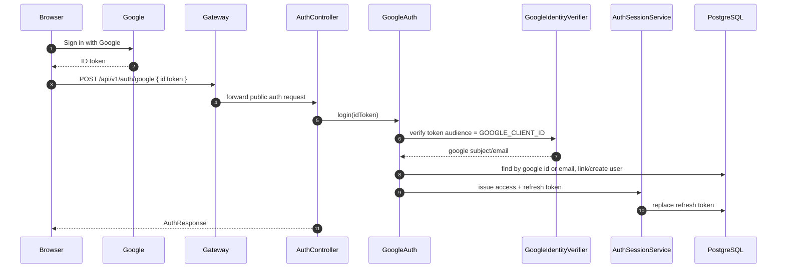
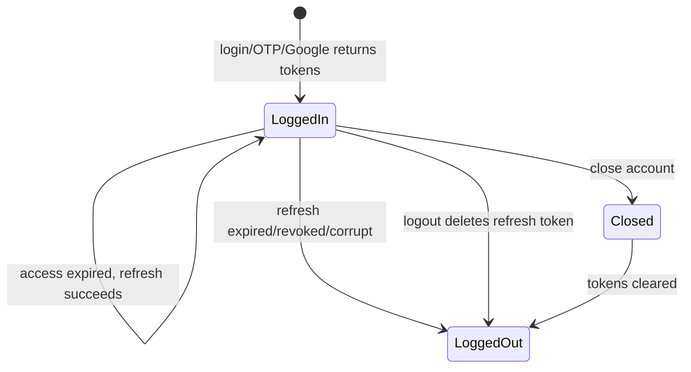
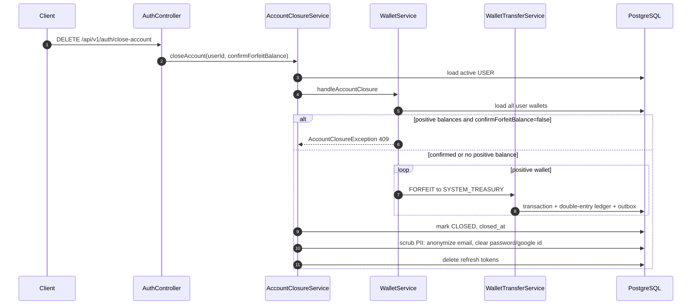

# Authentication and account lifecycle

Auth supports email/password with OTP verification, Google ID token login, refresh-token sessions, logout, and USER account closure.

## Auth module map



## Signup and OTP flow



## Google login flow

The frontend uses Google Identity Services. The browser obtains a Google ID token and sends it to the backend.



`POST /api/v1/auth/oauth2/success` is legacy if this flow is used.

## Refresh token persistence

Access tokens are short-lived. Refresh tokens are database-backed and revocable.



Frontend strict session mode can call refresh on app boot to validate that the refresh session is still valid. If the refresh token is corrupt or revoked, frontend clears tokens and redirects to login.

## Logout

Logout deletes the provided refresh token only if it belongs to the authenticated principal.
## Account closure

Only `ownerType=USER` sees or calls close-account.

Endpoint:

```text
DELETE /api/v1/auth/close-account
```

Request body:

```json
{
  "confirmForfeitBalance": true
}
```



## Profile page display rule

A profile page can show:

| Field                   |                             Show? |
|-------------------------|----------------------------------:|
| LDAP derived from email |                               Yes |
| Email                   |                               Yes |
| ownerType               |                               Yes |
| userId / subject        | No, unless explicitly admin/debug |
| password hash           |                             Never |
| refresh token           |                             Never |
| google id               |                             Never |
