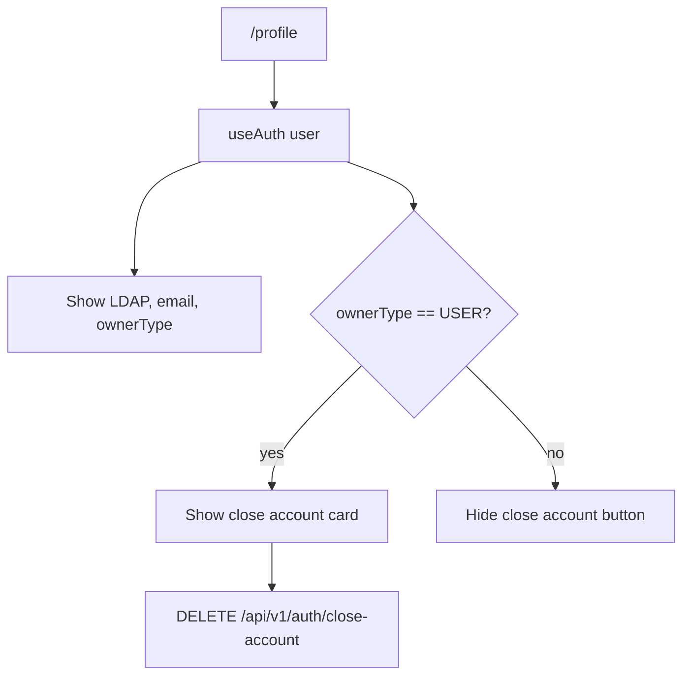
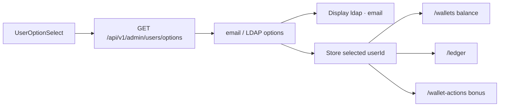

# User profile and admin user options

This document covers user-facing profile display, USER account closure, and SYSTEM user selection for balance, ledger, and bonus operations.

## Identity display rules

The UI does not display UUIDs as the main identity. Use LDAP or email.

| Internal value              | UI display                                |
|-----------------------------|-------------------------------------------|
| `sub` / `userId`            | Hidden; used internally for API calls     |
| `email=nishq.tan@gmail.com` | Display email or LDAP `nishq.tan`         |
| `ownerType=USER`            | Display as owner type or capability badge |
| `ownerType=SYSTEM`          | Display as owner type or capability badge |

## Profile page

The profile page is for the authenticated principal. It shows non-sensitive identity fields and exposes close-account only for USER accounts.



Close-account request:

```json
{
  "confirmForfeitBalance": true
}
```

Frontend requires an explicit checkbox and confirmation text such as `DELETE` before sending the request.

## Admin user options endpoint

SYSTEM users need a reusable dropdown for selecting target users in:

- Wallet balance lookup.
- Ledger lookup.
- SYSTEM bonus target selection.

Endpoint:

```text
GET /api/v1/admin/users/options?query=<optional>
```

Access:

```text
SYSTEM only
```

Recommended response:

```json
{
  "success": true,
  "message": null,
  "data": [
    {
      "userId": "de8e9ca5-607d-4c87-8772-636b48673f94",
      "email": "normal.user@gmail.com",
      "ldap": "normal.user",
      "ownerType": "USER"
    }
  ]
}
```

Return only `ownerType=USER` accounts unless there is a specific product requirement to target SYSTEM accounts.

## Shared dropdown behavior



The dropdown shows email/LDAP but stores userId because backend APIs still require userId.

## Wallet page behavior

| ownerType | UI                                                          |
|-----------|-------------------------------------------------------------|
| USER      | Show current LDAP/email only; no dropdown; load own balance |
| SYSTEM    | Show user dropdown; load selected user's balance            |

## Ledger page behavior

| ownerType | UI                                                              |
|-----------|-----------------------------------------------------------------|
| USER      | Show current LDAP/email only; asset dropdown; load own ledger   |
| SYSTEM    | Show user dropdown; asset dropdown; load selected user's ledger |

## Bonus card behavior

| ownerType | UI                                                                                             |
|-----------|------------------------------------------------------------------------------------------------|
| USER      | Bonus card hidden or disabled                                                                  |
| SYSTEM    | Bonus card enabled; target user dropdown; asset dropdown includes `GOLD`, `DIAMOND`, `LOYALTY` |
