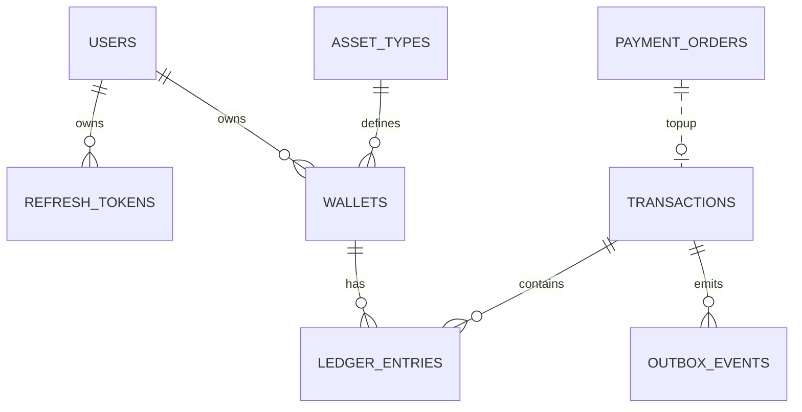

# Persistence and migrations

Flyway owns schema evolution. Hibernate validates schema rather than generating or mutating it in normal runtime profiles.

## Migration timeline

| Migration                            | Purpose                                                                |
|--------------------------------------|------------------------------------------------------------------------|
| `V1__init_schema.sql`                | Core wallet tables: asset types, wallets, transactions, ledger entries |
| `V2__init_schema.sql`                | Seed assets, treasury wallets, sample/dev data                         |
| `V3__auth_schema.sql`                | Users and OTP codes                                                    |
| `V4__payment_orders_schema.sql`      | Razorpay payment orders                                                |
| `V5__auth_and_closure_schema.sql`    | Account closure state and refresh tokens                               |
| `V6__webhook_idempotency_schema.sql` | Razorpay webhook inbox                                                 |
| `V7__shedlock_and_cleanup.sql`       | ShedLock and stale payment cleanup index                               |
| `V8__outbox_events_schema.sql`       | Transactional outbox for Kafka publishing                              |
| `V9_Kafka_event_audit_schema`        | `kafka_event_audit` consumed-event audit table                         |


## Outbox migration summary

`outbox_events` must include:

- `event_id` unique UUID.
- `event_type`, `schema_version`, `topic`, `event_key`.
- `payload` JSONB.
- `headers` JSONB.
- `status` with allowed values `PENDING`, `PUBLISHING`, `PUBLISHED`, `FAILED`, `DEAD`.
- retry/lock columns: `publish_attempts`, `next_attempt_at`, `locked_by`, `locked_at`, `last_error`.
- timestamps: `created_at`, `published_at`, `updated_at`.

Publisher hot path index:

```sql
CREATE INDEX idx_outbox_publish_ready
    ON outbox_events(next_attempt_at, created_at)
    WHERE status IN ('PENDING', 'FAILED');
```

## Kafka audit table summary

`kafka_event_audit` makes duplicate consumption safe.

Recommended uniqueness:

```sql
UNIQUE (event_id)
UNIQUE (topic, partition, offset)
```

The first protects logical duplicates. The second protects physical Kafka offset replay duplicates.

## Core tables



## Seeded assets

| Code      | Name           | Product behavior             |
|-----------|----------------|------------------------------|
| `GOLD`    | Gold Coins     | Purchasable and spendable    |
| `DIAMOND` | Diamonds       | Purchasable and spendable    |
| `LOYALTY` | Loyalty Points | Reward-only, not purchasable |

## Seeded system owners

| Owner                | Purpose                                                                               |
|----------------------|---------------------------------------------------------------------------------------|
| `SYSTEM_TREASURY`    | Counterparty for top-up, bonus, spend, and forfeit                                    |
| `SYSTEM_REWARD_POOL` | Optional seeded owner; not required by current operation beans unless explicitly used |

## Schema integrity rules

| Rule                              | Location                                         |
|-----------------------------------|--------------------------------------------------|
| Wallet balance non-negative       | DB check constraint and service policy           |
| Ledger amount positive            | DB check constraint                              |
| Wallet uniqueness per owner/asset | DB unique index                                  |
| Transaction idempotency           | DB unique index                                  |
| Payment order uniqueness          | DB unique constraints on Razorpay ids            |
| Webhook replay protection         | DB unique event id                               |
| Outbox event identity             | DB unique event id                               |
| Kafka audit duplicate safety      | DB unique event id and/or topic-partition-offset |

## Migration discipline

- Never edit an already-applied production migration.
- For local-only development before push, editing latest migration can be acceptable only if everyone resets local DB.
- Use `ddl-auto=validate` in non-test profiles.
- Keep test schema aligned with migrations or use integration tests with PostgreSQL/Testcontainers if H2 diverges.
- Add indexes for scheduled-worker hot paths before enabling high-frequency pollers.
