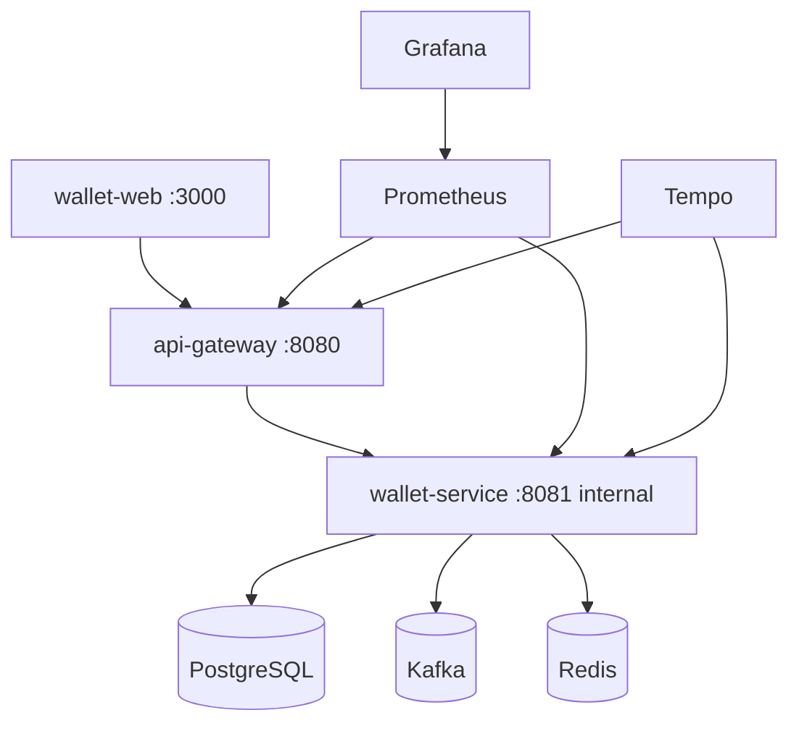

# Local development and Docker

`wallet-service` owns its Dockerfile. Local orchestration belongs in the separate `wallet-local-infra` repository.

## Repository layout

```text
workspace/
  wallet-service/
  api-gateway/
  wallet-web/
  wallet-local-infra/
    docker-compose.yml
    prometheus.yml
    grafana.yml
    tempo.yml
```

The local infra repository can mount/build sibling services through relative paths.

## Recommended local topology



Only the gateway is exposed to the browser for API traffic. Avoid exposing wallet-service directly to the host unless deliberately debugging.

## Standalone service run

Prerequisites:

- Java 17.
- PostgreSQL.
- Kafka if Kafka integration is enabled.
- Razorpay credentials for payments.
- Google client id for Google login.
- Brevo credentials for OTP email.

Run:

```bash
./mvnw spring-boot:run
```

Default service URL:

```text
http://localhost:8081
```

Direct calls need gateway token:

```bash
curl -H "X-Gateway-Token: default-edge-secret-string-123" \
  http://localhost:8081/actuator/health
```

Protected direct calls also need trusted identity headers when bypassing the gateway locally:

```bash
curl -H "X-Gateway-Token: default-edge-secret-string-123" \
  -H "X-User-Id: <user-uuid>" \
  -H "X-User-Role: USER" \
  http://localhost:8081/api/v1/wallets/<user-uuid>/balance
```

## Docker image

Build:

```bash
docker build -t wallet-service .
```

Run:

```bash
docker run --rm -p 8081:8081 --env-file .env wallet-service
```

## Local compose principles

`wallet-local-infra` provides:

- PostgreSQL for wallet-service.
- Redis for gateway/rate limiting if used.
- Kafka broker(s) for outbox publishing and audit consumer.
- Prometheus scrape config.
- Grafana dashboards.
- Tempo or tracing backend if used.
- api-gateway and wallet-service build contexts pointing to sibling repos.

## Common issues while setting up locally

| Symptom                                    | Fix                                                                                |
|--------------------------------------------|------------------------------------------------------------------------------------|
| `port 5432 already in use`                 | Stop local Postgres or change compose host port                                    |
| Gateway Swagger opens but wallet APIs fail | Check `WALLET_SERVICE_URL=http://wallet-service:8081` in compose                   |
| Direct access forbidden                    | Ensure gateway adds `X-Gateway-Token` and wallet-service has same secret           |
| CORS/preflight failure                     | OPTIONS bypasses auth/rate limiter where appropriate; CORS belongs at gateway |
| Google `invalid_client`                    | Add exact frontend origin in Google Cloud OAuth client                             |
| Kafka publish not happening                | Check Kafka enabled flag, bootstrap servers, outbox row status                     |
| Kafka audit empty                          | Check consumer group, topic name, and manual ack errors                            |

## Local verification flow

1. Start local infra.
2. Open `wallet-web` through browser.
3. Signup/verify OTP or Google login.
4. Confirm token contains `email` and `ownerType`.
5. As USER, create payment order and verify payment.
6. Confirm wallet balance and ledger updated.
7. Confirm outbox row created and published.
8. Confirm Kafka audit row consumed.
9. As SYSTEM, inspect admin messaging dashboard.
