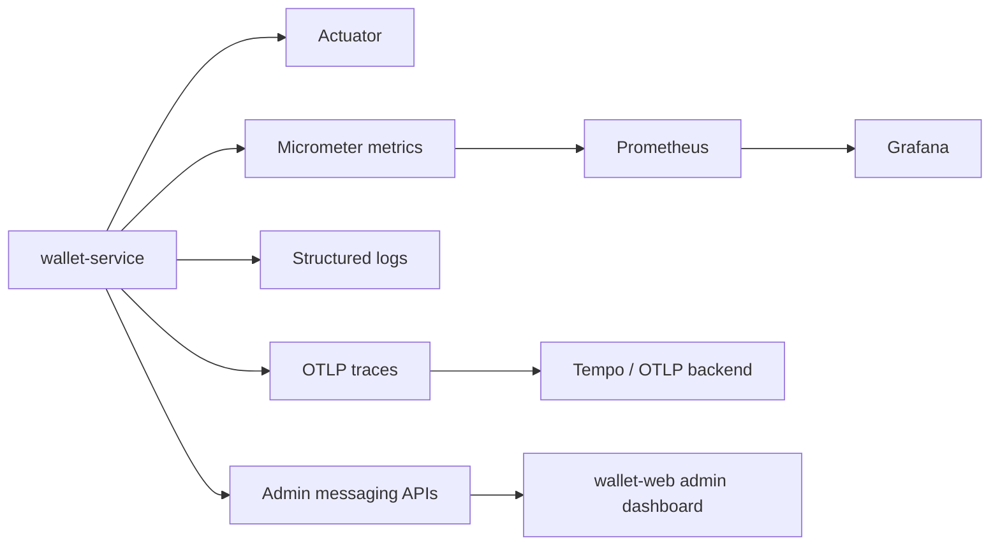
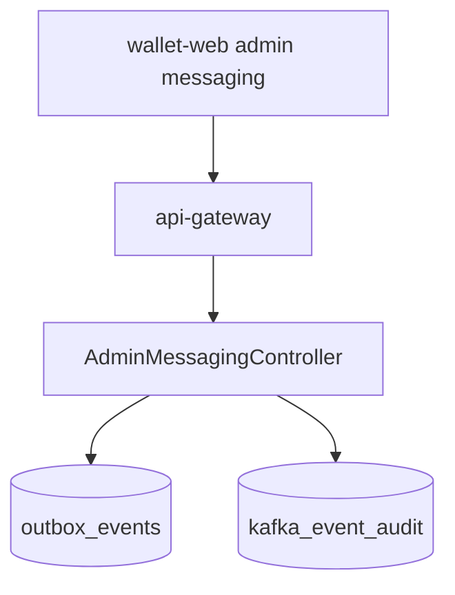

# Observability

Observability covers application health, business metrics, payment/webhook reconciliation, Kafka outbox lag, and audit visibility.

## Observability layers



## Actuator endpoints

Default/dev profile can expose:

```text
/actuator/health
/actuator/info
/actuator/prometheus
/v3/api-docs
/swagger-ui.html
```

Production hardens actuator:

- Obscure base path through `ACTUATOR_OBSCURE_PATH`.
- Expose only health unless metrics are behind secure infra.
- Hide health details from public callers.
- Enable graceful shutdown.

## Business metrics

| Metric                              | Tags                                       | Producer                           |
|-------------------------------------|--------------------------------------------|------------------------------------|
| `business.ledger.transfers`         | `operation`, `status`, `error`             | Wallet transfer engine             |
| `db.lock.wait`                      | `lock_type`, `entity`                      | Wallet lock acquisition            |
| `business.payment.orders`           | `status`, `gateway`, `reason`              | Payment verification/order service |
| `business.webhook.processing`       | `event_type`, `status`, `attempt`, `error` | Webhook poller                     |
| `business.webhook.latency`          | `event_type`                               | Webhook poller                     |
| `business.webhook.strategy.latency` | `strategy`                                 | Webhook dispatcher                 |
| `business.outbox.publish`           | `event_type`, `topic`, `status`            | Outbox publisher                   |
| `business.outbox.lag`               | `event_type`, `status`                     | Outbox publisher/admin summary     |
| `business.kafka.audit.consume`      | `event_type`, `topic`, `status`            | Audit consumer                     |

## Admin messaging observability

SYSTEM users can inspect messaging health without direct DB access:



Important views:

| View               | Purpose                                                 |
|--------------------|---------------------------------------------------------|
| Summary            | Counts by outbox status and Kafka audit totals          |
| Outbox list        | Identify stuck `FAILED`, `PUBLISHING`, or `DEAD` events |
| Outbox detail      | Inspect payload, headers, error, attempts               |
| Kafka audit list   | Verify events are consumed                              |
| Kafka audit detail | Inspect consumed payload/header/offset                  |

## Dashboard panels

Recommended Grafana panels:

- Wallet transfer success/failure rate by operation.
- Lock wait p95/p99 by entity.
- Payment create/verify success rate.
- Stale payment cleanup count.
- Webhook received/processed/failed counts.
- Webhook processing latency.
- Outbox status counts.
- Outbox oldest unpublished age.
- Kafka publish failure rate.
- Kafka audit consume count by event type.
- JVM memory/GC/thread counts.
- DB pool active/idle/pending connections.

## Alert candidates

| Alert                                                         | Severity |
|---------------------------------------------------------------|----------|
| Wallet transfer failure rate above threshold                  | Critical |
| Outbox `DEAD` rows > 0                                        | Critical |
| Oldest outbox unpublished age > SLA                           | High     |
| Kafka audit consumption stops while outbox publishes continue | High     |
| Webhook failed rows exhausted retries                         | High     |
| Payment verification 5xx spike                                | High     |
| DB pool pending connections sustained                         | High     |
| Health check failing                                          | Critical |

## Logging guidance

Include correlation identifiers where possible:

- user id/principal, but avoid logging PII unnecessarily.
- transaction id.
- idempotency key.
- payment order id.
- Razorpay order/payment id.
- outbox event id.
- Kafka topic/partition/offset.
- webhook event id.

Do not log:

- refresh token values.
- JWTs.
- OTP codes in production.
- passwords or password hashes.
- Razorpay secrets or webhook secret.
