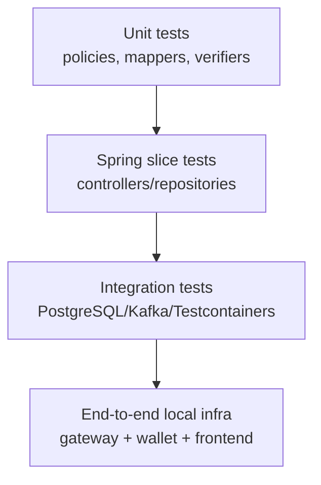

# Testing strategy

Testing must protect financial correctness, idempotency, security boundaries, payment reconciliation, and event publication reliability.

## Test pyramid

## Existing high-value unit areas

| Area                 | Examples                                                      |
|----------------------|---------------------------------------------------------------|
| Wallet transfer      | duplicate idempotency, sorted wallet locks, double-entry rows |
| Payment verification | valid signature, invalid signature, already-paid no-op        |
| Google auth          | malformed token, account linking, closed account rejection    |
| Notification         | Brevo request construction and delegation                     |
| Exception handling   | API error mapping                                             |

## Required tests for wallet engine

| Test                                                      | Expected result                                         |
|-----------------------------------------------------------|---------------------------------------------------------|
| Spend with enough balance                                 | User wallet debited, treasury credited, two ledger rows |
| Spend with insufficient balance                           | No balance mutation, no ledger rows                     |
| Duplicate idempotency key                                 | Does not create duplicate ledger rows                   |
| Concurrent spend on same wallet                           | No negative balance and no lost update                  |
| Unknown asset code                                        | Request rejected before mutation                        |
| Account closure with positive balance and no confirmation | 409 conflict                                            |
| Account closure with confirmation                         | Forfeit transactions created and user closed            |

## Required tests for payments

| Test                                | Expected result                  |
|-------------------------------------|----------------------------------|
| USER creates order for GOLD/DIAMOND | Payment order CREATED            |
| USER tries LOYALTY order            | Rejected                         |
| SYSTEM tries create order           | Forbidden                        |
| Verify valid payment                | Payment PAID, wallet credited    |
| Verify invalid signature            | Payment FAILED, no wallet credit |
| Duplicate verify                    | No duplicate wallet credit       |
| Order status by owner               | Allowed                          |
| Order status by SYSTEM              | Allowed if product rule permits  |

## Required tests for webhooks

| Test                              | Expected result                      |
|-----------------------------------|--------------------------------------|
| Valid webhook signature           | Inbox row persisted                  |
| Invalid webhook signature         | Rejected, no inbox row               |
| Duplicate webhook                 | No duplicate processing              |
| Poller processes captured payment | Payment PAID, wallet credited        |
| Already-paid order                | No-op                                |
| Strategy failure                  | Row FAILED with attempts incremented |
| Retry exhausted                   | Row parked/failed for manual review  |

## Required tests for Kafka outbox

| Test                               | Expected result                                            |
|------------------------------------|------------------------------------------------------------|
| Wallet mutation creates outbox row | PENDING row with event type `wallet.transaction.posted.v1` |
| Kafka publish success              | Outbox row PUBLISHED with published_at                     |
| Kafka publish failure              | Outbox row FAILED with error and next attempt              |
| Attempts exhausted                 | Outbox row DEAD                                            |
| Stale PUBLISHING recovery          | Row becomes retryable                                      |
| Audit consumer persists event      | `kafka_event_audit` row created                            |
| Duplicate consumed event           | No duplicate audit row                                     |
| Manual ack after DB save           | Offset ack only after audit persistence                    |

## Integration testing recommendation

Use Testcontainers for:

- PostgreSQL for real constraints, JSONB, locks, and `SKIP LOCKED`.
- Kafka for producer/consumer behavior and headers.

H2 compatibility tests are useful for fast feedback but cannot fully validate PostgreSQL locking, JSONB, partial indexes, or native SQL behavior.

## E2E local scenarios

1. Signup -> OTP verify -> refresh -> logout.
2. Google login -> token claims include `email` and `ownerType`.
3. USER create payment order -> Razorpay mock/verify -> wallet balance updated.
4. Webhook capture without frontend verify -> wallet balance updated.
5. USER spend -> ledger shows debit entry.
6. SYSTEM issue bonus -> target user's wallet updated.
7. Outbox publishes wallet transaction event -> audit consumer saves record.
8. SYSTEM admin dashboard loads summary, outbox, and audit events.
