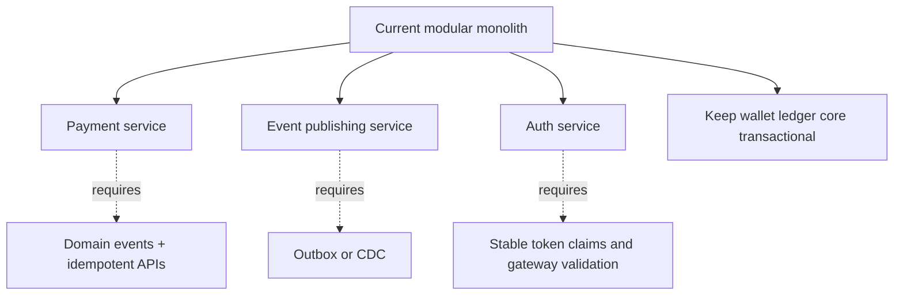

# Design tradeoffs and roadmap

This service prioritizes correctness and auditability over minimal code size.

## Major tradeoffs

| Decision                     | Benefit                                          | Cost                                                  |
|------------------------------|--------------------------------------------------|-------------------------------------------------------|
| Modular monolith             | Strong local transactions and simpler deployment | One service carries multiple modules                  |
| Double-entry ledger          | Clear audit trail                                | More rows and more validation                         |
| Pessimistic locks            | Strong concurrent correctness                    | Throughput limited by lock contention                 |
| Transactional outbox         | Reliable Kafka event publishing                  | Eventual consistency and publisher complexity         |
| Webhook inbox                | Payment recovery and replay protection           | Poller and retry lifecycle to maintain                |
| Refresh token DB table       | Revocable sessions                               | DB lookup and token storage lifecycle                 |
| Gateway-first trust          | Centralized auth/rate limiting                   | Requires correct gateway/service secret configuration |
| SYSTEM user options endpoint | Clean admin UI without exposing UUIDs            | Additional admin API and security rule                |

## Alternatives considered

### Direct Kafka publish

Rejected because it creates DB/Kafka dual-write risk.

### Kafka as balance source

Rejected because balance correctness requires transactional ledger writes and relational constraints. Kafka remains an event distribution layer.

### Optimistic balance update only

Rejected for current financial-style behavior. Optimistic updates may be revisited for specific high-throughput counters, but spend/topup/bonus keep stronger locking until proven otherwise.

### Frontend manual idempotency keys

Rejected. Idempotency keys are technical controls. Exposing them as editable fields creates user confusion and duplicate-risk bugs.

### SYSTEM behaving like USER

Rejected. SYSTEM can administer and issue bonus; it must not spend or create payment orders.

## Roadmap

### High priority

- Add admin payment investigation APIs.
- Add webhook admin inspection APIs.
- Add reconciliation report across Razorpay, payment orders, wallet transactions, ledger entries, outbox, and Kafka audit.
- Add Testcontainers for PostgreSQL and Kafka integration tests.
- Serialize large numeric ids as strings in API responses.

### Medium priority

- Add refund support with reverse ledger entries.
- Add Kafka schema documentation and compatibility tests.
- Add dead-letter handling for outbox and webhook exhausted failures.
- Add admin ability to replay DEAD outbox events after root-cause fix.
- Add OpenAPI examples for every endpoint.
- Add frontend profile page and account closure confirmation if not already merged.

### Lower priority

- Multi-session refresh-token support with device/session management.
- More granular roles beyond USER/SYSTEM.
- Per-asset configuration for purchasable/spendable/reward-only behavior.
- Externalized event schema registry.
- Move modules into microservices if operational scale requires it.

## Future architecture extraction candidates

The wallet ledger engine is the last module to extract because it is the strongest consistency boundary.

## Documentation maintenance checklist

When adding a feature, update:

- README summary if the feature is top-level.
- API reference if any endpoint changes.
- Security doc if ownership/role changes.
- ER/migrations doc if schema changes.
- Observability doc if metrics/logging changes.
- Testing doc if new test category is needed.
