# Complete system architecture

This document explains how Wallet Service works as a complete system. It focuses on architecture, runtime flow, module interaction, transaction boundaries, and data movement across synchronous and asynchronous paths.

Topic-specific documentation stays in the dedicated files:

| Topic | Detailed file |
|-------|---------------|
| API contracts | [`11-api-reference.md`](11-api-reference.md) |
| Domain model and ER details | [`04-domain-model-and-er.md`](04-domain-model-and-er.md) |
| Wallet ledger rules | [`05-wallet-ledger-engine.md`](05-wallet-ledger-engine.md) |
| Payments | [`06-payments-razorpay.md`](06-payments-razorpay.md) |
| Webhooks | [`07-webhook-reconciliation.md`](07-webhook-reconciliation.md) |
| Kafka outbox and audit | [`08-kafka-outbox-and-audit.md`](08-kafka-outbox-and-audit.md) |
| Auth lifecycle | [`09-authentication-and-account-lifecycle.md`](09-authentication-and-account-lifecycle.md) |

## Architecture summary

Wallet Service is a modular monolith with a financial consistency core. Multiple entry points exist, but every balance-changing path converges on the same wallet transfer engine.

```text
External event or user action
        |
        v
Gateway security boundary
        |
        v
Controller and application service
        |
        v
Domain operation / strategy
        |
        v
WalletTransferService when value moves
        |
        v
PostgreSQL transaction: wallets + transaction + ledger + outbox
        |
        v
Async recovery and event publication jobs
```

The central runtime rule:

> PostgreSQL commits wallet truth. Kafka events, webhook processing, admin screens, and metrics are derived from committed database state.

## C4 context view

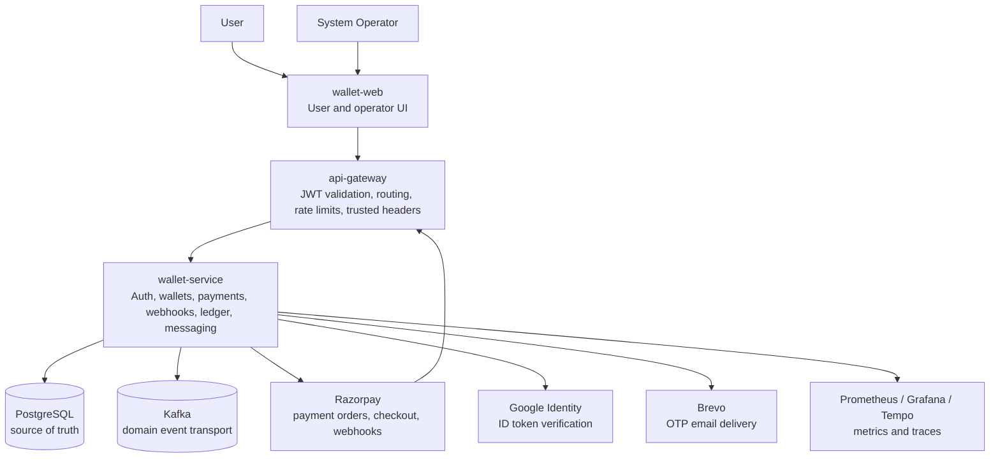

Context responsibilities:

| System | Responsibility |
|--------|----------------|
| `wallet-web` | Presents signup, login, wallet, payment, ledger, and operator screens |
| `api-gateway` | Owns public routing, client JWT validation, rate limiting, and trusted identity headers |
| `wallet-service` | Owns business state, financial movement, auth state, payment state, webhook state, and outbox state |
| PostgreSQL | Stores committed identity, wallet, ledger, payment, webhook, outbox, audit, and lock data |
| Kafka | Carries committed wallet transaction events to downstream consumers |
| Razorpay | Creates payment orders, processes checkout, and emits payment webhooks |
| Google Identity | Verifies Google login tokens |
| Brevo | Sends OTP emails |
| Observability stack | Reads health, metrics, and traces |

## Container and deployment view

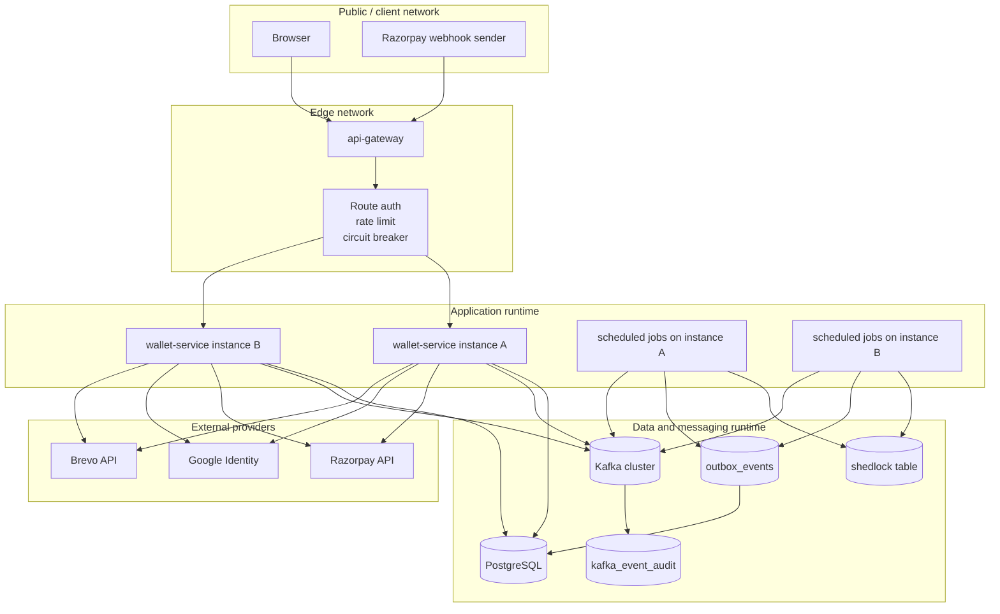

Deployment behavior:

| Runtime concern | Architecture decision |
|-----------------|-----------------------|
| Horizontal instances | Multiple service instances can run behind the gateway |
| Scheduled jobs | ShedLock prevents duplicate scheduled job execution across instances |
| Wallet concurrency | Database row locks protect wallet rows during balance mutation |
| Kafka publishing | Outbox rows are claimed from PostgreSQL, then published to Kafka |
| Webhook retries | Webhook rows are claimed from PostgreSQL and retried independently of the HTTP request |
| Health checks | Platform health probes use actuator health without application JWT |

## Application module map

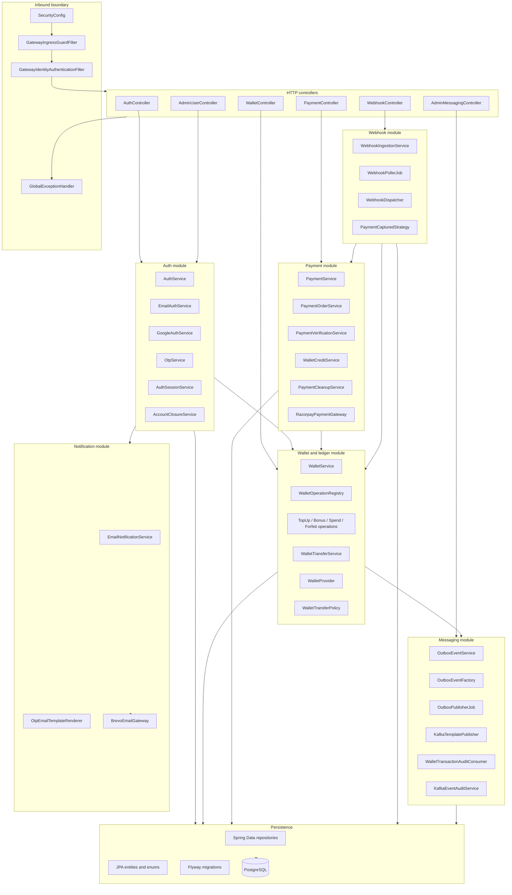

Module direction rules:

| Direction | Meaning |
|-----------|---------|
| Controllers call services | HTTP code does not own business rules |
| Payment and webhook call wallet | External money confirmation becomes internal wallet movement |
| Auth closure calls wallet | Account closure uses wallet operation flow for forfeiture |
| Wallet calls outbox | Committed financial movement produces a committed event record |
| Outbox calls Kafka | Kafka publish happens after database commit |
| Notification stays outside auth core | Email transport can change without changing auth state rules |

## How the application works

The application is a set of entry points that converge into a small number of consistency boundaries.

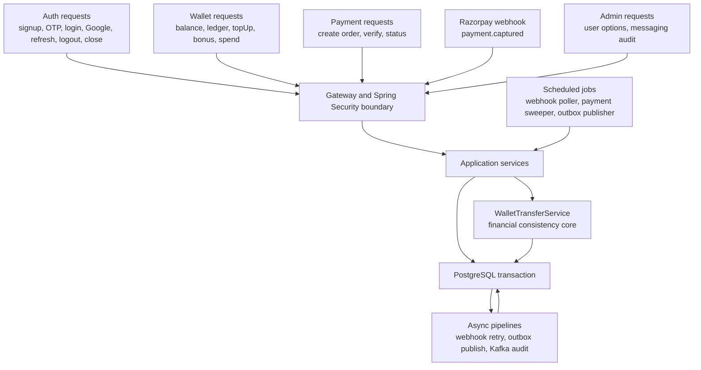

Runtime convergence:

| Entry point | Immediate module | Consistency boundary |
|-------------|------------------|----------------------|
| Email signup | Auth module | User and OTP transaction |
| OTP verification | Auth module | User verification and session creation |
| Google login | Auth module | User link/create and session creation |
| Wallet spend | Wallet module | Wallet transfer transaction |
| System bonus | Wallet module | Wallet transfer transaction |
| Razorpay verification | Payment module | Payment order update plus wallet transfer |
| Razorpay webhook | Webhook module | Inbox insert, then async payment order update plus wallet transfer |
| Account closure | Auth module | Forfeit transfer plus user closure and token revocation |
| Outbox publishing | Messaging module | Outbox claim/update around external Kafka publish |
| Kafka audit | Messaging module | Audit insert before manual Kafka acknowledgement |

## Request pipeline

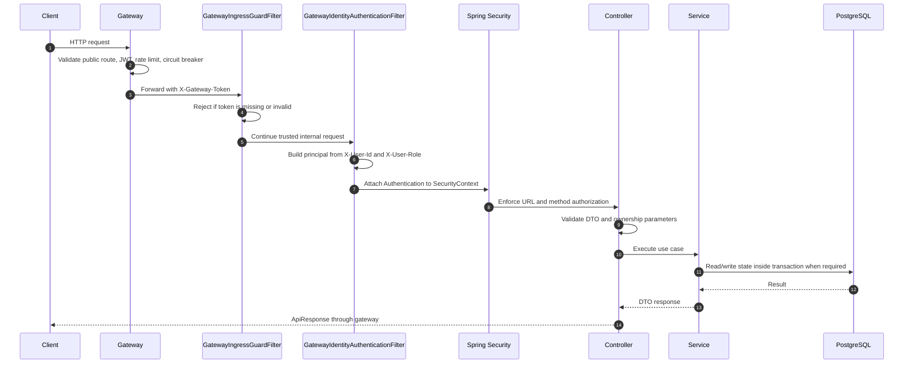

Request pipeline responsibilities:

| Stage | Responsibility |
|-------|----------------|
| Gateway | Public authentication, routing policy, rate limiting, trusted headers |
| Ingress guard | Prevent direct backend bypass |
| Identity filter | Convert trusted gateway headers into Spring principal |
| Spring Security | Enforce role-level access |
| Controller | Validate request shape and path/user ownership |
| Service | Execute business use case |
| Repository/database | Enforce persistence constraints and locks |

## Financial write path

All balance mutations use the same architecture path. The caller changes, but the write model remains stable.

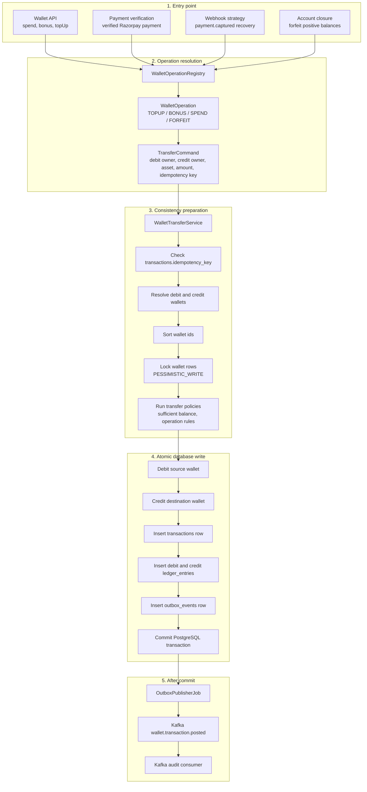

The wallet write path is intentionally narrow. Payment, webhook, bonus, spend, and account closure do not update wallet balances directly. They express intent as a transfer command, then the engine performs idempotency, locking, balance mutation, ledger creation, and outbox recording.

### Financial transaction boundary

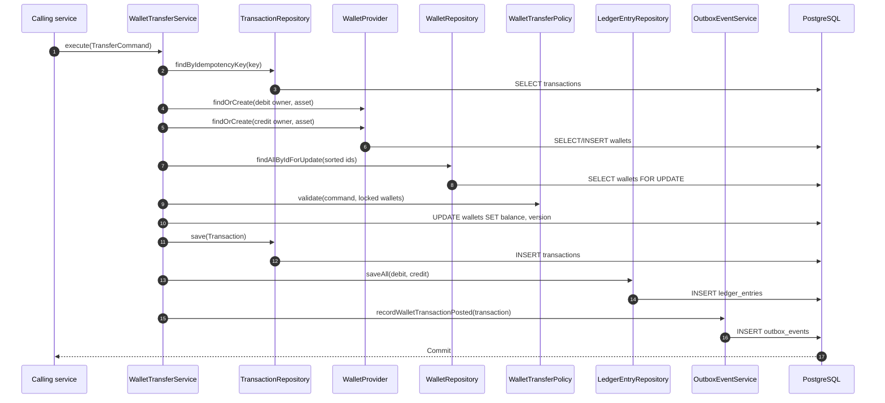

Database objects touched by this boundary:

| Object | Why it is inside the transaction |
|--------|----------------------------------|
| `wallets` | Current balance projection changes atomically |
| `transactions` | Business-level transfer record commits with the balance |
| `ledger_entries` | Double-entry audit commits with the balance |
| `outbox_events` | Kafka publication intent commits only when the balance commits |

## Payment architecture path

Payment has a synchronous browser path and an asynchronous webhook recovery path. Both paths converge on wallet credit through the wallet engine.

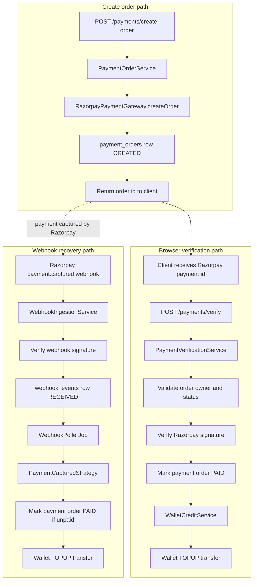

Important architectural point: the wallet engine does not know whether a top-up came from browser verification or webhook reconciliation. It receives a deterministic transfer request and applies the same idempotency, lock, ledger, and outbox rules.

## Webhook architecture path

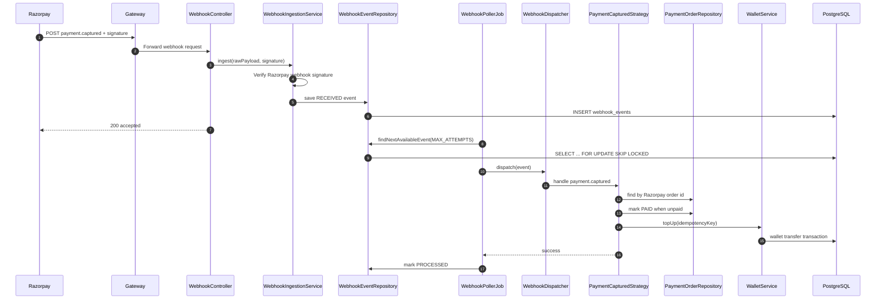

Webhook design separates three concerns:

| Concern | Owner |
|---------|-------|
| External authenticity | `WebhookIngestionService` verifies Razorpay signature |
| Durable acceptance | `webhook_events` stores the event before async processing |
| Business recovery | `PaymentCapturedStrategy` reconciles payment state and wallet credit |

## Outbox and Kafka architecture path

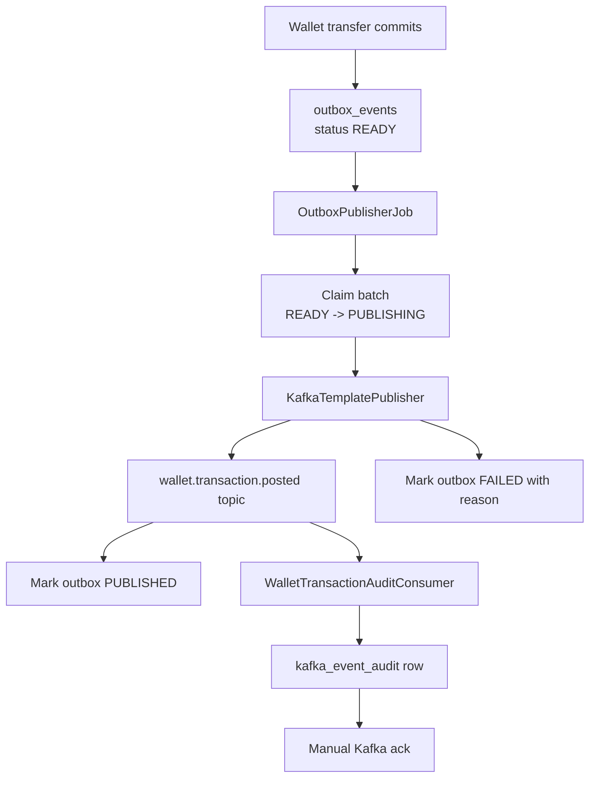

Outbox is the architecture boundary between database truth and Kafka delivery.

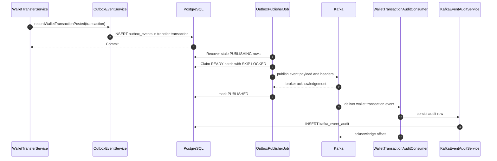

Failure behavior:

| Failure | Result | Recovery path |
|---------|--------|---------------|
| Transfer fails before commit | No outbox row exists | Nothing publishes |
| Service crashes after commit | Outbox row remains `READY` | Next publisher run claims it |
| Publisher crashes after claim | Row remains `PUBLISHING` | Stale recovery returns it to publishable state |
| Kafka send fails | Row records failure state and attempts | Later retry or operator inspection |
| Consumer crashes before ack | Kafka redelivers | Audit deduplication prevents duplicate audit records |

## Account closure architecture path

Account closure crosses auth and wallet domains. The architecture keeps financial movement in the wallet engine and identity cleanup in the auth module.

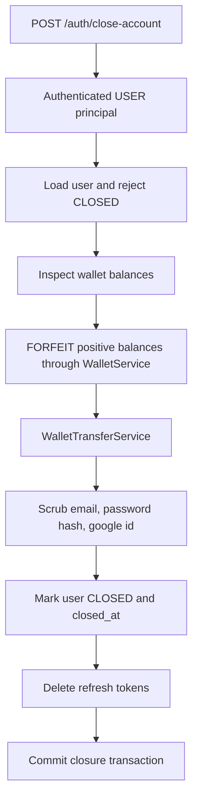

This path prevents identity deletion from bypassing financial accounting. Positive balances move with ledger records before the account loses active identity data.

## Read model architecture

Read paths avoid wallet mutation and do not use the transfer engine.

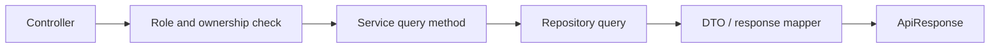

Read path examples:

| Read | Source |
|------|--------|
| Balance | `wallets` joined with `asset_types` |
| Ledger history | `ledger_entries`, `transactions`, `wallets`, `asset_types` |
| Payment order status | `payment_orders` filtered by order id and user |
| Admin user options | `users` query projection |
| Outbox admin view | `outbox_events` |
| Kafka audit admin view | `kafka_event_audit` |

## Database ownership view

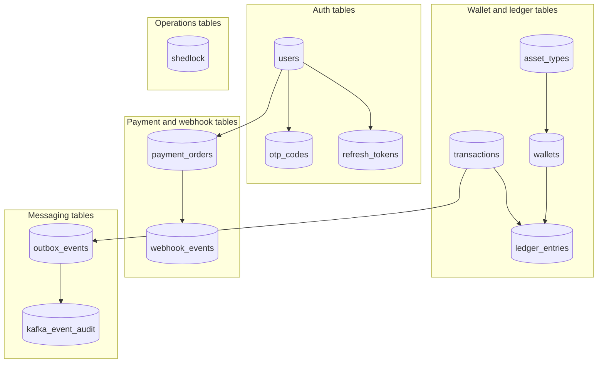

Table ownership by module:

| Module | Tables it owns |
|--------|----------------|
| Auth | `users`, `otp_codes`, `refresh_tokens` |
| Wallet | `asset_types`, `wallets`, `transactions`, `ledger_entries` |
| Payment | `payment_orders` |
| Webhook | `webhook_events` |
| Messaging | `outbox_events`, `kafka_event_audit` |
| Scheduling | `shedlock` |

## Transaction and consistency map

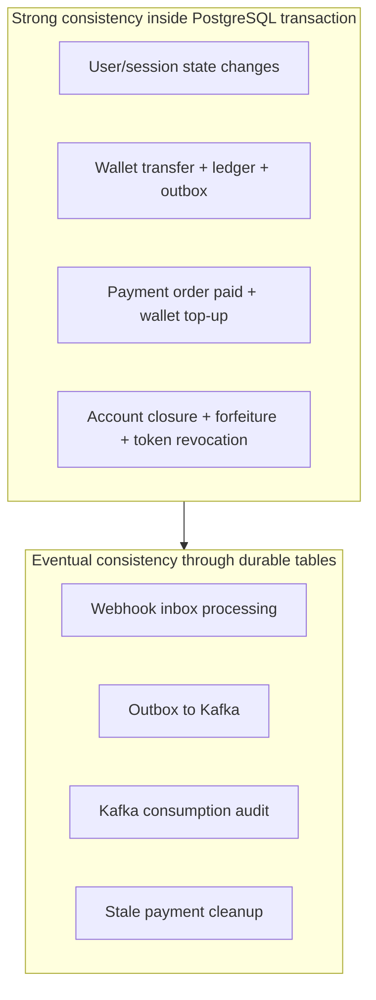

Consistency rules:

| Area | Consistency model |
|------|-------------------|
| Wallet balance | Strong consistency with database locks |
| Ledger audit | Strong consistency with balance mutation |
| Payment order verification | Strong consistency before wallet credit returns |
| Browser/webhook duplicate payment events | Idempotent convergence through deterministic keys |
| Kafka event delivery | Eventual consistency from outbox |
| Webhook processing | Eventual consistency from inbox |
| Admin messaging views | Read committed state from outbox and audit tables |

## Threading and background jobs

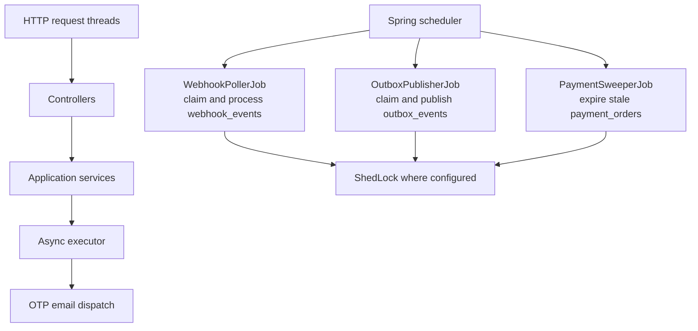

Job responsibilities:

| Job | Responsibility |
|-----|----------------|
| `WebhookPollerJob` | Convert accepted webhook rows into payment reconciliation attempts |
| `OutboxPublisherJob` | Convert committed outbox rows into Kafka messages |
| `PaymentSweeperJob` | Mark stale payment orders as failed |
| Async email dispatch | Send OTP mail without blocking the signup transaction longer than required |

## Architecture invariants

| Invariant | Architectural enforcement |
|-----------|---------------------------|
| Direct internet traffic does not reach business controllers | Gateway token guard blocks backend bypass |
| Header-based identity is trusted only after perimeter validation | Identity filter runs after ingress guard |
| Balance mutation has one implementation path | All financial operations use `WalletTransferService` |
| Ledger and wallet balance commit together | Same PostgreSQL transaction |
| Kafka reflects committed wallet state only | Outbox row is written in the wallet transaction and published later |
| Webhooks are durable before processing | Webhook endpoint writes inbox row before async dispatch |
| Scheduled jobs remain multi-instance safe | ShedLock and row-level claiming |
| Payment credit is idempotent | Razorpay payment id maps to deterministic wallet idempotency key |
| Account closure preserves accounting | Forfeiture uses wallet transfer before identity cleanup |

## Production runtime shape

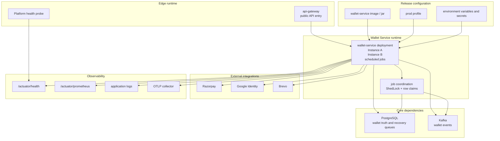

Production assumptions:

| Assumption | Reason |
|------------|--------|
| Gateway is the only public API entry point | Backend trusts gateway-supplied identity headers after token guard |
| PostgreSQL is highly available and backed up | It owns wallet truth and recovery queues |
| Kafka can be temporarily unavailable | Outbox stores pending events until publishing resumes |
| External providers can be temporarily unavailable | Payment, email, and Google failures stay outside wallet balance truth |
| Health endpoint remains low-noise and fast | Platform probes depend on it |

## Architecture reading order

Use this order when tracing a production issue:

1. Identify the entry point: auth, wallet, payment, webhook, admin, or scheduled job.
2. Follow the request boundary: gateway, ingress guard, identity filter, Spring Security, controller.
3. Locate the application service that owns orchestration.
4. For value movement, trace into `WalletTransferService`.
5. Check the PostgreSQL transaction tables involved in the path.
6. For asynchronous completion, inspect `webhook_events`, `outbox_events`, or `kafka_event_audit`.
7. Confirm metrics and logs at the boundary where the state stopped moving.
