# Concurrency, transactions, and consistency

Wallet Service handles money-like digital assets. Concurrent requests can target the same user wallet, the same system wallet, the same payment order, or the same external webhook event. The architecture keeps these races safe through database transactions, row-level locks, deterministic idempotency keys, uniqueness constraints, optimistic versions, and durable retry queues.

This document explains how the project maintains consistency when many transactions run at the same time.

## Consistency model

The service uses PostgreSQL as the source of truth. Application code can retry, Kafka can redeliver, Razorpay can send duplicate webhooks, and users can click twice, but committed wallet state comes from the database transaction.

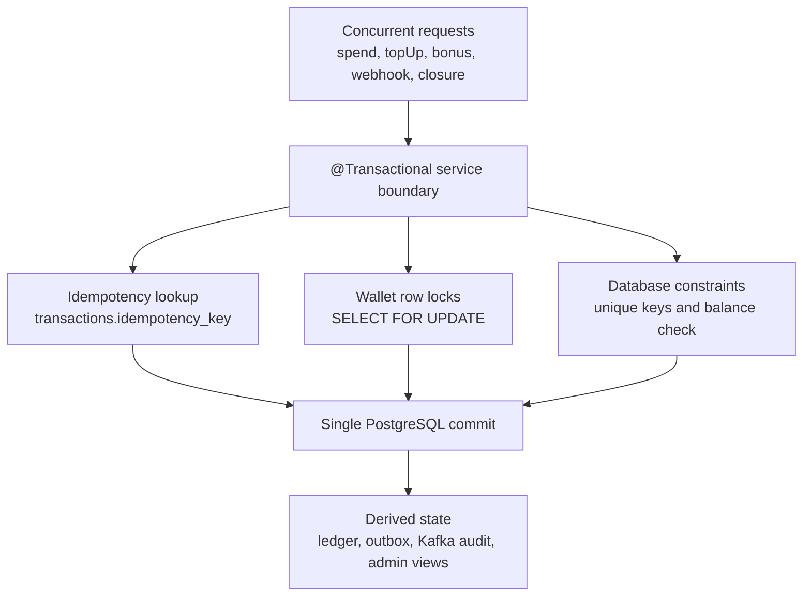

Consistency guarantees:

| Guarantee | Mechanism |
|-----------|-----------|
| A wallet balance never commits below zero | `wallets_balance_check` and `SufficientBalancePolicy` |
| Two concurrent transfers do not update the same wallet blindly | Pessimistic row locks on wallet rows |
| Deadlock risk is reduced for two-wallet transfers | Wallet ids are sorted before lock acquisition |
| Duplicate business commands do not create duplicate transfers | Unique idempotency key on `transactions` |
| Payment double-credit is blocked | Razorpay payment id checks and deterministic wallet idempotency keys |
| Webhook duplicate delivery is safe | Unique webhook event id and idempotent payment strategy |
| Kafka publish never precedes wallet commit | Outbox row commits inside the wallet transaction |
| Kafka redelivery does not corrupt audit | Audit persistence is duplicate-safe |

## Core write transaction

Every balance-changing operation follows the same write model.

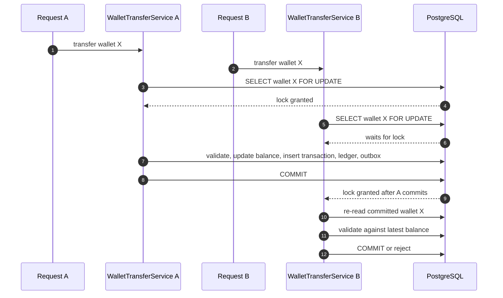

The second request does not calculate from stale balance. It waits for the first transaction to finish, then validates against the latest committed row.

## Two-wallet transfer locking

Wallet transfers touch two wallets: a debit wallet and a credit wallet. Examples:

| Operation | Debit wallet | Credit wallet |
|-----------|--------------|---------------|
| `TOPUP` | `SYSTEM_TREASURY` asset wallet | User asset wallet |
| `BONUS` | `SYSTEM_TREASURY` asset wallet | User asset wallet |
| `SPEND` | User asset wallet | `SYSTEM_TREASURY` asset wallet |
| `FORFEIT` | User asset wallet | `SYSTEM_TREASURY` asset wallet |

The service locks both rows in deterministic order.

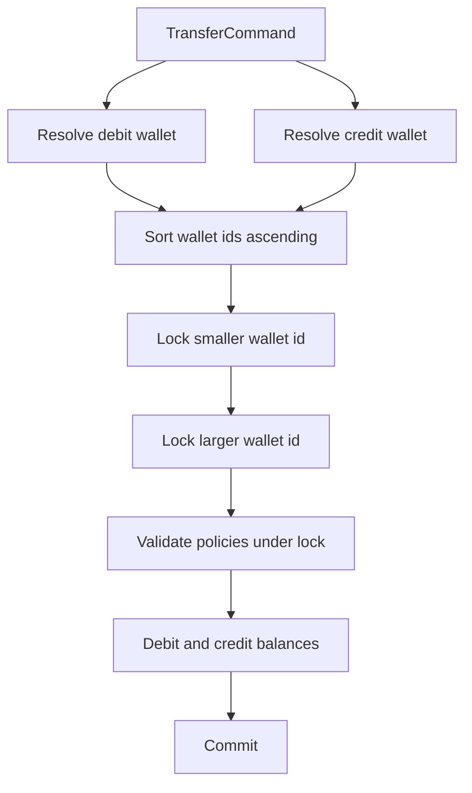

Why sorted locking matters:

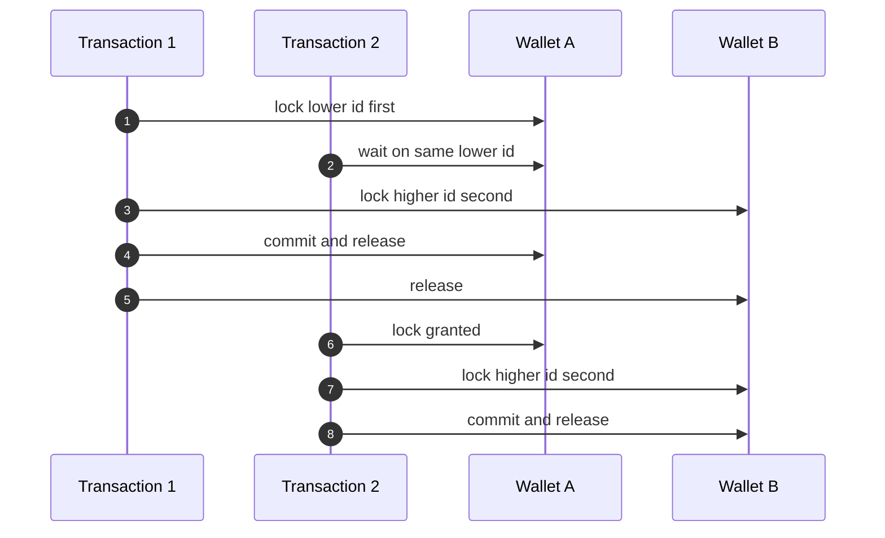

Both transactions ask for locks in the same order. That prevents the common deadlock pattern where transaction 1 holds wallet A and waits for wallet B while transaction 2 holds wallet B and waits for wallet A.

## Same-wallet concurrent spend

Two spend requests can hit the same user wallet at nearly the same time.

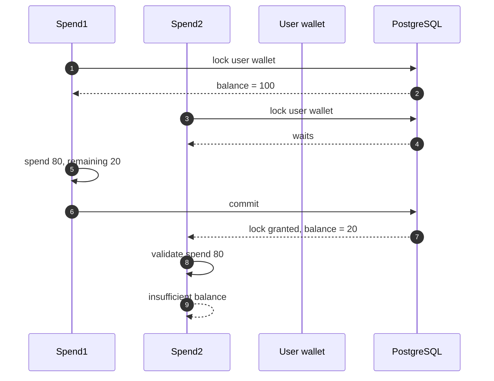

Only one spend sees the original balance. The second spend sees the committed balance after the first spend and fails cleanly when funds are insufficient.

## Shared system treasury contention

Top-up, bonus, spend, and forfeit all touch `SYSTEM_TREASURY`. This creates intentional serialization on the relevant system wallet row.

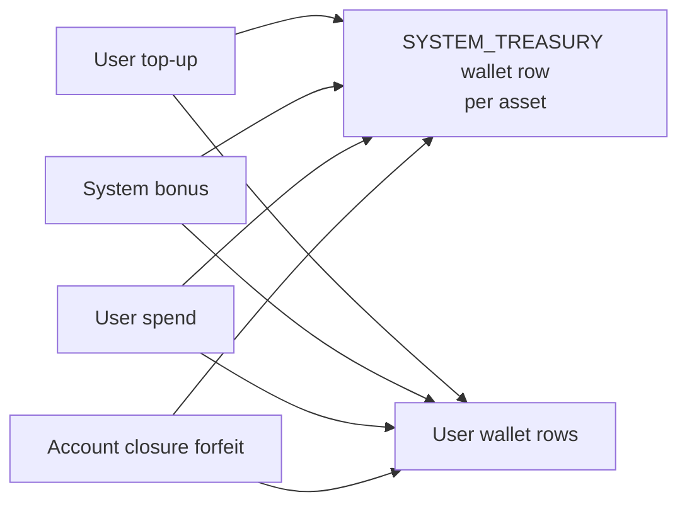

This is conservative and correct for the current product. The tradeoff is throughput: many operations for the same asset can queue behind the same treasury wallet row. The benefit is simple, auditable accounting where every transfer has a real debit and credit side.

## Idempotency under retries

Retries are normal in distributed systems. The service uses deterministic idempotency keys to separate a retry from a new business command.

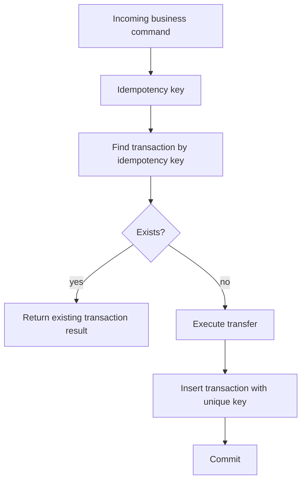

Idempotency key sources:

| Flow | Key source |
|------|------------|
| Payment browser verification | Razorpay payment id based key |
| Payment webhook recovery | Razorpay payment id based webhook key |
| User wallet command | Client/backend supplied command id |
| Account closure forfeiture | Closure flow generated command id |

The unique database constraint is the final protection. Even if two requests pass the pre-check at the same time, only one can commit the same idempotency key.

## Payment verification race

A browser verification request and a Razorpay webhook can arrive for the same payment.

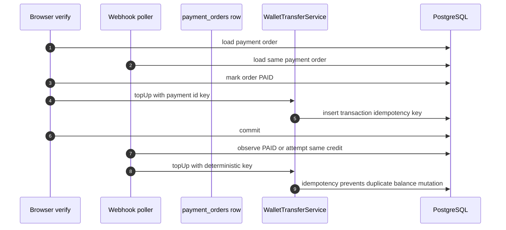

The architecture has two layers of protection:

| Layer | Protection |
|-------|------------|
| Payment order state | Already `PAID` orders are skipped |
| Wallet transaction idempotency | Duplicate credit command does not mutate balance twice |

## Webhook concurrency

Webhook events are stored before processing. Pollers claim rows with row-level locking and skip rows already claimed by another transaction.

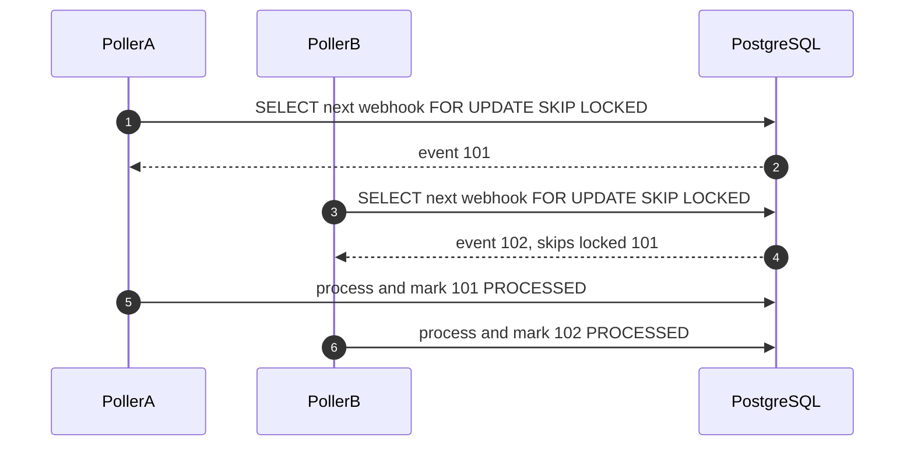

This allows multiple service instances to process webhook backlog without processing the same row concurrently.

## Outbox concurrency

Outbox events use the same durable-queue pattern.

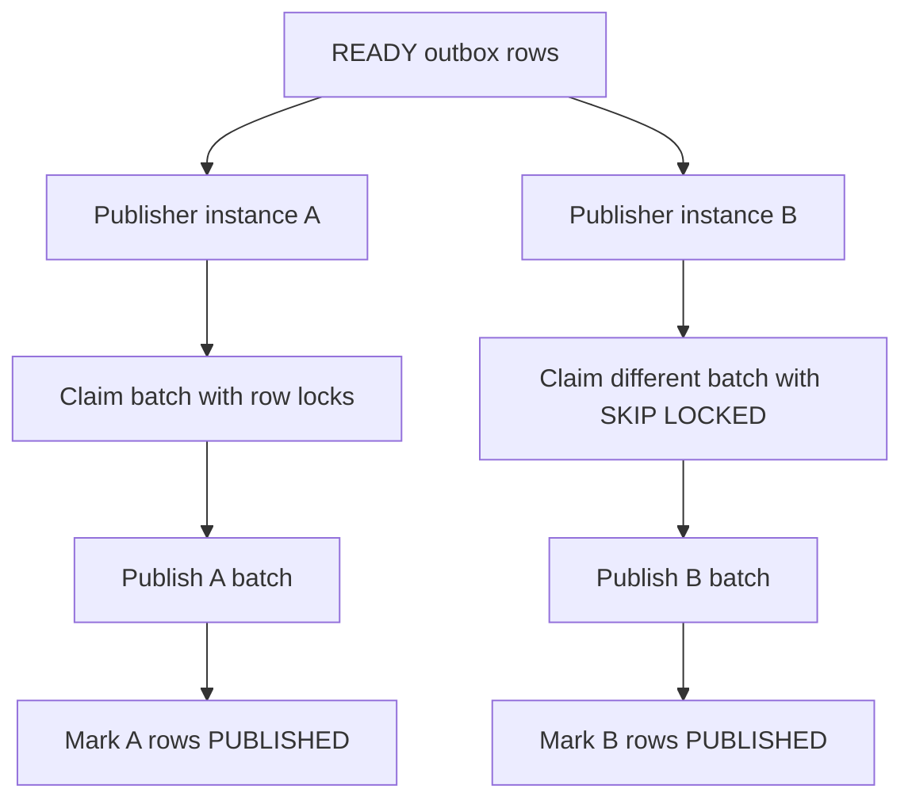

Outbox concurrency rules:

| Rule | Effect |
|------|--------|
| Claim rows before publishing | Two publishers do not publish the same READY row concurrently |
| Use stale publishing recovery | Crashed publisher work returns to the queue |
| Mark success after broker ack | Database reflects actual Kafka publish result |
| Store failure reason | Operators can inspect repeated publish failures |

## Optimistic versioning

`Wallet` includes a version field. The primary concurrency control for transfers is pessimistic locking, but optimistic versioning still protects updates that rely on entity version checks.

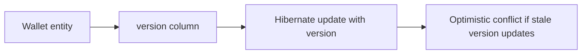

The project does not rely on optimistic versioning alone for balance mutation because spend/top-up operations require a deterministic lock-and-validate sequence.

## Failure and rollback behavior

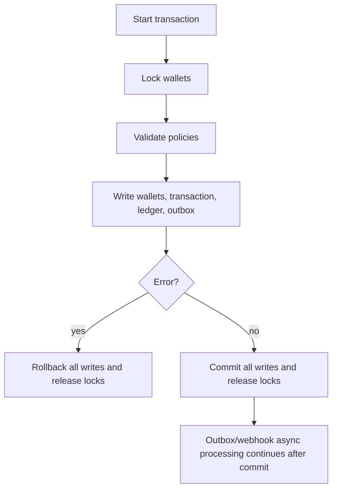

Rollback guarantees:

| Failure point | Result |
|---------------|--------|
| Policy validation fails | No wallet balance, ledger, transaction, or outbox row commits |
| Database constraint fails | Entire transaction rolls back |
| Application exception occurs before commit | Entire transaction rolls back |
| Kafka is unavailable after commit | Wallet state remains committed; outbox retries later |
| Webhook processing fails | Webhook row stores failure state and retry metadata |

## Consistency across accounts

Every transfer is a two-sided movement. This is how the service maintains consistency across accounts.

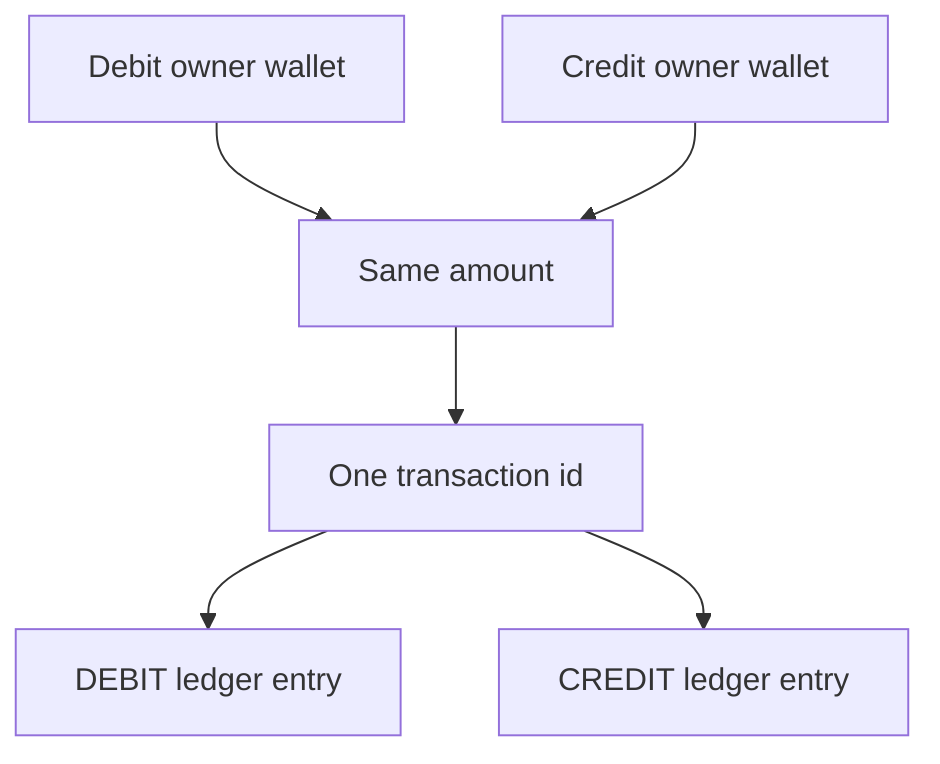

Cross-account consistency rules:

| Rule | Meaning |
|------|---------|
| Debit and credit use the same asset | No cross-asset conversion occurs inside a transfer |
| Debit and credit use the same amount | Ledger remains balanced for each transaction |
| Both wallet rows lock before mutation | No partial account update occurs |
| Both ledger entries share the same transaction | Audit can reconstruct both sides |
| Outbox event is based on the committed transaction | Downstream systems receive the final committed view |

## What happens under load

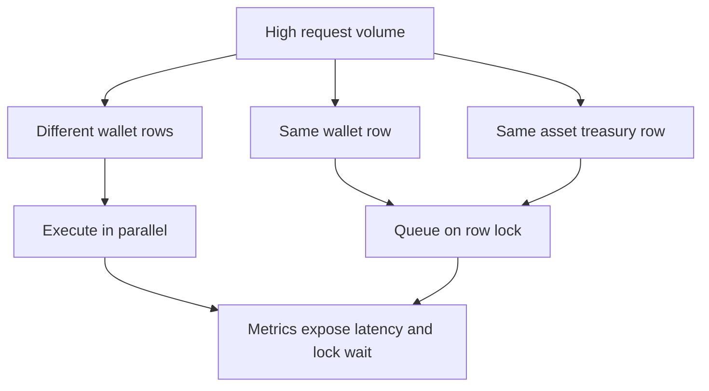

Throughput behavior:

| Load pattern | Runtime behavior |
|--------------|------------------|
| Many users spending different assets/accounts | High parallelism |
| Same user spending the same wallet repeatedly | Serialized by that wallet row |
| Many top-ups for the same asset | Serialized by the `SYSTEM_TREASURY` wallet for that asset |
| Large webhook backlog | Parallel row claiming with `SKIP LOCKED` |
| Kafka outage | Wallet writes continue; outbox backlog grows |

## Operational checks

Use these checks when diagnosing concurrency issues:

| Symptom | Inspect |
|---------|---------|
| Slow wallet writes | Lock wait metrics and PostgreSQL lock activity |
| Duplicate payment complaint | `payment_orders`, `transactions.idempotency_key`, ledger entries |
| Missing Kafka event | `outbox_events` status and attempts |
| Webhook processed twice | `webhook_events.event_id`, payment order status, transaction idempotency |
| Negative balance error | Application policy path plus database check constraint failure |
| Deadlock | Wallet lock ordering and PostgreSQL deadlock logs |

## Engineering rules for future changes

- Keep wallet balance mutation inside `WalletTransferService`.
- Lock all wallet rows needed by a transfer before validating balance.
- Acquire multi-wallet locks in deterministic order.
- Keep idempotency keys stable for retryable commands.
- Keep ledger writes in the same transaction as wallet balance updates.
- Keep outbox writes in the same transaction as wallet balance updates.
- Use durable inbox/outbox tables for external retry flows.
- Treat database constraints as final enforcement, not as a replacement for domain validation.
